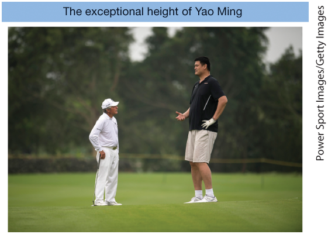
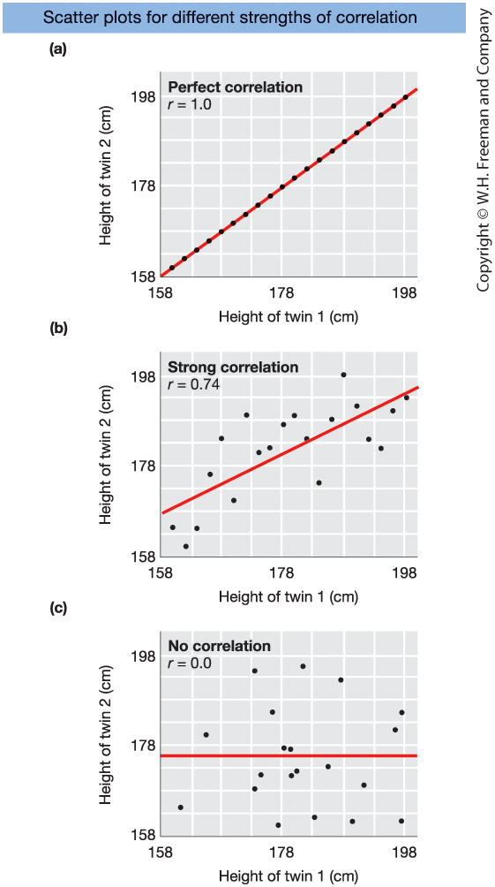
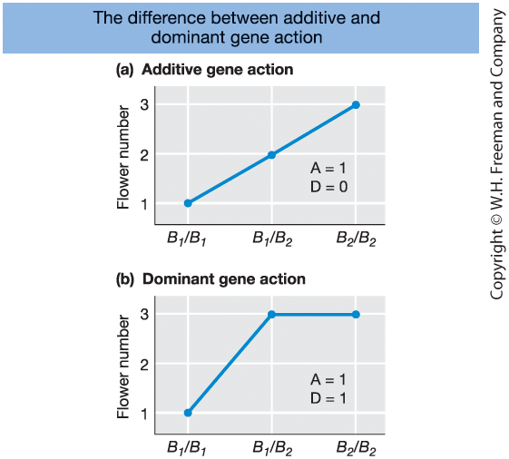
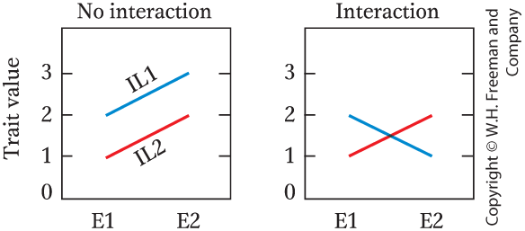
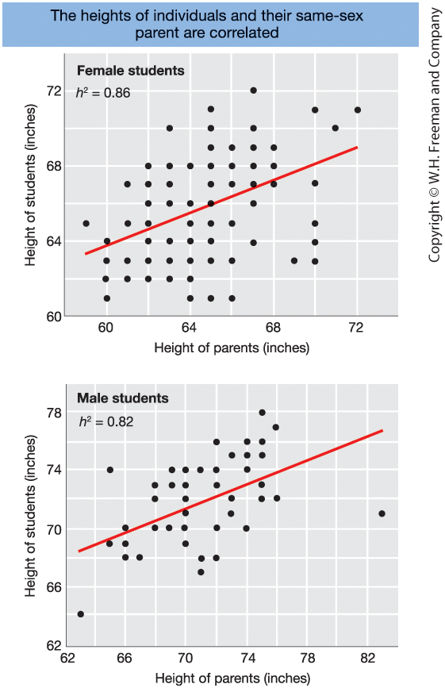
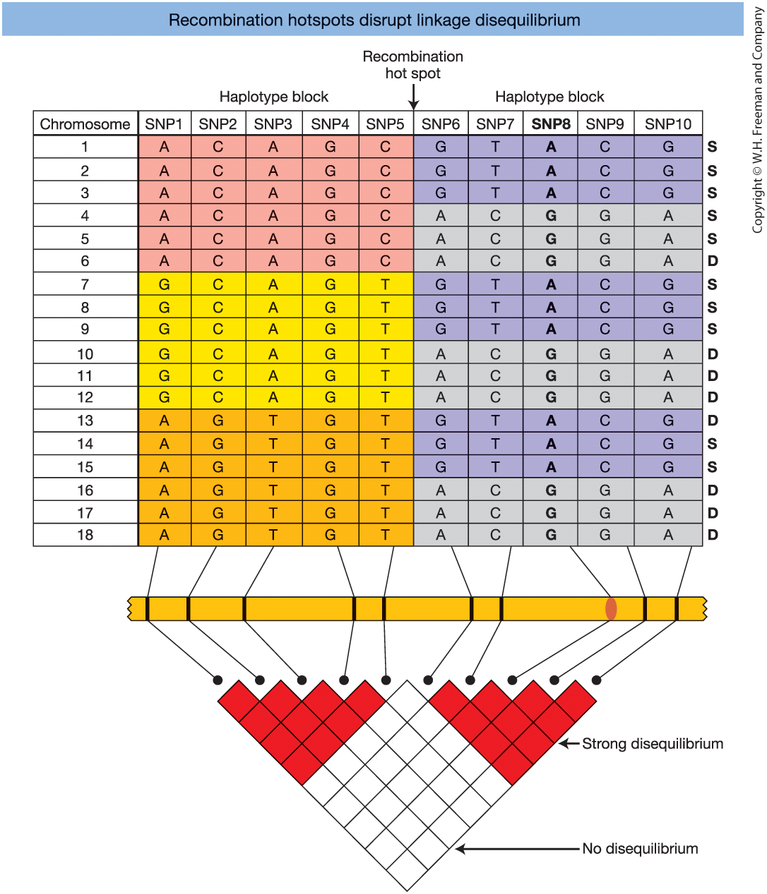

## Learning Goals

**19.1 Measuring Quantitative Variation**

- Understand how mathematical models and statistics are used to study complex traits  

**19.2 A Simple Genetic Model**

- Assess the relative contributions of genetic and environmental factors to phenotypic traits  

**19.3–19.4 Heritability**

- Calculate and interpret **broad-sense heritability**  
- Calculate and interpret **narrow-sense heritability**  
- Use parental phenotypes to predict offspring phenotypes  

**19.5–19.6 Mapping Quantitative Traits**

- Determine how many genes contribute to variation in a trait  
- Design and analyze QTL and association mapping studies  

::: notes

Chapter 19 shifts our focus from single-gene traits to quantitative traits — traits that vary continuously, such as height, milk yield, blood pressure, or crop yield.

First, we will learn how to measure and describe quantitative variation using statistical tools. This is where population genetics meets statistics.

Next, we introduce a simple genetic model that separates phenotypic variation into genetic and environmental components.

We then study heritability:
Broad-sense heritability measures the total genetic contribution to variation.
Narrow-sense heritability focuses on additive genetic effects and allows prediction of offspring phenotypes.

Finally, we examine mapping approaches:
QTL mapping in populations with known pedigrees.
Association mapping in random-mating populations.

By the end of this chapter, you should understand how quantitative traits are analyzed and how loci contributing to complex traits can be identified.

:::

## What Are Complex (Quantitative) Traits?

Quantitative (complex) traits:

- Show a **continuous range of variation**
- Do **not** follow simple Mendelian ratios
- Are influenced by:
  - **Multiple genes**
  - **Environmental factors**

Examples:

- Human height  
- Blood pressure  
- Crop yield  
- Milk production  

**Multifactorial hypothesis**

- Many Mendelian loci (each small effect)
- Environmental contributions

::: notes

Complex traits differ from the simple Mendelian traits we studied earlier.

Instead of falling into clear categories — like purple vs. white flowers —
they show a continuous distribution.

Human height is a classic example.
People are not just “tall” or “short” — they vary across a spectrum.

These traits are influenced by many genes, each contributing a small effect,
as well as environmental factors such as nutrition, climate, and lifestyle.

Historically, this caused major confusion.

When Mendel’s laws were rediscovered around 1900,
scientists struggled to reconcile them with continuous traits.

Biometricians argued that continuous traits did not follow Mendel.

Mendelians focused on discrete traits and ignored quantitative variation.

The resolution came with the multifactorial hypothesis:

Continuous traits can be explained by many Mendelian loci,
each with small effects,
plus environmental variation.

This unified Mendelian genetics and statistical descriptions of variation.

Quantitative genetics was born from this synthesis.

:::

## What Is Quantitative Genetics?

Quantitative genetics:

- Uses **mathematical models**
- Applies **statistical methods**
- Studies inheritance of complex traits

Central goal is to **define the genetic architecture of a trait**:

- Number of genes involved
- Size of their effects
- Population-specific variation

::: notes
Classic Mendelian analysis does not work well for continuous traits.

We cannot sort individuals into simple categories with expected ratios.

Instead, quantitative genetics uses mathematical models and statistics.

A central concept is genetic architecture —
the full set of genetic factors influencing a trait.

This includes:
- How many genes affect the trait  
- How large their effects are  
- Whether effects differ among populations  

For example, the genetic architecture of blood pressure may differ
between human populations because allele frequencies and environments differ.

Understanding complex traits is one of the major challenges in modern genetics,
with applications in medicine, agriculture, and livestock breeding.
:::

## 19.1 Measuring Quantitative Variation

To study complex traits, we need basic statistical tools:

- Mean → describes differences between groups  
- Variance → quantifies variation within groups  
- Normal distribution → describes how variation is distributed  

Quantitative genetics focuses on traits with **complex inheritance**.

::: notes
To understand quantitative traits, we first need statistical tools.

The mean, or average, helps us compare groups.
For example, we can compare the average height of two populations.

Variance measures how spread out individuals are around the mean.
Two populations may have the same average height,
but one may show much greater variation.

The normal distribution is also central.
Many complex traits follow an approximately bell-shaped curve.

Quantitative genetics focuses on traits that do not follow simple Mendelian ratios.
Instead, they are influenced by multiple genes and environmental factors.
:::

## Types of Traits and Inheritance

**Continuous traits**

- Infinite range of values (e.g., height)
- Typically influenced by many genes + environment

**Categorical traits**

- Discrete groups (e.g., purple vs. white flowers)
- May show simple or complex inheritance

**Threshold traits**

- Categorical outcome
- Underlying risk is quantitative (e.g., type 2 diabetes)

**Meristic traits**

- Countable values (e.g., clutch size)
- Quantitative but not continuous

**Key concept:**  
A complex trait does not follow simple Mendelian inheritance.

::: notes
A continuous trait can take on an infinite range of values.
Height is a classic example.
If measured precisely, there are infinitely many possible values.

Categorical traits fall into distinct classes.
Some show simple Mendelian inheritance,
but many diseases do not.

Type 2 diabetes is an example of a threshold trait.
Individuals are either affected or not,
but the risk depends on many genetic and environmental factors.
Disease occurs once risk passes a threshold.

Meristic traits are counting traits.
For example, a bird can lay 1, 2, or 3 eggs,
but not 2.5 eggs.
These traits are discrete but still quantitative.

The important takeaway:
A complex trait is defined by complex inheritance,
not by whether it is continuous or categorical.
:::

## The Mean

::: {.columns}

::: {.column width="50%"}

**Definition**

To study quantitative traits we sample from a population.

 

Sample mean:

$$
\bar{X} = \frac{\sum X_i}{n}
$$

 

Population mean:

$$
\mu
$$

The mean describes the center of the data.  

:::

::: {.column width="50%"}

**Example**

Suppose we measure height (cm) for a random sample of 5 individuals:  
168, 172, 170, 174, 166

 

$$
\bar{X} = \frac{168+172+170+174+166}{5}
$$

 

We use $\bar{X}$ to estimate the true population mean $\mu$.

$$
\bar{X} = \frac{850}{5} = 170
$$

:::

:::

::: notes

When studying quantitative traits, we usually cannot measure the entire population.  
Instead, we take a **random sample**.

If the sample is truly random, it provides an unbiased estimate of population properties.

The sample mean is calculated by summing all observed values and dividing by the sample size:

$$
\bar{X} = \frac{\sum X_i}{n}
$$

We use $\bar{X}$ (X-bar) to represent the sample mean.

The true population mean is denoted by the Greek letter $\mu$.

Because height varies from individual to individual, it is a **random variable**.  
Sampling introduces natural variation due to chance.

Left panel:

The formula defines the sample mean and distinguishes it from the population mean.

Right panel:

This numerical example shows how the formula works in practice.

Even though the sample size here is only five individuals,  
the exact same computation applies when $n = 100$ or $n = 10{,}000$.

Key idea:

The sample mean is our best estimate of the unknown population mean.

:::

## Mean Using Frequencies

::: {.columns}

::: {.column width="50%"}

**Definition (Grouped Data)**

If data are grouped into classes:

$$
\bar{X} = \frac{\sum f_i X_i}{n}
$$

- $f_i$ = frequency of class $i$  
- $X_i$ = value (or midpoint) of class $i$  
- $n = \sum f_i$

The mean is a weighted average.

:::

::: {.column width="50%"}

**Example**

Suppose height data are grouped:

| Height (cm) | Frequency ($f_i$) |
|-------------|-------------------|
| 165 | 2 |
| 170 | 3 |
| 175 | 1 |

Total $n = 6$

$$
\bar{X} = \frac{(2 \cdot 165) + (3 \cdot 170) + (1 \cdot 175)}{6}
$$

$$
\bar{X} = \frac{330 + 510 + 175}{6}
= \frac{1015}{6}
= 169.2 \text{ cm}
$$

:::

:::

::: notes

Sometimes we do not have individual observations.
Instead, data are grouped into classes with frequencies.

In that case, we compute a **weighted mean**.

Each class value is multiplied by how often it occurs.
We then divide by the total number of observations.

Left panel:

The formula shows that the mean is a weighted average.
The total sample size equals the sum of frequencies.

Right panel:

This small example illustrates the calculation.

We multiply each height by its frequency:
2 × 165,
3 × 170,
1 × 175.

Then divide by the total number of individuals (6).

In real datasets, classes may represent intervals,
and we would use class midpoints as $X_i$.

The grouped mean allows us to:

- Describe populations
- Compare groups

For example:
If urban men average 170 cm and rural men average 166 cm,
we can begin asking whether the difference is due to genetics,
environment, or both.

Later, we will partition variance into genetic and environmental components.

:::

## The Variance

::: {.columns}

::: {.column width="50%"}

**Definition**

Variance describes the spread the data.

Deviation from the mean:

$$
x_i = X_i - \bar{X}
$$

Population variance:

$$
\sigma^2 = \frac{\sum (X_i - \mu)^2}{n}
$$

Standard deviation:

$$
\sigma = \sqrt{\sigma^2}
$$

:::

::: {.column width="50%"}

**Example**

Using the sample:  
168, 172, 170, 174, 166  

Mean:
$$
\bar{X} = 170
$$
Deviations:
-2, 2, 0, 4, -4  

Squared deviations:
4, 4, 0, 16, 16  

Sum of squares:
$$
40
$$
Variance (using $n=5$):
$$
\sigma^2 = \frac{40}{5} = 8
$$

Standard deviation:
$$
\sigma = \sqrt{8} \approx 2.83 \text{ cm}
$$

:::

:::

::: notes

The mean tells us the center of the distribution.
But it does not tell us how spread out the values are.

Variance measures the average squared deviation from the mean.

Left panel:

First, compute deviations:
Each observation minus the mean.

Because positive and negative deviations cancel out,
we square them.

Population variance equals the mean of squared deviations.

The standard deviation is the square root of variance,
which brings the units back to centimeters.

Right panel:

Using the same five heights:

168, 172, 170, 174, 166

We already calculated the mean as 170.

Deviations:
-2, 2, 0, 4, -4

Squaring removes signs:
4, 4, 0, 16, 16

The sum of squared deviations is 40.

Dividing by 5 gives a variance of 8.

Taking the square root gives a standard deviation of about 2.83 cm.

In real studies, we often divide by (n − 1) for sample variance.
But the principle remains the same.

Variance and standard deviation quantify how much individuals differ from the mean.
This is essential for partitioning phenotypic variance into genetic and environmental components later.

:::

## The Normal Distribution

::: {.columns}

::: {.column width="50%"}

**Definition**

Many biological traits follow a **normal distribution**.

A normal distribution is fully defined by:

- Mean: $\mu$  
- Variance: $\sigma^2$  
  (or standard deviation $\sigma$)

 

Probability density function:

$$
f(x) = \frac{1}{\sigma \sqrt{2\pi}} 
\exp\left( -\frac{(x - \mu)^2}{2\sigma^2} \right)
$$

:::

::: {.column width="50%"}

**Key Properties**

Characteristics:

- Bell-shaped curve  
- Symmetrical around the mean $\mu$  
- Spread determined by $\sigma$  
- Total area under curve = 1  

 

Central role in quantitative genetics:

- Describing quantitative traits  
- Modeling phenotypic variance  
- Partitioning genetic and environmental effects  

:::

:::

::: notes

Left panel:

The normal distribution is completely determined by two parameters:

The mean, μ — which determines the center.

The variance, σ² (or standard deviation σ) — which determines the spread.

The probability density function shown here gives the exact mathematical form of the curve.

The exponential term contains (x − μ)² divided by 2σ².
This explains why values close to μ are most common,
and extreme values become increasingly rare.

Right panel:

Visually, the distribution is bell-shaped and symmetric around μ.

Changing μ shifts the curve left or right.

Changing σ stretches or compresses the curve.
Larger σ → wider, flatter curve.
Smaller σ → narrower, taller curve.

The total area under the curve equals 1,
because it represents total probability.

This mathematical structure allows us to model phenotypic variation rigorously.

Later, when we partition phenotypic variance into genetic and environmental components,
we are effectively partitioning σ² of a normal distribution.

:::

## Frequency Distribution of Height

::: {.columns}

::: {.column width="50%"}

{width=90%}

:::

::: {.column width="50%" }

**Figure 19-1.**  
Frequency histogram of simulated height data  
for 100 adult men from Shanghai, China.

- X-axis = height classes (cm)  
- Y-axis = number of individuals / frequency  
- Most individuals cluster near the mean (~170 cm)  
- Few individuals at the extremes  

:::

:::

::: notes
This figure shows a frequency histogram of height.

The horizontal axis shows height intervals in centimeters.
The vertical axis shows either the number of individuals
or the relative frequency in each class.

Most individuals fall in the middle height classes,
around 167–174 cm.

Very few individuals are found at the extremes,
such as below 158 cm or above 182 cm.

This pattern — many individuals near the mean
and fewer at the extremes —
is typical of quantitative traits
and approximates a normal distribution.

The histogram gives us a visual impression
of the amount of variation in the population.

If the bars were tightly clustered,
variation would be small.
If they were spread out,
variation would be larger.
:::

## Normal Distribution

::: {.columns}

::: {.column width="50%"}

{width=50%}

:::

::: {.column width="50%" }

**Figure 19-2**

a. Histogram of U.S. women’s height  
   - Red line = fitted normal curve  
   - Mean = 164.4 cm  
   - SD = 6.18 cm  

 

b. The 68–95–99.7 rule  
   - 68% within ±1 SD  
   - 95% within ±2 SD  
   - 99.7% within ±3 SD  

 

c. Same mean, different SD  
   - Smaller SD → narrower curve  
   - Larger SD → wider curve  

:::

:::

::: notes
Panel (a) shows real data for height in adult U.S. women.
The bars represent observed frequencies,
and the red curve is the best-fitting normal distribution.

The distribution is symmetric and centered around the mean,
which is 164.4 cm.
The standard deviation is 6.18 cm.

Panel (b) illustrates one of the most important properties
of the normal distribution — the 68–95–99.7 rule.

Approximately:
• 68% of observations fall within one standard deviation of the mean.
• 95% fall within two standard deviations.
• 99.7% fall within three standard deviations.

This rule is extremely useful in quantitative genetics
for describing how much variation exists in a population.

Panel (c) shows how changing the standard deviation
affects the shape of the curve.

All curves have the same mean,
but:
• A small standard deviation produces a tall, narrow curve.
• A large standard deviation produces a flatter, wider curve.

The standard deviation therefore controls the spread of the distribution.
:::

## 19.2 A Simple Genetic Model for Quantitative Traits

::: {.columns}

::: {.column width="50%"}

**Theory**

A quantitative trait value can be modeled as:

$$
P = \mu + G + E
$$

- $\mu$ = population mean  
- $G$ = genetic deviation  
- $E$ = environmental deviation  

 

Deviation from the mean:

$$
p = P - \mu = G + E
$$

:::

::: {.column width="50%"}

**Interpretation**

- $\mu$ sets the baseline of the population  
- $G$ explains differences due to genotype  
- $E$ explains differences due to environment  

Two individuals can differ because:

- They carry different alleles  
- They experience different environments  
- Or both  

This model is the foundation for:

- Variance partitioning  
- Heritability  
- Prediction of response to selection  

:::

:::

::: notes

Left panel:

This is the fundamental model of quantitative genetics.

The phenotype P equals:
the population mean plus a genetic deviation plus an environmental deviation.

We often subtract the mean and work with the deviation:

p = G + E

This simplifies the mathematics because we focus only on what makes individuals differ.

Right panel:

Conceptually, μ is simply the average phenotype in the population.

The genetic deviation, G, captures how an individual’s genotype shifts them above or below the mean.

The environmental deviation, E, captures all non-genetic influences.

If two individuals differ in phenotype,
that difference must come from differences in G, differences in E, or both.

This deceptively simple equation is the backbone of the entire chapter.

From it, we derive:
- Variance partitioning
- Broad- and narrow-sense heritability
- The breeder’s equation
- QTL mapping and GWAS
- Modern genomic prediction models

Everything builds from this model.

:::

## Example: Decomposing a Phenotype

::: {.columns}

::: {.column width="50%"}

{width=90%}

:::

::: {.column width="50%"}

**Step 1: Observed phenotype**

- Yao Ming’s height: $P = 229$ cm  
- Population mean: $\mu \approx 170$ cm  

**Step 2: How far is he from the average?**

$$
p = P - \mu = 229 - 170 = 59\text{ cm}
$$

He is **59 cm taller than the population mean**.

**Step 3: Apply the genetic model**

Our model says that $p = G + E$ and therefore  
$$
59 = G + E
$$
His exceptional height must be due to a genetic component ($G$), an environmental component ($E$), or both.

:::

:::

::: notes

This slide applies the quantitative genetic model to a concrete example.

Yao Ming is 229 cm tall.
If the population mean for adult men from Shanghai is about 170 cm,
then his phenotypic deviation is:

p = 229 − 170 = 59 cm.

According to our model:

p = G + E

So his 59 cm deviation must be due to a combination of:

- genetic effects (G)
- environmental effects (E)

We cannot directly observe G and E separately for an individual.
We only observe the phenotype P.

The purpose of the model is not to measure G and E for one person,
but to provide a framework for analyzing variation in populations.

This simple decomposition will allow us,
in the next steps,
to partition variance and define heritability.

:::

## From Phenotype to Variance

::: {.columns}

::: {.column width="50%"}

**Mathematical derivation**

Start with the phenotype model:

$$
P = \mu + G + E
$$

Deviation from the mean:

$$
p = P - \mu = G + E
$$

Variance:

$$
V_P = \text{Var}(p)
$$

Substitute:

$$
V_P = \text{Var}(G + E)
$$

Statistical rule:

$$
V_P = V_G + V_E + 2\text{Cov}(G,E)
$$

:::

::: {.column width="50%"}

**Interpretation**

If genotype and environment are independent:

$$
\text{Cov}(G,E) = 0
$$

Then:

$$
V_P = V_G + V_E
$$

Meaning:

- Total variation = genetic variation  
  + environmental variation

This partition works only when:

- Genotypes are randomly exposed to environments  
- There is no systematic matching of  
  “good genes” with “good environments”

If such matching occurs:

- $\text{Cov}(G,E) \neq 0$  
- Variance cannot be cleanly decomposed

:::

:::

::: notes

We begin again with the phenotype model:

P = μ + G + E.

Subtracting the mean gives:

p = G + E.

Variance measures the average squared deviation from the mean,
so phenotypic variance equals the variance of (G + E).

Now we apply a fundamental statistical identity:

Var(G + E) = Var(G) + Var(E) + 2Cov(G,E).

This extra covariance term is crucial.

If genetic and environmental effects are independent,
the covariance equals zero.

In that case, the equation simplifies to:

V_P = V_G + V_E.

This clean partition is foundational in quantitative genetics.

However, if certain genotypes systematically experience certain environments —
for example, if the best genotypes are consistently placed in the best environments —
then G and E are correlated.

In that case, the covariance term is not zero,
and the simple variance decomposition breaks down.

This assumption of independence underlies heritability estimation.

:::

## Example: Partitioning Variance (Maize Experiment I)

::: {.columns}

::: {.column width="50%"}

**Numerical results**

Total phenotypic variance:

$$
V_P = 14.67
$$

Genetic variance  
(variation among inbred line means):

$$
V_G = 12.00
$$

Environmental variance  
(variation among environment means):

$$
V_E = 2.67
$$

Check:

$$
V_P = V_G + V_E
$$

$$
14.67 = 12.00 + 2.67
$$

:::

::: {.column width="50%"}

**Interpretation**

- Most variation is genetic  
  ($12.00$ out of $14.67$)

- Environmental variation is smaller  
  ($2.67$)

- The decomposition works because:

  $$
  \text{Cov}(G,E) = 0
  $$

- Genotypes were randomized  
  across environments

 

This concrete example shows that:

$$
V_P = V_G + V_E
$$

holds when genotype and environment are independent.

:::

:::

::: notes

This slide applies the variance decomposition to real data.

In Experiment I,
10 inbred maize lines were grown in three environments.

Using all 30 observations,
the total phenotypic variance is 14.67.

We then estimate:

- V_G as the variance among line means → 12.00  
- V_E as the variance among environment means → 2.67  

When we add them:

12.00 + 2.67 = 14.67.

So the equation works exactly.

Why?

Because the experiment was designed properly:
genotypes were randomly assigned to environments.

That means genotype and environment are independent,
so Cov(G,E) = 0.

This example makes the abstract variance equation tangible.

It also sets up the next concept naturally:

Heritability is simply a ratio built from these variance components.

:::

## Correlation Between Variables

::: {.columns}

::: {.column width="50%"}

**Definition**

Correlation measures the relationship  
between two variables.

Mathematically:

$$
r = \frac{\text{Cov}(X,Y)}{\sigma_X \sigma_Y}
$$

Properties:

- $-1 \le r \le 1$
- $r = 1$ → perfect positive correlation  
- $r = 0$ → no correlation  
- $r = -1$ → perfect negative correlation  

:::

::: {.column width="50%"}

**Interpretation (Twin Example)**

Imagine plotting:

- Twin 1 height (x-axis)  
- Twin 2 height (y-axis)

• Perfect correlation  
→ All points lie on a straight line  

• Strong positive correlation  
→ Clear upward trend with scatter  

• No correlation  
→ Random cloud of points  

Correlation quantifies  
how tightly the points cluster around a line.

:::

:::

::: notes

Correlation measures whether two variables change together.

In quantitative genetics, we often study:

- Resemblance between relatives
- Relationships between genotype and phenotype
- Relationships between different traits

The correlation coefficient r is based on covariance,
but standardized by the standard deviations of the two variables.

That is why r is unitless and bounded between −1 and 1.

The twin-height example makes this intuitive.

If one twin’s height perfectly predicts the other,
all points lie on a line → r = 1.

If there is an upward trend with scatter,
r is positive but less than 1.

If there is no relationship,
points form a cloud → r ≈ 0.

This visual intuition is important
because later we estimate heritability using correlations.

:::

## Correlation, Covariance, and the Variance Model

::: {.columns}

::: {.column width="50%"}

**Statistical identity**

Variance of a sum:

$$
\text{Var}(G + E)
=
V_G + V_E + 2\text{Cov}(G,E)
$$

If:

$$
\text{Cov}(G,E) = 0
$$

Then:

$$
V_P = V_G + V_E
$$

:::

::: {.column width="50%"}

**Why this matters**

Our genetic model assumes:

$$
P = \mu + G + E
$$

The clean partition:

Phenotypic variance  
= Genetic variance + Environmental variance

works only if:

- Genotype and environment are independent  

If:

- Best genotypes → best environments  

Then:

- $\text{Cov}(G,E) \ne 0$  
- Variance cannot be cleanly decomposed  

This assumption is crucial for estimating heritability.

:::

:::

::: notes

Correlation is just standardized covariance.

Covariance tells us whether two variables vary together.

Now apply this idea to genetics.

We wrote earlier:

V_P = V_G + V_E.

But strictly speaking:

Var(G + E) = V_G + V_E + 2Cov(G,E).

The covariance term disappears only if genotype and environment are independent.

If certain genotypes systematically experience certain environments,
then Cov(G,E) is not zero.

For example:
- Elite athletes receive elite training.
- High genetic potential children receive enriched schooling.

In such cases, genetic and environmental effects are correlated.

If Cov(G,E) ≠ 0,
heritability estimates become biased.

This assumption of independence is foundational
for everything that follows.

:::

## Strength of Correlation

::: {.columns}

::: {.column width="50%"}

{width=50%}

:::

::: {.column width="50%" }

**Figure 19-4.**  
Scatter plots illustrating different strengths of correlation:

- (a) Perfect correlation ($r = 1.0$)  
- (b) Strong positive correlation ($r = 0.74$)  
- (c) No correlation ($r = 0.0$)

Red line = best-fit line  
Slope of red line = correlation coefficient

:::

:::

::: notes
This figure illustrates how correlation appears visually in scatter plots.

In all three panels:
- The x-axis shows the height of Twin 1.
- The y-axis shows the height of Twin 2.

Panel (a): Perfect correlation (r = 1.0)
Every data point lies exactly on a straight line.
If one twin is tall, the other is exactly the same height.
There is no deviation from the line.

Panel (b): Strong positive correlation (r = 0.74)
There is a clear upward trend.
When one twin is tall, the other tends to be tall.
However, points scatter around the line.
The relationship is strong but not perfect.

Panel (c): No correlation (r = 0.0)
The points form a random cloud.
Knowing the height of Twin 1 gives no information about Twin 2.
The best-fit line is horizontal.

The slope of the red line equals the correlation coefficient.
The stronger the relationship, the steeper the slope (when variables are standardized).

This concept will be crucial when we analyze resemblance between relatives
and estimate heritability.
:::

## Key Concept: Why Correlation Matters

::: {.columns}

::: {.column width="50%"}

**Individual Level**

Deviation from the mean:

$$
x = g + e
$$

- $g$ = genetic deviation  
- $e$ = environmental deviation  

---

**Population Level**

$$
V_P = V_G + V_E
\quad
(\text{if } g \perp e)
$$

Variance can be partitioned  
only if genotype and environment are independent.

:::

::: {.column width="50%"}

**Why Correlation Is Central**

Correlation allows us to measure:

- Resemblance between relatives  
- Association between traits  
- Dependence between $g$ and $e$  

If:

$$
\text{Cov}(g,e) \ne 0
$$

Then:

$$
V_P \ne V_G + V_E
$$

Correlation determines whether variance can be cleanly decomposed.

:::

:::

::: notes

Left panel:

At the individual level,
a phenotype is the sum of a genetic and an environmental deviation.

At the population level,
we describe variation using variance.

Under independence,
phenotypic variance equals genetic variance plus environmental variance.

This is the foundation for defining heritability.

Right panel:

But the key condition is independence.

If genotype and environment are correlated,
then covariance appears in the variance equation,
and the clean partition breaks down.

This is why correlation is central in quantitative genetics.

We use correlation to:

- Measure resemblance between relatives (heritability)
- Measure association between traits (genetic correlations)
- Detect gene–environment dependence

Correlation connects statistical structure
to biological interpretation.

:::

## Broad-Sense Heritability ($H^2$)

::: {.columns}

::: {.column width="50%"}

**Definition**

Key question:

- How much of trait *variation* is genetic?

Broad-sense heritability:

$$
H^2 = \frac{V_G}{V_P}
$$

where:

- $V_G$ = genetic variance  
- $V_P$ = total phenotypic variance  

Range:

- $0 \le H^2 \le 1$

:::

::: {.column width="50%"}

**Interpretation**

- $H^2 = 0$ → all variation environmental  
- $H^2 = 1$ → all variation genetic  

Important:

- Describes **variation in a population**
- Not “% genetic” for an individual
- Population- and environment-specific

“Broad-sense” includes:

- Additive effects  
- Dominance effects  
- Gene–gene interactions (epistasis)

:::

:::

::: notes

Broad-sense heritability answers a very specific question:

Of all the variation we observe in a population,
what fraction is associated with genetic differences?

It is defined as the ratio of genetic variance to total phenotypic variance.

The range is between 0 and 1.

If H² = 0,
all observed differences are environmental.

If H² = 1,
all observed differences are genetic.

But this does NOT mean a trait is “genetically determined” in an individual.

Heritability always refers to variation within a population.

If everyone had identical genotypes,
genetic variance would be zero,
even if genes are biologically essential.

The term “broad-sense” is used because V_G includes:

- Additive variance
- Dominance variance
- Interaction (epistatic) variance

Later, we will distinguish this from narrow-sense heritability,
which focuses only on additive variance.

Also emphasize:

Heritability depends on:
- The population
- The environment
- The amount of genetic variation present

It is not a universal constant.

:::

## Heritability Depends on the Environment (Maize Example)

::: {.columns}

::: {.column width="50%"}

**Experiment I: Similar Environments**

- $V_G = 12.0$
- $V_E = 2.67$
- $V_P = 14.67$

$$
H^2 = \frac{12.0}{14.67} = 0.82
$$

Interpretation:

- 82% of variation is genetic  
- Trait appears highly heritable  

:::

::: {.column width="50%"}

**Experiment II: More Variable Environments**

- $V_G = 12.0$  (same genotypes)
- $V_E = 24.0$  
- $V_P = 36.0$

$$
H^2 = \frac{12.0}{36.0} = 0.33
$$

Interpretation:

- Only 33% of variation is genetic  
- Environmental variance dominates  

:::

:::

::: notes

This slide compares two experiments using the same 10 maize inbred lines.

The genetic variance is identical in both experiments: V_G = 12.0.

In Experiment I, environmental variance is small (2.67).
So most of the total variance is genetic.
Heritability is high: 0.82.

In Experiment II, the environments are much more variable.
Environmental variance increases to 24.0.
Total variance increases to 36.0.

Even though the genetics did not change,
heritability drops dramatically to 0.33.

This illustrates one of the most important concepts in quantitative genetics:

Heritability is not a fixed property of a trait.

It depends on:
- The amount of genetic variation
- The amount of environmental variation
- The specific population being studied

If environmental variance increases,
heritability decreases.

If environmental variance decreases,
heritability increases.

Heritability is therefore population- and environment-specific.

And crucially:
This does NOT mean the genes became less biologically important.
It means their contribution to *variation* changed.

:::

## Estimating Heritability Using Identical Twins

::: {.columns}

::: {.column width="50%"}

**Theory**

Identical (monozygotic) twins:

- Share 100% of their genes  
- If reared apart → environments treated as independent  

Under independence:

$$
\text{Cov}(\text{Twin 1}, \text{Twin 2}) = V_G
$$

Therefore:

$$
H^2 = \frac{V_G}{V_P}
     = \frac{\text{Cov(twins)}}{V_P}
$$

Key assumption:

$$
\text{Cov}(G,E) = 0
$$

:::

::: {.column width="50%"}

**Example: IQ in Twins Reared Apart**

From data:

- Covariance between twins = 119.2  
- Total phenotypic variance $V_P$ = 154.3  

Heritability estimate:

$$
H^2 = \frac{119.2}{154.3} = 0.77
$$

**Interpretation**

- 77% of IQ variation (in this population)  
  is associated with genetic differences  

- This describes variation in a population  
  — not individuals.

:::

:::

::: notes

Left panel:

Identical twins share the same genotype.

If they are reared apart,
their environmental deviations can be treated as independent.

Under that assumption,
the covariance between twin phenotypes reflects genetic variance.

Thus:

Cov(twin 1, twin 2) = V_G

And broad-sense heritability can be estimated as:

H² = Cov(twins) / V_P.

Right panel:

In this example, covariance between twin IQ scores is 119.2.
Total phenotypic variance is 154.3.

Dividing gives H² = 0.77.

Interpretation is crucial:

This does NOT mean IQ is 77% genetic for an individual.

It means 77% of the variation in IQ within this population,
under these environmental conditions,
is associated with genetic differences.

Twin studies rely on assumptions:

- Truly independent environments  
- No strong gene–environment correlation  
- Accurate measurement  

These assumptions must always be considered when interpreting heritability estimates.

:::

## Broad-Sense Heritability in Humans  

::: {.columns}

::: {.column width="50%"}

| Trait | $H^2$ |
|-------|-------|
| **Physical traits** | |
| Height | 0.88 |
| Fingerprint ridge count | 0.97 |
| Systolic blood pressure | 0.64 |
| **Cognitive traits** | |
| IQ | 0.69 |
| Spatial processing speed | 0.36 |
| **Personality traits** | |
| Extraversion | 0.54 |
| Neuroticism | 0.48 |
| **Psychiatric disorders** | |
| Autism | 0.90 |
| Schizophrenia | 0.80 |
| Major depression | 0.37 |
| **Beliefs / attitudes** | |
| Religiosity (adults) | 0.30–0.45 |
| Conservatism (adults) | 0.45–0.65 |

:::

::: {.column width="50%"}

This table shows broad-sense heritability ($H^2$) estimates from twin studies.

$$
H^2 = \frac{V_G}{V_P}
$$

**Key patterns:**

- Physical traits → often high $H^2$  
  (e.g., height, fingerprints)

- Cognitive & personality traits → moderate $H^2$

- Psychiatric disorders → variable  
  (some high, some moderate)

- Even beliefs and attitudes show measurable heritability

:::

:::

::: notes
This table shows broad-sense heritability estimates from twin studies.

Remember:

H² = V_G / V_P

These values represent the proportion of variation in a population
that is associated with genetic differences.

Several important patterns emerge:

1. Physical traits often show high heritability.
   - Height is very high (0.88).
   - Fingerprint ridge count is extremely high (0.97).

2. Cognitive and personality traits show moderate heritability.
   - IQ around 0.69.
   - Personality traits around 0.4–0.5.

3. Psychiatric disorders vary.
   - Autism and schizophrenia show high heritability.
   - Depression and anxiety are lower.

4. Even beliefs and political attitudes show measurable heritability.

Critical interpretation:

High heritability does NOT mean:
- The trait is genetically determined.
- The trait cannot change.
- Environment is unimportant.

Heritability is:
- Population-specific
- Environment-specific
- A measure of variation, not destiny.

If environmental variation increases,
heritability can decrease — even if genes matter biologically.

Twin-based estimates also rely on assumptions:
- Equal environments assumption
- No gene–environment correlation
- Accurate trait measurement
:::

## Narrow-Sense Heritability: Predicting Phenotypes

::: {.columns}

::: {.column width="50%"}

**From Broad to Narrow Heritability**

Broad-sense heritability:

$$
H^2 = \frac{V_G}{V_P}
$$

But genetic variance contains multiple components:

- **Additive variance ($V_A$)**  
  → predictably transmitted  

- **Dominance variance ($V_D$)**  
  → depends on allele combinations  

Total genetic variance:

$$
V_G = V_A + V_D \; (+ \text{interaction variance})
$$

:::

::: {.column width="50%"}

**Narrow-Sense Heritability**

$$
h^2 = \frac{V_A}{V_P}
$$

Focuses only on **additive variance**.

Why?

- Additive effects are predictably inherited  
- Determine parent–offspring resemblance  
- Determine response to selection  

Key idea:

Only additive genetic variation drives evolutionary change.

:::

:::

::: notes

Left panel:

Broad-sense heritability measures total genetic variance.

But genetic variance is not a single entity.

It includes:

- Additive variance (V_A)
- Dominance variance (V_D)
- Possibly gene–gene interaction variance

Only additive variance is transmitted predictably from parents to offspring.

Dominance effects depend on allele combinations within individuals.
Because meiosis reshuffles alleles each generation,
dominance effects are not transmitted in a consistent way.

Right panel:

Narrow-sense heritability isolates the additive component:

h² = V_A / V_P.

This is the most important form of heritability for:

- Predicting offspring phenotypes  
- Understanding resemblance between relatives  
- Predicting response to selection  

If h² is high, selection produces rapid evolutionary change.
If h² is low, response to selection is limited.

This distinction between H² and h² is fundamental in quantitative genetics.

:::

## Additive vs Dominant Gene Action

::: {.columns}

::: {.column width="50%"}

{width=90%}

:::

::: {.column width="50%"}

**Figure 19-6. Gene action at locus B**

(a) Additive gene action  
(b) Dominant gene action  

- X-axis: Genotype ($B_1B_1$, $B_1B_2$, $B_2B_2$)  
- Y-axis: Number of flowers  

Key idea:

- Additive → heterozygote is intermediate  
- Dominant → heterozygote equals one homozygote  

:::

:::

::: notes
This figure illustrates two different modes of gene action at a single locus.

The horizontal axis shows the three possible genotypes:
B1/B1, B1/B2, and B2/B2.
The vertical axis shows the number of flowers.

In panel (a), we see additive gene action.
B1/B1 produces 1 flower.
B1/B2 produces 2 flowers.
B2/B2 produces 3 flowers.
The heterozygote lies exactly midway between the two homozygotes.
Here, A = 1 and D = 0.
All genetic effects are additive.

In panel (b), we see dominant gene action.
B1/B1 produces 1 flower.
B1/B2 produces 3 flowers.
B2/B2 produces 3 flowers.
The heterozygote has the same phenotype as B2/B2.
Here, A = 1 and D = 1.

The key biological point:
Only additive gene action contributes to additive variance (V_A),
which determines narrow-sense heritability and response to selection.
Dominance contributes to genetic variance, but not to predictable transmission across generations.
:::

## Additivity and Dominance in the Genetic Model

::: {.columns}

::: {.column width="50%"}

**Example: Same phenotype, different inheritance**

With dominance:

- $B_1B_2$ → 3 flowers  
- $B_2B_2$ → 3 flowers  

Population mean = 2.5  

Genotypic deviation:

$$
g = 3 - 2.5 = 0.5
$$

But offspring means differ:

- $B_1B_2$ → mean offspring = 2.75  
- $B_2B_2$ → mean offspring = 3.0  

Same phenotype  
≠ same transmitted effect  

:::

::: {.column width="50%"}

**Genetic Decomposition**

Full phenotypic model in the case of dominance:

$$
p = a + d + e
$$
Where:

- $a$ = additive deviation  
  → breeding value  
  → predictably transmitted  

- $d$ = dominance deviation  
  → allele interaction  
  → not predictably transmitted  

- $e$ = environmental deviation  

Only $a$ contributes to predictable parent–offspring resemblance.

:::

:::

::: notes

Left panel:

In this example, two genotypes produce the same phenotype:
3 flowers.

The population mean is 2.5,
so both have genotypic deviation g = 0.5.

However, when they reproduce,
their offspring means differ.

The heterozygote produces a mixture of genotypes.
The homozygote produces only one genotype.

Thus, although the parents look the same,
they do not transmit the same genetic effect.

This reveals an important distinction:
Phenotype does not fully reveal transmissible genetic value.

Right panel:

To formalize this, we decompose:

g = a + d.

The additive deviation (a)
is the average effect of substituting one allele for another.
It is the breeding value.

The dominance deviation (d)
captures interactions between alleles at the same locus.

The full phenotypic model becomes:

x = a + d + e.

Only the additive component (a)
predictably contributes to resemblance between parents and offspring.

This leads directly to narrow-sense heritability,
which focuses on additive variance.

:::

## Decomposing Genetic Effects

::: {.columns}

::: {.column width="50%"}

| Genotype | $B_1B_1$ | $B_1B_2$ | $B_2B_2$ |
|-----------|-----------|-----------|-----------|
| **Trait value** | 1 | 3 | 3 |
| **Genetic deviation ($g$)** | −1.5 | 0.5 | 0.5 |
| **Additive deviation ($a$)** | −1 | 0 | 1 |
| **Dominance deviation ($d$)** | −0.5 | 0.5 | −0.5 |

:::

::: {.column width="50%"}

**Partition of genetic deviation**

$$
g = a + d
$$

Where:

- $g$ = total genetic deviation  
- $a$ = additive deviation  
  → breeding value  
  → predictably transmitted  

- $d$ = dominance deviation  
  → allele interaction  
  → not predictably transmitted  

Only **additive effects** drive  
parent–offspring resemblance.

:::

:::

::: notes

This table makes the decomposition concrete.

The population mean is 2.5 flowers.

Genetic deviation (g) is calculated as:

trait value − population mean.

For $B_1B_1$:
1 − 2.5 = −1.5

For both $B_1B_2$ and $B_2B_2$:
3 − 2.5 = 0.5

So the heterozygote and one homozygote
have the same total genetic deviation.

But when we partition:

g = a + d

We see something important.

Additive deviation (a):

- Changes linearly across genotypes (−1, 0, 1)
- Represents the breeding value
- Predicts the average performance of offspring

Dominance deviation (d):

- Captures allele interaction
- Positive in the heterozygote
- Not predictably transmitted

Biological meaning:

Two individuals can have identical phenotypes,
yet differ in their additive genetic value.

That is why narrow-sense heritability focuses on additive variance.

This table is the bridge from genetic model → breeding value → h².

:::

## Modes of Gene Action at One Locus

::: {.columns}

::: {.column width="50%"}

**Genotypes at locus $B$**

$BB$, $Bb$, $bb$

### Additive gene action
- $BB = 3$
- $Bb = 2$
- $bb = 1$

Heterozygote is **midway**

### Dominant gene action
- $BB = 3$
- $Bb = 3$
- $bb = 1$

$B$ is **dominant**

### Partial dominance
- $BB = 3$
- $Bb = 2.5$
- $bb = 1$

Intermediate, but not exactly midway

:::

::: {.column width="50%"}

**Why this matters**

Additive gene action:

- Allele effects add linearly
- Produces predictable transmission
- Creates additive variance ($V_A$)

Dominance:

- Depends on allele combinations
- Does not transmit predictably
- Contributes to $V_D$, not $V_A$

Key insight:

Only additive effects contribute to
**narrow-sense heritability**

:::

:::

::: notes

Left panel:

These are three classic patterns of gene action.

Additive:
Each allele contributes equally.
The heterozygote is exactly midway.

Dominance:
One allele masks the other.
The heterozygote resembles one homozygote.

Partial dominance:
Intermediate, but not linear.

Right panel:

Additive effects create predictable inheritance.
That’s because the average allele effect is transmitted.

Dominance depends on allele combinations.
Since allele combinations reshuffle every generation,
dominance effects are not transmitted consistently.

This is why only additive variance contributes to narrow-sense heritability.

This slide prepares us for defining h².

:::

## Narrow-Sense Heritability ($h^2$)

::: {.columns}

::: {.column width="50%"}

**Definition**

$$
h^2 = \frac{V_A}{V_P}
$$

- $V_A$ = additive variance  
- $V_P$ = total phenotypic variance  

Only additive variance is predictably transmitted.

Broad-sense heritability:

$$
H^2 = \frac{V_G}{V_P}
$$

But:

$$
V_G = V_A + V_D (+ V_I)
$$

:::

::: {.column width="50%"}

**Estimation**

Parent–offspring covariance:

$$
\text{Cov}_{\text{parent, offspring}} = \frac{1}{2} V_A
$$

Therefore:

$$
h^2 = \frac{2\,\text{Cov}_{\text{parent, offspring}}}{V_P}
$$

Alternative:

Half-sibs share $\frac{1}{4}$ genes

$$
V_A = 4\,\text{Cov}_{\text{half-sibs}}
$$

Example:

Human height: $h^2 \approx 0.8$

:::

:::

::: notes

Left panel:

Narrow-sense heritability isolates additive variance.

Broad-sense heritability includes all genetic effects,
but only additive effects drive predictable inheritance.

Right panel:

An offspring inherits half its alleles from a parent.
So the covariance between parent and offspring equals 1/2 V_A.

Rearranging gives:

h² = 2 × Cov(parent, offspring) / V_P.

Similarly, half-sibs share 1/4 of genes,
so V_A = 4 × Cov(half-sibs).

Human height has h² ≈ 0.8,
meaning most variation is additive and transmissible.

But this does NOT mean height is genetically fixed.
Environment still contributes to variation.

:::

## Genotype × Environment Interaction

::: {.columns}

::: {.column width="50%"}

{width=90%}

:::

::: {.column width="50%"}

**Reaction norms for two inbred lines (IL1, IL2)**

Left panel: No interaction  
- Parallel lines  
- Difference between genotypes is constant  
- Genetic effect is stable across environments  

Right panel: Genotype × Environment interaction  
- Lines cross  
- Relative performance changes  
- Genetic differences depend on environment  

Key idea:

Genotype performance is environment-dependent.

:::

:::

::: notes

The simple model:

X = μ + g + e

assumes that genetic and environmental effects are independent.

A genotype–environment (G×E) interaction occurs when:

The difference between genotypes changes across environments.

We illustrate this using two inbred lines (IL1 and IL2) grown in two environments (E1 and E2).

Left panel: No interaction

- IL1 is always 1 unit higher than IL2.
- The lines are parallel.
- The genetic difference is consistent across environments.
- We can meaningfully talk about an overall genetic difference.

Right panel: Interaction

- IL1 performs better in E1 but worse in E2.
- The lines cross.
- The genetic ranking changes across environments.
- Averaging across environments could misleadingly suggest no genetic difference.

This type of graph is called a reaction norm:
It shows how a genotype responds across environments.

Statistically, we expand the model:

X = μ + g + e + ge

where:
- ge = genotype × environment interaction term
- V_GE = interaction variance

If we omit this term, we assume no interaction.

Important implication:

If G×E exists:
- Selection may work differently in different environments.
- A “superior” genotype in one environment may not be superior in another.

Beyond G×E:

Interactions can also occur between genes.
This is called epistasis.

Extended genetic model:

X = μ + a + d + i + e

where:
- a = additive deviation
- d = dominance deviation
- i = epistatic deviation

Like dominance variance, interaction variance is generally not predictably transmitted across generations.

Key takeaway:

Additive effects determine predictable inheritance.
Interactions complicate prediction.

:::

## Narrow-Sense Heritability (h²)

::: {.columns}

::: {.column width="50%"}

{width=60%}

:::

::: {.column width="50%"}

**Figure 19-8.**  
Parent–offspring regression for height  

- Top: mother–daughter pairs  
- Bottom: father–son pairs  

Key points:

- Clear positive correlations  
- Slope of regression line ≈ h²  
- Estimates:
  - Daughters: h² ≈ 0.86  
  - Sons: h² ≈ 0.82  

Interpretation:

Most variation in height is additive and transmitted from parent to offspring.

:::

:::

::: notes

This figure illustrates narrow-sense heritability (h²).

Definition:

h² = V_A / V_P

where:
- V_A = additive genetic variance
- V_P = total phenotypic variance

Narrow-sense heritability measures the proportion of phenotypic variance that is predictably transmitted to offspring.

In parent–offspring regression:

The slope of the regression line equals h².

Top panel (mother–daughter pairs):

- X-axis: mother’s height (inches), ~60–72
- Y-axis: daughter’s height (inches), ~60–72
- Strong positive relationship
- Estimated h² ≈ 0.86

Bottom panel (father–son pairs):

- X-axis: father’s height (inches), ~62–82
- Y-axis: son’s height (inches), ~62–78
- Strong positive relationship
- Estimated h² ≈ 0.82

Most points cluster near the regression line, with some natural scatter due to:
- Environmental variation
- Non-additive genetic effects
- Measurement error

Key interpretation:

Height shows high narrow-sense heritability.
This means most of the variation is additive and can respond to selection.

Important cautions:

- These estimates are population-specific.
- Environmental similarity between parents and offspring can inflate estimates.
- h² does not measure genetic determination of an individual.

It measures transmissible variation in a population.
:::

## Narrow-Sense Heritability (h²) Across Species

::: {.columns}

::: {.column width="50%"}

| Trait | h² (%) |
|-------------------------------|--------|
| **Agronomic species** | |
| Body weight (cattle) | 65 |
| Milk yield (cattle) | 35 |
| Back-fat thickness (pig) | 70 |
| Litter size (pig) | 5 |
| Body weight (chicken) | 55 |
| Egg weight (chicken) | 50 |
| **Natural species** | |
| Bill length (Darwin’s finch) | 65 |
| Flight duration (milkweed bug) | 20 |
| Plant height (jewelweed) | 8 |
| Fecundity (red deer) | 46 |
| Life span (collared flycatcher) | 15 |

:::

::: {.column width="50%"}

These are estimates of **narrow-sense heritability (h²)** in different species and traits.

$$h^2 = V_A / V_P$$  

- Measures additive (transmissible) variation  
- Predicts response to selection  

Patterns:

- Production traits in livestock often show moderate–high h²  
- Reproductive traits tend to have low h²  
- Natural populations show wide variation  

Low h² does not mean genes are unimportant —  
it means additive variance is limited relative to total variance.

:::

:::

::: notes

This table shows narrow-sense heritability estimates for traits in both agricultural and natural species.

Recall:

h² = V_A / V_P

It measures the proportion of phenotypic variance due to additive genetic variance — the part that is predictably transmitted to offspring.

This is the form of heritability most relevant to breeding and evolutionary response.

Agronomic species:

Many production traits show moderate to high heritability:

- Body weight in cattle: 65%
- Back-fat thickness in pigs: 70%
- Egg weight in chickens: 50%

These traits respond well to artificial selection.

In contrast, reproductive traits such as litter size in pigs have very low heritability (5%).

Why?

Reproductive traits are often closely tied to fitness and may have already been under strong natural selection, reducing additive variation.

Natural species:

We also see variation:

- Bill length in Darwin’s finches: 65% — strong potential for evolutionary response.
- Flight duration in milkweed bug: 20%.
- Plant height in jewelweed: 8% — mostly environmental or non-additive variation.
- Fecundity in red deer: 46%.
- Life span in collared flycatchers: 15%.

Key interpretation:

Heritability varies dramatically by trait and population.

Low h² does not mean genes are irrelevant.
It means that additive variance is small relative to total phenotypic variance.

Environmental variance, dominance, epistasis, and past selection history all influence these values.

This table highlights that evolutionary and breeding potential differ among traits.

:::

## Predicting Offspring Phenotypes

::: {.columns}

::: {.column width="50%"}

**What is transmitted?**

Individual deviation:

$$
x = a + d + e
$$

Parents:

$$
x' = a' + d' + e'
$$

$$
x'' = a'' + d'' + e''
$$

Expected offspring deviation:

$$
x_0 = \frac{a' + a''}{2}
$$

Only **additive effects ($a$)**  
are predictably transmitted.

Dominance ($d$) and environment ($e$)  
are not inherited.

:::

::: {.column width="50%"}

**Prediction Using $h^2$**

Since $a$ is not directly observed:

$$
\hat{x}_{\text{offspring}} = h^2 \times \bar{x}_{\text{parents}}
$$

Predicted phenotype:

$$
\hat{X}_{\text{offspring}} = \mu + \hat{x}_{\text{offspring}}
$$

**Example (Sheep fleece)**

Population mean = 6.0 lb  
Mean parental deviation = 0.75  
$h^2 = 0.4$

$$
0.4 \times 0.75 = 0.3
$$

Predicted offspring:

$$
6.0 + 0.3 = 6.3 \text{ lb}
$$

:::

:::

::: notes

Left panel:

Each individual’s phenotype can be decomposed:

x = a + d + e.

When parents reproduce, only additive effects are predictably transmitted.

Dominance effects are not transmitted because new genotype combinations form each generation.

Environmental effects are not transmitted because offspring experience new environments.

Therefore, the expected offspring deviation equals the average parental additive deviation.

Right panel:

Because we cannot directly observe additive deviations,
we estimate them using narrow-sense heritability.

The expected offspring deviation equals:

h² × mean parental phenotypic deviation.

In the sheep example:

Population mean = 6.0 lb.
Mean parental deviation = 0.75.
Heritability = 0.4.

Predicted offspring deviation = 0.4 × 0.75 = 0.3.

Predicted offspring phenotype = 6.3 lb.

Notice the offspring are predicted to be less extreme than the parents.

Why?

Because only the additive portion of the parental superiority is transmitted.

If h² = 1, offspring would be exactly midway between parents.
If h² = 0, offspring would equal the population mean.

This principle underlies selective breeding and evolutionary response.

:::

## Selection on Complex Traits

::: {.columns}

::: {.column width="50%"}

**Artificial selection**

Humans select individuals with desirable phenotypes for reproduction.

**Selection differential**
$$
S = \bar{X}_{selected} - \bar{X}_{population}
$$

**Response to selection**
$$
R = \bar{X}_{offspring} - \bar{X}_{population}
$$

**Breeder’s equation**
$$
R = h^2 S
\qquad
h^2 = \frac{R}{S}
$$

Only **additive genetic variance** contributes to response.

:::

::: {.column width="50%"}

**Example: Provitamin A in maize**

Base population mean = 1.25 µg/g  
Selected mean = 1.63 µg/g  
Offspring mean = 1.44 µg/g  

Selection differential:

$$
S = 1.63 - 1.25 = 0.38
$$

Response:

$$
R = 1.44 - 1.25 = 0.19
$$

Heritability:

$$
h^2 = \frac{0.19}{0.38} = 0.50
$$

About 50% of variation is additive and transmissible.

:::

:::

::: notes

Left panel:

Artificial selection occurs when humans select individuals with desirable phenotypes to reproduce.

The selection differential ($S$) measures how much better the selected parents are compared to the base population.

The response ($R$) measures how much the offspring generation changes relative to the original population.

The breeder’s equation links response to selection and heritability: $R = h^2 S$.

Only additive genetic variance contributes to predictable response.

Right panel:

In the maize example:

The base population mean is 1.25 µg/g.

Selected plants have mean 1.63 µg/g, so $S = 0.38$.

The offspring mean is 1.44 µg/g, so $R = 0.19$.

Because $R$ is half of $S$, $h^2 = 0.50$.

This suggests about half of the phenotypic variation is additive and transmissible.

The remainder is due to dominance and/or environmental effects, which do not yield a predictable response.

Key insight:

Larger $h^2$ implies a stronger and faster response to selection.

:::

## Selection Shifts the Population Mean

::: {.columns}

::: {.column width="50%"}

{width=80%}

:::

::: {.column width="50%"}

**Figure 19-9.**

One generation of artificial selection for provitamin A in maize.

- Base population mean = 1.25 μg/g  
- Selected group mean = 1.63 μg/g  
- Offspring mean = 1.44 μg/g  

- Selection differential:  
  $$
  S = 1.63 - 1.25 = 0.38
  $$

- Selection response:  
  $$
  R = 1.44 - 1.25 = 0.19
  $$

Only the additive (heritable) component causes the shift in the next generation.

:::

:::

::: notes

This figure illustrates how artificial selection changes the population mean.

In panel (a), we see the foundation population.
The distribution is centered at 1.25 μg per gram.
Only individuals in the right tail of the distribution are selected.
Their mean is 1.63 μg per gram.
The difference between 1.63 and 1.25 is the selection differential, S = 0.38.

In panel (b), we see the offspring of the selected individuals.
The entire distribution has shifted to the right.
The new population mean is 1.44 μg per gram.

The shift from 1.25 to 1.44 is the response to selection:
R = 0.19.

Notice that the response is smaller than the selection differential.
This is because only the additive genetic component is transmitted to offspring.
Dominance and environmental effects are not predictably inherited.

This figure visually demonstrates the fundamental breeder’s equation:
R = h²S.

:::

## Long-Term Response to Artificial Selection

::: {.columns}

::: {.column width="50%"}

{width=70%}

:::

::: {.column width="50%"}

**Figure 19-10.**

Long-term selection experiments demonstrate sustained evolutionary change.

(a) **Fruit flies**  
- Selected for increased flight speed  
- Mean speed increased dramatically over 100 generations  

(b) **Mice**  
- Selected for voluntary wheel running  
- Large increase over just 10 generations  
- Control (unselected) lines changed very little  

Key message:

Populations contain substantial additive genetic variation  
and can respond to selection for many generations.

:::

:::

::: notes

This figure illustrates the power of artificial selection over time.

In panel (a), fruit flies were selected for faster flight speed.
Each generation, the fastest individuals were chosen to breed.
Over 100 generations, mean flight speed increased dramatically —
from very low values to roughly 150–170 cm per second.
Importantly, the response did not plateau quickly.
The population continued responding across many generations.

In panel (b), mice were selected for voluntary wheel running.
Selected lines show a steep increase in revolutions per day,
while unselected control lines remain relatively stable.
Within just 10 generations, selected lines increased activity by about 75 percent.

These experiments demonstrate two important principles:

First, complex traits often contain deep reservoirs of additive genetic variation.

Second, as long as additive variance remains,
populations can continue to respond to selection.

This is the foundation of modern plant and animal breeding —
and also a powerful demonstration of evolutionary change in action.

:::

## What Heritability Does **NOT** Mean

::: {.columns}

::: {.column width="50%"}

**Broad-sense heritability**
$$
H^2 = \frac{V_G}{V_P}
$$

**Narrow-sense heritability**
$$
h^2 = \frac{V_A}{V_P}
$$

:::

::: {.column width="50%"}

**Heritability is:**

- Population-specific  
- Environment-specific  
- A measure of **variation**, not destiny  

**Heritability does NOT mean:**

- Not the “% genetic” for an individual  
- Not that a trait is genetically determined  
- Not that a trait cannot change  
- Not universal across populations  
- Not independent of environment  

:::

:::

::: notes

This is one of the most misunderstood concepts in genetics.

Heritability does NOT tell us how genetic a trait is in a particular person.

If height has h² = 0.8, that does not mean a person is “80% genetic and 20% environmental.”
It means that 80% of the variation in height within a specific population, under specific environmental conditions, is associated with additive genetic differences.

Heritability also does NOT imply immutability.

A trait can have very high heritability and still change dramatically if the environment changes.
For example, average height increased substantially over the 20th century due to improved nutrition, even though height has high heritability.

Heritability is not universal.
It depends on:
- The population being studied
- The amount of genetic variation present
- The amount of environmental variation present

If environmental variance increases, heritability decreases — even if genes are biologically important.

Finally, heritability measures variation, not destiny.
It tells us about differences among individuals in a population,
not about inevitability for any individual.

:::

## 19.5 Mapping QTL in Known Pedigrees

Quantitative Trait Loci (QTL):

- Genes contributing to variation in complex traits  
- Typically small, additive effects  

Key challenge:

- Genotype distributions overlap  
- Cannot infer genotype from phenotype alone  

Solution:

- Use linked marker loci  
- Look for statistical association between marker genotype and trait value  

::: notes

QTL are normal genes, but their alleles have small quantitative effects.

Unlike Mendelian traits, phenotypic distributions overlap.
So we cannot determine genotype directly from phenotype.

Instead, we use marker loci that are linked to QTL.

If a marker is near a QTL, individuals with different marker genotypes
will differ in mean trait value.

That is the fundamental logic of QTL mapping.

:::

## Basic Experimental Design

Example: Tomato fruit weight  

Parents:
- Beefmaster (230 g)  
- Sungold (10 g)  

Steps:

1. Cross parents → F₁  
2. Backcross → BC₁ population  
3. Measure fruit weight  
4. Genotype markers across genome  

BC₁ marker genotypes:

- B/B  
- B/S  

::: notes

We cross two inbred lines with contrasting phenotypes.

In the backcross population, fruit weight varies continuously.

At each marker locus, plants are either:
- Homozygous for Beefmaster (B/B)
- Heterozygous (B/S)

We then compare mean fruit weight between these two groups.

:::

## Detecting a QTL

If marker is NOT linked to QTL:

- Mean(B/B) ≈ Mean(B/S)

If marker IS linked to QTL:

- Mean(B/B) ≠ Mean(B/S)

Example:

- Marker M1 → means similar → no QTL  
- Marker M3 → means differ → QTL nearby  

Conclusion:

- QTL mapping identifies genomic regions  
- Statistical tests determine significance  

::: notes

At markers far from a QTL,
the two genotype classes have similar means.

Near a QTL,
the means differ substantially.

The larger the difference,
the stronger the evidence for linkage.

In practice, likelihood-based statistics are used
to determine whether the difference is large enough
to declare a significant QTL.

Main takeaway:

QTL mapping uses segregation in controlled crosses
plus molecular markers
to locate genes affecting quantitative traits.

:::

## Association Mapping (GWAS)

::: {.columns}

::: {.column width="50%"}

Association mapping identifies loci controlling quantitative traits  
in **random-mating populations**.

**Core idea**

- Uses naturally occurring **linkage disequilibrium (LD)**
- Tests statistical association between:
  - Genetic markers (e.g., SNPs)
  - Phenotypic variation

---

**Genome-Wide Association Study (GWAS)**

- Scans the entire genome  
- Tests thousands to millions of SNPs  
- No need to specify candidate genes in advance  

:::

::: {.column width="50%"}

**Example: ApoE gene (1990s study)**

- e4 allele associated with cardiovascular disease  
- Carriers had ~42% higher risk  

---

**Advantages over classical QTL mapping**

- No controlled crosses required  
- No pedigree information needed  
- Tests many alleles simultaneously  
- Can directly pinpoint causal genes  

---

**Key idea**

If a SNP is in LD with a QTL,  
that SNP will show a statistical association with the trait.

:::

:::

::: notes

Association mapping identifies loci affecting quantitative traits in natural, random-mating populations.

The key concept is linkage disequilibrium (LD).
If a marker SNP is physically close to a causal variant,
they tend to be inherited together.
Therefore, the marker shows statistical association with the trait.

Early studies often tested candidate genes.
For example, ApoE was studied because of its role in lipid metabolism.
Carriers of the e4 allele had about a 42% higher risk of cardiovascular disease.

Modern GWAS scans the entire genome simultaneously.
With dense SNP arrays and sequencing,
millions of markers can be tested without prior biological assumptions.

Compared to classical QTL mapping,
association mapping:
- Does not require controlled crosses
- Does not require pedigree information
- Works directly in natural populations
- Can sometimes pinpoint causal genes

The strength of association depends on how tightly linked the SNP is to the causal variant.

This approach has transformed human genetics, plant breeding, and animal genetics.

:::

## Association Mapping (GWAS)

::: {.columns}

::: {.column width="50%"}

Association mapping identifies loci controlling quantitative traits in **random-mating populations**.

**Core idea**

- Uses naturally occurring **linkage disequilibrium (LD)**
- Tests statistical association between:
  - Genetic markers (e.g., SNPs)
  - Phenotypic variation

**Genome-Wide Association Study (GWAS)**

- Scans the entire genome  
- Tests thousands to millions of SNPs  
- No need to specify candidate genes in advance  

:::

::: {.column width="50%"}

**Example: ApoE gene (1990s study)**

- e4 allele associated with cardiovascular disease  
- Carriers had ~42% higher risk  

**Advantages over classical QTL mapping**

- No controlled crosses required  
- No pedigree information needed  
- Tests many alleles simultaneously  
- Can directly pinpoint causal genes  

**Key idea**

If a SNP is in LD with a QTL,  
that SNP will show a statistical association with the trait.

:::

:::

::: notes

Association mapping identifies loci affecting quantitative traits in natural, random-mating populations.

The key concept is linkage disequilibrium (LD).
If a marker SNP is physically close to a causal variant,
they tend to be inherited together.
Therefore, the marker shows statistical association with the trait.

Early studies often tested candidate genes.
For example, ApoE was studied because of its role in lipid metabolism.
Carriers of the e4 allele had about a 42% higher risk of cardiovascular disease.

Modern GWAS scans the entire genome simultaneously.
With dense SNP arrays and sequencing,
millions of markers can be tested without prior biological assumptions.

Compared to classical QTL mapping,
association mapping:
- Does not require controlled crosses
- Does not require pedigree information
- Works directly in natural populations
- Can sometimes pinpoint causal genes

The strength of association depends on how tightly linked the SNP is to the causal variant.

This approach has transformed human genetics, plant breeding, and animal genetics.

:::

## The Basic Method of GWAS

::: {.columns}

::: {.column width="50%"}

GWAS relies on **linkage disequilibrium (LD)** across the genome.

**Key genomic features**

- Nearby SNPs → strong LD  
- Distant SNPs → weak/no LD  
- Recombination hotspots disrupt LD  
- SNPs form **haplotype blocks**

**Within a haplotype block**

- SNPs are highly correlated  
- One SNP can serve as a **proxy**  
- Functional SNP need not be directly genotyped  

:::

::: {.column width="50%"}

**Basic GWAS workflow**

1. Sample large population  
   - e.g., 50,000 cases + 50,000 controls  
2. Genotype hundreds of thousands of SNPs  
3. Test each SNP for association  
4. Plot P-values across the genome  

**Interpretation**

- Each SNP tested independently  
- Significant SNPs indicate genomic region of interest  
- Association ≠ causation  
- Functional validation required  

**Key principle**

LD allows detection of causal loci even without directly genotyping the functional mutation.

:::

:::

::: notes

GWAS works because of linkage disequilibrium (LD).

SNPs that are physically close tend to be inherited together,
forming haplotype blocks — regions of strong correlation.

Recombination hotspots break up LD,
so SNPs separated by hotspots are largely independent.

If a functional mutation affects a trait,
nearby SNPs in the same haplotype block will also show association.
These SNPs act as proxies.

Thus, GWAS does not require direct genotyping of the causal mutation —
only sufficient marker density to tag each haplotype block.

In a typical human GWAS:
- Tens of thousands of individuals
- Hundreds of thousands to millions of SNPs
- Millions to billions of genotype observations

Each SNP is tested statistically.
For binary traits, logistic regression or chi-square tests are used.
For quantitative traits, linear regression is typical.

Small P-values indicate evidence against the null hypothesis of no association.
Results are visualized using Manhattan plots.

Important:
Association does not prove causation.
Further molecular and functional studies are required.

This illustrates how GWAS can identify specific genes underlying complex traits.

:::

## Linkage Disequilibrium and Recombination Hotspots

::: {.columns}

::: {.column width="50%"}

{width=85%}

:::

::: {.column width="50%"}

**Figure 19-17.**

Top:  
- SNP patterns across 18 chromosomes  
- Two haplotype blocks: SNP1–5 and SNP6–10  
- Recombination hotspot between SNP5 and SNP6  
- SNP8 (bold) is a functional SNP affecting phenotype  

Bottom (LD heatmap):  
- Red = strong linkage disequilibrium (LD)  
- White = weak or no LD  
- Strong LD within haplotype blocks  
- Weak LD across hotspot  

Key idea:

Recombination hotspots break up LD  
and define haplotype blocks.

:::

:::

::: notes

This figure illustrates how linkage disequilibrium is structured along a chromosome.

At the top, we see 18 chromosomes from different individuals.
There are 10 SNPs across this chromosomal region.

Two haplotype blocks are visible:
- SNP1 through SNP5 form one block.
- SNP6 through SNP10 form another block.

Between SNP5 and SNP6 there is a recombination hotspot.
This hotspot increases crossing over and disrupts LD between the two regions.

Within each block:
- SNP combinations are highly correlated.
- Only a few haplotypes are observed.

SNP8 (shown in bold) is assumed to be functional — meaning it directly affects phenotype.

Because SNP8 is in strong LD with nearby SNPs (such as SNP6, 7, 9, and 10),
any of these SNPs can serve as proxies in a GWAS.

The lower triangular heatmap shows pairwise LD:
- Red squares indicate strong LD.
- White squares indicate weak or no LD.

Notice the clear block structure:
Strong LD in the upper-left and upper-right triangles,
but weak LD across the recombination breakpoint.

This block structure is what makes GWAS feasible.
We do not need to genotype every functional mutation —
we only need enough SNPs to tag each haplotype block.

Recombination hotspots therefore shape the resolution of association mapping.

:::

## GWAS Identifies a Gene for Body Size in Dogs

::: {.columns}

::: {.column width="50%"}

{width=75%}

:::

::: {.column width="50%"}

**Figure 19-18.**

(a) Genome-wide association study (GWAS) for body size in dogs  

- Each dot = one SNP  
- Y-axis = −log10(P value)  
- Horizontal line = significance threshold  
- Strong peak on chromosome 15  

→ Region contains the **IGF1** gene  

(b) Small vs. large dog breeds  

IGF1 is a major contributor to size differences.

:::

:::

::: notes

This figure shows a real example of association mapping.

Panel (a) is a GWAS result.

The horizontal axis shows genomic position across several chromosomes.
The vertical axis shows statistical significance, plotted as −log10(P value).

Because the scale is inverted:
- Higher points mean smaller P values.
- Smaller P values mean stronger evidence of association.

The horizontal line represents the genome-wide significance threshold.
Points above this line are considered statistically significant.

Notice that almost all chromosomes show no strong signal.
But on chromosome 15, there is a clear cluster of highly significant SNPs.

That region contains the IGF1 gene — insulin-like growth factor 1.

IGF1 plays a major role in juvenile growth in mammals.
Variation in this gene explains much of the size difference between small and large dog breeds.

Panel (b) visually illustrates the dramatic size difference among breeds.

Key takeaway:

GWAS does not require a prior candidate gene.
By scanning the entire genome,
we can statistically localize regions controlling quantitative traits.

However, association does not prove causation —
functional validation is required to confirm the gene’s role.

:::

## GWAS Identifies Genes for Common Human Diseases

::: {.columns}

::: {.column width="50%"}

{width=100%}

:::

::: {.column width="50%"}

**Figure 19-19.**

Genome-wide association studies (GWAS)  
for several common human diseases.

- X-axis: Chromosomes 1–22  
- Y-axis: −log10(P value)  
- Green dots = significant SNP associations  
- Red labels = candidate genes identified  

Examples:

- **Coronary artery disease** → *APOE*  
- **Crohn’s disease** → *IL23R, ATG16L1, IRGM*  
- **Rheumatoid arthritis** → *PTPN22, HLA-DRB1*  
- **Type 1 diabetes** → *PTPN22, HLA-DRB1*
:::

:::

::: notes

This figure shows results from genome-wide association studies 
for several common human diseases.

The horizontal axis lists chromosomes 1 through 22.

The vertical axis shows −log10(P value).
Higher points indicate stronger statistical evidence of association.

Green dots represent SNPs that pass the genome-wide significance threshold.
Clusters of significant SNPs identify genomic regions linked to disease risk.

Several important genes are labeled in red.

For example:

- Coronary artery disease shows association near the APOE gene,
  which is involved in lipid metabolism.

- Crohn’s disease shows multiple associated genes,
  including IL23R, ATG16L1, IRGM, IBD5, NKX2-3, CARD15, and PTPN2.
  This illustrates that complex diseases often involve many loci.

- Rheumatoid arthritis and type 1 diabetes both show strong associations
  with PTPN22 and HLA-DRB1,
  genes involved in immune function.

Key points:

1. Complex diseases are typically polygenic.
2. Many associated genes are involved in biological pathways
   relevant to disease mechanisms.
3. GWAS identifies statistical associations —
   further functional studies are needed to confirm causation.

:::

## Chapter 19 Review – Quantitative Genetics

::: {.columns}

::: {.column width="50%"}

Quantitative genetics studies **complex traits**:

- Influenced by multiple genes  
- Influenced by environment  
- Do not follow simple Mendelian ratios  

**Types of complex traits**

- Continuous (e.g., height)  
- Categorical / threshold (e.g., disease status)  
- Meristic (counting traits)  

:::

::: {.column width="50%"}

**Central concept: Genetic architecture**

- Number of genes involved  
- Effect sizes of loci  
- Environmental contribution  
- Gene–gene interactions  
- Gene–environment interactions  

Quantitative genetics seeks to explain  
how these components generate phenotypic variation.

:::

:::

::: notes

This chapter introduced quantitative genetics —
the study of traits that do not follow simple Mendelian inheritance.

Complex traits are influenced by:
- Many genes
- Environmental factors
- Interactions among genes and environments

They may appear as:
- Continuous traits like height
- Threshold traits like disease status
- Counting traits like litter size

A key goal is to understand the genetic architecture of a trait —
how many genes are involved, how large their effects are,
and how genes and environment interact.

This framework is essential in medicine, agriculture,
and evolutionary biology.

:::

## Variance and Heritability

::: {.columns}

::: {.column width="50%"}

**Phenotype model**
$$
p = \mu + g + e
$$

**Phenotypic variance**
$$
V_P = V_G + V_E
$$

**Broad-sense heritability**
$$
H^2 = \frac{V_G}{V_P}
$$

**Narrow-sense heritability**
$$
h^2 = \frac{V_A}{V_P}
$$

:::

::: {.column width="50%"}

**Interpretation**

Phenotype = population mean  
+ genetic deviation  
+ environmental deviation  

Total variation can be partitioned into:
- Genetic variance  
- Environmental variance  

**Broad-sense heritability (H²)**  
Proportion of total variation due to genetics.
Includes:
- Additive effects  
- Dominance effects  
- Interaction (epistatic) effects  

**Narrow-sense heritability (h²)**  
Proportion due to additive (transmissible) variation.

Only additive variance predicts  
response to selection.

:::

:::

::: notes

We use a simple statistical model:

An individual’s phenotype equals:
population mean plus genetic deviation plus environmental deviation.

Variation in a population is measured by variance.

Phenotypic variance can be partitioned into:
- Genetic variance
- Environmental variance

Broad-sense heritability, H²,
measures the proportion of total variation due to genetic effects
(additive, dominance, and interactions).

But not all genetic variation is transmitted predictably.

Narrow-sense heritability, h²,
focuses only on additive genetic variance —
the component passed from parent to offspring.

This is the key quantity for predicting response to selection.

:::

## Additive Effects and Prediction

::: {.columns}

::: {.column width="50%"}

**Genetic deviation**
$$
g = a + d
$$

- \(a\) = additive deviation (breeding value)  
- \(d\) = dominance deviation  

Only additive effects are predictably transmitted.

**Prediction of response to selection**
$$
R = h^2 S
$$

- \(S\) = selection differential  
- \(R\) = selection response  

Traits respond to selection when additive variation exists.

:::

::: {.column width="50%"}

**Interpretation**

Genetic effects can be decomposed into:

- Additive effects → transmitted from parent to offspring  
- Dominance effects → not predictably transmitted  

Additive variance drives:
- Evolutionary change  
- Artificial selection  

Breeder’s equation:

Response depends on:
- Strength of selection (\(S\))  
- Amount of additive variance (\(h^2\))  

High \(h^2\) → rapid response  
Low \(h^2\) → limited response  

:::

:::

::: notes

We decomposed genetic deviation into additive and dominance components.

Additive effects represent the breeding value —
the component transmitted predictably from parent to offspring.

Dominance effects depend on allele combinations
and are not predictably inherited across generations.

Additive variance drives both evolutionary change
and artificial selection.

The breeder’s equation states:

Response equals heritability times selection differential.

If heritability is high,
selection produces rapid change.

If heritability is low,
response is small.

Long-term experiments in flies and mice show
that populations often contain substantial additive genetic variation.

:::

## Mapping Genes for Complex Traits

Quantitative trait loci (QTL):

- Genomic regions affecting trait variation

Two major approaches:

QTL mapping  
- Controlled crosses  
- Known pedigrees  

Association mapping / GWAS  
- Random-mating populations  
- Uses linkage disequilibrium  
- Genome-wide SNP scans  

GWAS can directly identify candidate genes.

::: notes

Finally, we examined how to identify genes underlying complex traits.

QTL mapping:
- Uses controlled crosses
- Tracks segregation in pedigrees

Association mapping:
- Uses natural populations
- Relies on linkage disequilibrium
- Scans the entire genome

Genome-wide association studies test hundreds of thousands
of SNPs simultaneously.

These approaches have identified genes for:
- Disease susceptibility in humans
- Agronomic traits in crops
- Size differences in dogs

Quantitative genetics now integrates statistics,
molecular biology, and genomics.

It is central to modern biology.

:::

## From QTL Mapping to Modern Genomics

Classical QTL Mapping  
- Controlled crosses (e.g., backcross, F₂)
- Known pedigrees  
- Detect regions linked to trait variation  
- Limited allelic diversity (2 parental alleles)

↓

Genome-Wide Association Studies (GWAS)  
- Random-mating populations  
- Millions of SNPs across genome  
- Exploit linkage disequilibrium  
- Can identify candidate genes directly  

↓

Genomic Prediction / Genomic Selection  
- Uses *all* markers simultaneously  
- No need to identify individual QTL  
- Predict breeding values directly  
- Widely used in livestock, crops, and human risk prediction  

**Core principle (unchanged):**  
Genotype–phenotype correlations reveal the genetic basis of complex traits.

::: notes

This slide places classical QTL mapping in historical and conceptual context.

First, QTL mapping:
It relies on controlled crosses and known pedigrees.
We track recombination events and test whether marker genotypes correlate with trait differences.
However, only two parental alleles are compared.

Second, GWAS:
Instead of controlled crosses, we use natural populations.
We genotype hundreds of thousands to millions of SNPs.
Because of linkage disequilibrium, markers tag nearby functional variants.
We can sometimes identify the causal gene directly.

Third, genomic prediction:
Here we move beyond identifying individual QTL.
Instead, we use all SNPs simultaneously in statistical models.
The goal is prediction — estimating breeding values or disease risk.

Important message:
The core logic is the same across all methods:
If genotype correlates with phenotype, then genetic variation contributes to trait variation.

What changes is the scale, resolution, and statistical modeling.

This connects classical quantitative genetics to modern genomics.

:::

## From Classical Quantitative Genetics to Modern Genomics

Foundations:

- Variance partitioning  
  $$
  V_P = V_G + V_E
  $$
  $$
  H^2 = \frac{V_G}{V_P}, \quad h^2 = \frac{V_A}{V_P}
  $$

Prediction:

- Response to selection  
  $$
  R = h^2 S
  $$

Gene discovery:

- QTL mapping → controlled crosses, known pedigrees  
- GWAS → random-mating populations, linkage disequilibrium  

Modern extension:

- Genomic prediction → uses all SNPs simultaneously  
  - Estimates genomic breeding values  
  - Predicts phenotypes from genome-wide markers  

Key idea:

Quantitative genetics connects statistical models  
to molecular identification of genes underlying complex traits.

::: notes

This slide ties the entire chapter together.

We began with a simple statistical decomposition:

Phenotypic variance equals genetic variance plus environmental variance.

From that, we defined:
- Broad-sense heritability (H²)
- Narrow-sense heritability (h²)

Narrow-sense heritability allows prediction of evolutionary change through the breeder’s equation:

R = h²S

This connects statistical variance to real biological change under selection.

We then moved to gene discovery.

Classical QTL mapping uses controlled crosses and pedigrees.
It identifies genomic regions linked to trait differences.

Association mapping and GWAS extend this to natural populations.
By exploiting linkage disequilibrium, we can scan the entire genome and identify candidate genes.

Finally, genomic prediction represents the modern synthesis:
Instead of focusing on single loci,
we use all SNPs simultaneously to predict breeding values or disease risk.

So the chapter moves from:
Variance → Heritability → Selection → Gene mapping → Genomic prediction.

This progression shows how classical quantitative genetics
naturally leads into modern genomics.

:::

