## Learning Goals — Chapter 18 (Population Genetics)

### 18.1 Detecting Genetic Variation
- Explain how genetic variation is measured within populations  
- Interpret measures such as heterozygosity, segregating sites, and nucleotide diversity  
- Distinguish between allele frequency and genotype frequency  

### 18.2 Gene Pool & Hardy–Weinberg Law
- Describe the gene pool concept  
- Explain the assumptions and biological meaning of Hardy–Weinberg equilibrium  
- Interpret deviations from Hardy–Weinberg in terms of evolutionary forces  

### 18.3 Mating Systems and Inbreeding
- Explain how nonrandom mating affects genotype frequencies  
- Describe how inbreeding increases homozygosity  
- Interpret the biological consequences of inbreeding  

### 18.4 Sources and Structure of Genetic Variation
- Explain how mutation, migration, and recombination generate genetic variation  
- Describe how linkage disequilibrium arises and why it decays over time  

### 18.5 Evolutionary Forces
- Explain how genetic drift changes allele frequencies in finite populations  
- Predict how population size influences the strength of drift  
- Explain how natural selection alters allele frequencies  
- Distinguish among directional, balancing, and purifying selection  

### 18.6 Applications of Population Genetics
- Explain how population genetic principles apply to:
  - Conservation biology  
  - Medical genetics  
  - DNA forensics  

::: notes

These learning goals emphasize conceptual understanding.

Students should understand how genetic variation is measured,
what the Hardy–Weinberg model represents,
and why deviations from it are biologically meaningful.

They should be able to explain how mutation, migration, recombination,
drift, and selection interact to shape allele frequencies.

Rather than focusing only on calculations,
students should interpret what formulas mean biologically.

They should also understand how these principles apply
to real-world problems such as conservation,
disease risk prediction, and forensic DNA analysis.

The central theme of the chapter is:

Population genetics explains how molecular variation
translates into evolutionary change over time.

:::

## Why Study Population Genetics?

- Assess genetic disease risk in families  
- Understand consequences of plant and animal breeding on genetic diversity  
- Evaluate risks of inbreeding in wildlife populations  
- Explore relationships among human populations worldwide  
- Study how genomes adapt to environments and lifestyles  
- Explain how populations and species evolve over time  

::: notes
The principles of population genetics are central to many important societal questions. 

For example:
- What is the risk that a couple will have a child with a genetic disease?  
- Have plant and animal breeding practices reduced genetic diversity, and could this threaten food security?  
- As human populations expand and wildlife habitats shrink, can wild species avoid inbreeding and persist?

Population genetics is also fundamental to understanding historical and evolutionary questions:

- How are human populations from different regions related?  
- How has the human genome responded as humans spread across the globe and adapted to diverse environments and lifestyles?  
- How do populations and species evolve over time?
:::

## Population Genetics

::: {.columns}

::: {.column width="50%"}

**What is a Population?**

- A group of individuals of the same species  
- An interbreeding group contributing genes to the next generation  
- A defined set of individuals from which genetic samples are drawn  

A population is defined by **gene exchange**  
and shared contribution to future generations.

:::

::: {.column width="50%"}

**What is Population Genetics?**

- Study of genetic variation within populations  
- Study of changes in allele frequencies over time  

Driven by evolutionary forces:

- Mutation  
- Migration (gene flow)  
- Recombination  
- Genetic drift  
- Natural selection  
- Mating systems  

Focus: how evolutionary forces change allele frequencies across generations.

:::

:::

::: notes

First, what is a population?

A population is a group of individuals of the same species
that interbreed and contribute genes to the next generation.

In genetics, we also define a population as the group of individuals
from which we collect samples and estimate allele frequencies.

Now, what is population genetics?

It is the study of genetic variation within populations
and how allele frequencies change over time.

Instead of following individual families,
we study the whole population.

Allele frequencies change because of evolutionary forces:
mutation, migration, recombination, genetic drift,
natural selection, and mating patterns.

Population genetics tries to understand
how these forces shape genetic variation across generations.

:::

# 18.1 Detecting Genetic Variation

## DNA Variation in Populations

::: {.columns}

::: {.column width="50%"}

**DNA variation occurs at specific genomic locations**

- A **locus** = a specific position in the genome  
  - Single nucleotide  
  - Or longer DNA region  

At a locus, individuals may carry different **alleles**.

 

**Major types of genetic variation**

- Single nucleotide polymorphisms (**SNPs**)  
- Small insertions/deletions (indels)  
- Repeat-length variants (microsatellites / STRs)  
- Structural variants (CNVs, inversions)

:::

::: {.column width="50%"}

**Two important marker types**

**SNPs**

- Single base change (A, C, G, T)  
- Most abundant variant type  
- Usually **biallelic**  
- Low mutation rate  

**Microsatellites (STRs)**

- Short motifs (2–6 bp) repeated in tandem  
- Alleles differ in repeat number  
- Highly polymorphic  
- Higher mutation rate  

SNPs $\Rightarrow$ abundant and stable  
Microsatellites $\Rightarrow$ highly variable

:::

:::

::: notes

Population genetics studies variation at specific genomic positions called loci.

A locus is simply a location in the genome.
It may refer to a single nucleotide or a longer DNA region.

At a given locus, individuals may carry different versions, called alleles.

Genetic variation occurs at several scales:
single-base changes (SNPs),
small insertions or deletions,
repeat-length variants,
and larger structural changes.

In this course, we focus mainly on SNPs and microsatellites.

SNPs are single nucleotide differences.
They are extremely abundant and usually biallelic.
Because they mutate slowly, they are stable and very useful for studying population structure and linkage disequilibrium.

Microsatellites consist of short repeated DNA motifs.
Individuals differ in the number of repeats.
They mutate more rapidly and are often highly polymorphic.

So in simple terms:
SNPs are abundant and stable,
microsatellites are highly variable.

:::

## Visualizing Genetic Variation

 

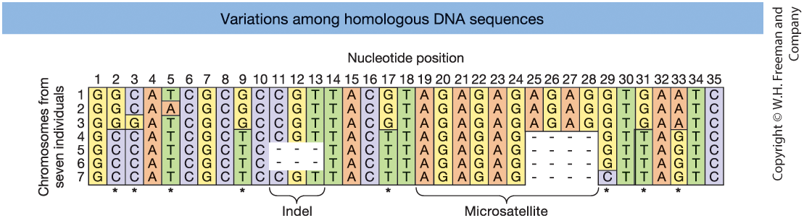{fig-align="center" width=80%}

 

**Figure 18-1.** Aligned DNA sequences from seven chromosomes.
Asterisks indicate SNPs. Indels and a microsatellite region are also shown.

::: notes
This figure shows aligned DNA sequences from seven different chromosomes.

Each row represents a chromosome from a different individual.
Each column represents a nucleotide position.

Notice that most positions are identical across individuals.
These are conserved sites.

The asterisks mark single nucleotide polymorphisms, or SNPs.
At these positions, at least one individual has a different base.

We also see insertions and deletions — called indels.
These occur when a stretch of nucleotides is either missing or inserted in some individuals.

Finally, the figure shows a microsatellite region.
This is a short repeated sequence.
Different individuals have different numbers of repeats.

The key idea:
A locus can exhibit several types of variation —
single-base differences, small insertions or deletions, and repeat-length variation.

All of these contribute to genetic diversity in populations.
:::

## From DNA to Genotype Data

::: {.columns}

::: {.column width="60%"}

Genomic technologies allow us to measure variation at thousands to millions of loci.

 

**Marker-based genotyping**

- Assay selected known variants  
  (SNP arrays, STR panels)  
- Efficient for large sample sizes  

**Sequencing-based approaches**

- Discover and genotype variants simultaneously  
- Provide richer genomic information  

Thousands to millions of SNPs can be genotyped simultaneously.

Large genotype datasets across many loci form the foundation of population genetic analysis.

:::

::: {.column width="40%"}

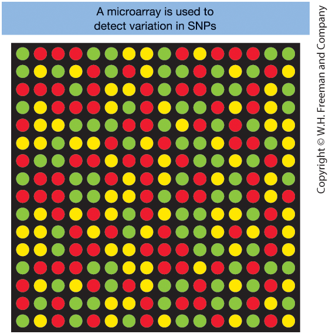{width=60%}

**Figure 18-2. Microarray for SNP genotyping**

- Each dot represents one SNP  
- Red and green = homozygous genotypes  
- Yellow = heterozygous genotype  

:::

:::

::: notes

Modern genomic technologies allow us to measure genetic variation
at thousands to millions of loci across the genome.

There are two main strategies.

Marker-based genotyping tests predefined variants,
such as SNP arrays or STR panels.
These methods are efficient and cost-effective for large sample sizes,
but they only assay known variants.

Sequencing-based approaches directly read DNA sequence.
They allow us to discover new variants
and determine genotypes at the same time.
Sequencing provides richer information
but requires more computational processing.

Regardless of the method,
the end result is a large genotype matrix:
many individuals × many loci.
That dataset is the foundation for population genetic analysis.

The figure shows a DNA microarray used for SNP genotyping.

Each dot corresponds to a specific SNP.
Color indicates genotype:
red and green are homozygotes,
yellow is heterozygous.

Fluorescent labeling allows thousands to millions of SNPs
to be genotyped simultaneously.

This technological development made modern population genetics possible.

:::

## Linked Loci, Haplotypes, and Phase

::: {.columns}

::: {.column width="55%"}

Although we analyzed loci individually, they are physically organized along chromosomes.

 

- Physically close loci recombine less often  
- Nearby alleles are often inherited together  

These combinations of alleles on the same chromosome are called **haplotypes**.

 

**Definition**

A haplotype = combination of alleles  
at multiple loci on the same chromosome.

:::

::: {.column width="45%"}

**Example: Two linked loci**

- Locus A: A / a  
- Locus B: B / b  

Possible haplotypes: **AB, Ab, aB, ab**

 

**Genotype vs. Haplotype (Phase)**

- Genotype (unphased):  Alleles present, ignoring chromosome origin  

- Haplotype (phased):  Alleles located on the same chromosome  

Same genotype can have different phases.

:::

:::

::: notes

Until now, we treated loci independently.

However, loci are arranged along chromosomes and may be physically close.

If two loci are close together,
recombination between them is less likely.

Therefore, nearby alleles are often inherited together.
This motivates the concept of a haplotype.

A haplotype is the combination of alleles
located on a single chromosome copy.

Remember that individuals are diploid —
they carry two homologous chromosomes,
each with its own haplotype.

For two linked loci A and B,
four possible haplotypes exist:
AB, Ab, aB, and ab.

Now consider phase.

A genotype tells us which alleles are present,
but not which alleles are on the same chromosome.

Two individuals can have the same genotype
but different haplotype arrangements.

This matters because recombination acts on chromosomes —
on haplotypes — not on genotypes.

Understanding haplotypes is essential for studying linkage disequilibrium and genetic mapping.

:::

## Visualizing Haplotypes and Their Relationships

::: {.columns}

::: {.column width="70%"}

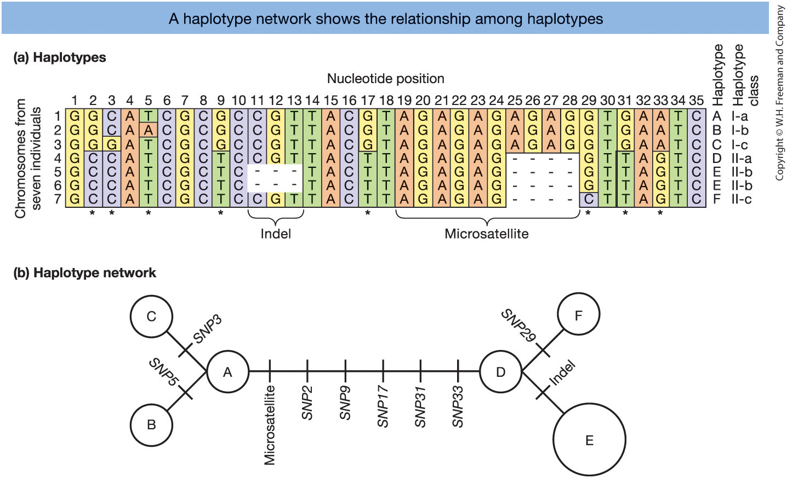{width=100%}

:::

::: {.column width="30%" }

**Figure 18-4.**  
(a) Six haplotypes (A–F) from aligned DNA sequences.  
(b) Haplotype network showing mutational relationships.  

  - Circles = haplotypes
  - Branches = mutations

:::

:::

::: notes
Panel (a) shows aligned DNA sequences from several chromosomes.
From these sequences, we identify six distinct haplotypes, labeled A through F.

Each haplotype represents a unique combination of alleles across the loci shown.

Panel (b) translates this sequence information into a haplotype network.

In the network:
- Each circle represents one haplotype.
- Lines connecting circles represent mutational steps.
- The number of differences between haplotypes corresponds to the mutations along the branches.

Closely connected haplotypes differ by only one or a few mutations.
More distant haplotypes differ at multiple sites.

This type of network helps us visualize evolutionary relationships among haplotypes.

Instead of just listing differences at individual SNPs, the network shows how haplotypes are related and how they may have evolved from one another.
:::

## Haplotype Network for Human mtDNA

::: {.columns}

::: {.column width="70%"}

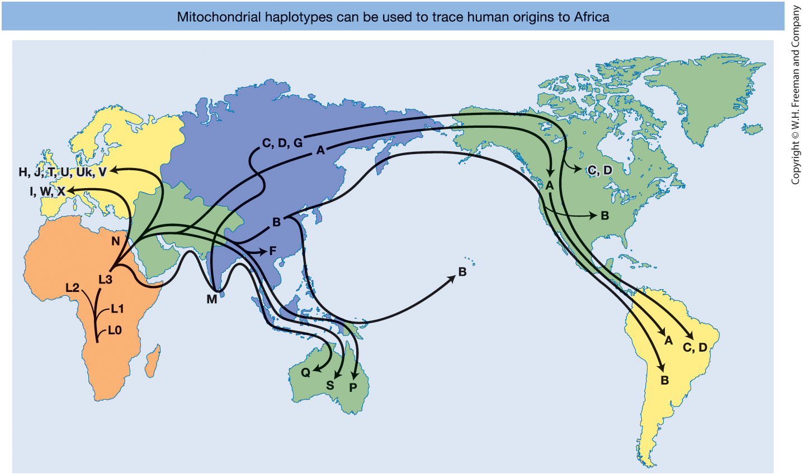{width=100%}

:::

::: {.column width="30%" }

**Figure 18-6** Human mitochondrial DNA haplotype network mapped globally.

- The ancestral **L haplogroup** appears in Africa  
- Derived haplogroups spread worldwide  
- Supports the *Out of Africa* model  

:::

:::

::: notes
This figure shows a haplotype network for human mitochondrial DNA, projected onto a world map.

Each circle represents a haplotype group.
Lines connecting circles represent mutational steps.

The ancestral haplogroup, labeled L, is found in Africa.
This indicates that modern human mitochondrial diversity originated in Africa.

From L, derived haplogroups arose.
One branch, L3, gave rise to haplogroups that left Africa.

These derived haplogroups spread into Europe, Asia, Oceania, and the Americas.

The pattern supports the "Out of Africa" model of modern human origins.

The key takeaway:
Haplotype networks can reconstruct evolutionary history and migration patterns.

Because mtDNA is inherited maternally and does not recombine,
it preserves clear lineage relationships over time.
:::

# 18.2 Gene pool concept and Hardy–Weinberg

## The gene pool concept

::: {.columns}

::: {.column width="50%"}

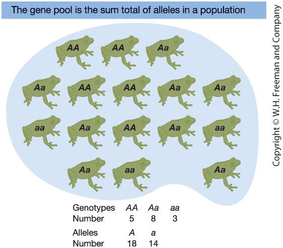{width=90%}

:::

::: {.column width="50%" }

**Figure 18-7. A frog gene pool**

Gene pool refers to the total collection of alleles in the population.

- a population of **N=16** frogs
- diploid and carries two alleles (**A** and **a**) at a single locus
- total number of alleles in the population is **2N=32**.
- count genotypes (**5 AA**, **8 Aa** and **3 aa**)
- count alleles (**18 A** and **14 a**)

:::

:::

::: notes
The gene pool refers to the total collection of alleles in the breeding members of a population at a given time.

In this example, we have a population of 16 frogs.

Each frog is diploid and carries two alleles, A and a, at a single locus.
So the total number of alleles in the population is 2N, or 32.

From the figure, we count:
5 AA homozygotes,
8 Aa heterozygotes,
and 3 aa homozygotes.

To describe the gene pool, we count alleles rather than genotypes.

Each AA frog contributes two A alleles.
Each Aa frog contributes one A and one a allele.
Each aa frog contributes two a alleles.

This gives:
18 copies of allele A,
and 14 copies of allele a.

So the gene pool at locus A consists of 18 A alleles and 14 a alleles.

This simple counting process is the foundation for calculating allele frequencies,
which we will use throughout population genetics.
:::

## Genotype Frequencies

::: {.columns}

::: {.column width="50%"}

**Definition**

Genotype frequency = proportion of individuals with a given genotype.

 

For a diploid locus with alleles A and a:

$$
f(AA) = \frac{\#AA}{N}
$$

$$
f(Aa) = \frac{\#Aa}{N}
$$

$$
f(aa) = \frac{\#aa}{N}
$$

Genotype frequencies must sum to 1:

$$
f(AA) + f(Aa) + f(aa) = 1
$$

:::

::: {.column width="50%"}

**Numerical example (N = 16 frogs)**

Counts:

- 5 AA  
- 8 Aa  
- 3 aa  

Frequencies:

$$
f(AA) = \frac{5}{16} = 0.31
$$

$$
f(Aa) = \frac{8}{16} = 0.50
$$

$$
f(aa) = \frac{3}{16} = 0.19
$$

Check: $0.31 + 0.50 + 0.19 = 1$

:::

:::

::: notes

Genotype frequency is the proportion of individuals
with a particular genotype in the population.

We calculate it by dividing the number of individuals
with that genotype by the total number of individuals, N.

Because these are proportions, they must sum to 1.

In the frog example, we have 16 individuals:
5 AA, 8 Aa, and 3 aa.

Dividing each count by 16 gives genotype frequencies of
0.31, 0.50, and 0.19.

If we add them together,
they sum to 1, as expected.

This confirms that the genotype frequencies
form a proper probability distribution.

:::

## Allele Frequencies

::: {.columns}

::: {.column width="50%"}

**Definition**

Instead of counting genotypes, we can count **alleles**.

For a diploid population:

$$
\text{Total number of alleles} = 2N
$$

Let:

- $p$ = frequency of allele A  
- $q$ = frequency of allele a  

Then:

$$
p = \frac{\#A}{2N}
\qquad
q = \frac{\#a}{2N}
$$

Allele frequencies must sum to 1:

$$
p + q = 1
$$

:::

::: {.column width="50%"}

**Numerical example (N=16 frogs)**

Total alleles:

$$
2N = 2 \times 16 = 32
$$

Allele counts:

- Number of A alleles = 18  
- Number of a alleles = 14  

Frequencies:

$$
p = \frac{18}{32} = 0.56
$$

$$
q = \frac{14}{32} = 0.44
$$

Check: $0.56 + 0.44 = 1$

:::

:::

::: notes

We can describe the gene pool more simply by counting alleles rather than genotypes.

Because individuals are diploid, each carries two alleles at a locus.
So in a population of size N, the total number of alleles is 2N.

In the frog example, N = 16.
Therefore, there are 32 alleles in total.

From our genotype counts:

AA individuals contribute two A alleles each.
Aa individuals contribute one A and one a.
aa individuals contribute two a alleles each.

This gives 18 copies of A and 14 copies of a.

We define:

p as the frequency of allele A,
q as the frequency of allele a.

Dividing by 32 gives p = 0.56 and q = 0.44.

Because these are frequencies, they must sum to 1.

Notice that we have now summarized the entire gene pool using just two numbers: p and q.

This simplification becomes powerful when we introduce Hardy–Weinberg equilibrium.

:::

## From Alleles to Genotypes: Hardy–Weinberg Law

::: {.columns}

::: {.column width="50%"}

**Hardy–Weinberg Law**

 

If mating is random:

$$
f(AA) = p^2
$$

$$
f(Aa) = 2pq
$$

$$
f(aa) = q^2
$$

$$
p^2 + 2pq + q^2 = 1
$$

If the Hardy–Weinberg assumptions hold, **allele frequencies remain constant from generation to generation**, and the population is in equilibrium.

:::

::: {.column width="50%"}

**Why does this work?**

Allele frequency = probability of drawing that allele from the gene pool.

 

Let:

- $p$ = frequency of allele A  
- $q$ = frequency of allele a  

When gametes combine at random:

$$
f(AA) = p \times p = p^2
$$

$$
f(aa) = q \times q = q^2
$$

$$
f(Aa) = p \times q + q \times p = 2pq
$$

:::

:::

::: notes

Let us first state the result.

Under random mating, genotype frequencies are
p², 2pq, and q².

These must sum to 1,
giving p² + 2pq + q² = 1.

This is the Hardy–Weinberg law.

If all Hardy–Weinberg assumptions hold,
allele frequencies remain constant across generations.
That is what we mean by equilibrium.

Now, why does this work?

Because allele frequencies can be interpreted as probabilities.

If p is the frequency of allele A,
then p is also the probability that a randomly chosen gamete carries A.

Similarly, q is the probability of drawing allele a.

When two gametes combine at random,
we multiply probabilities.

AA occurs with probability p × p = p².
aa occurs with probability q × q = q².

For heterozygotes,
there are two possible combinations:
A from one parent and a from the other,
or the reverse.

So the total probability is 2pq.

Hardy–Weinberg therefore follows directly
from simple probability under random mating.

If observed genotype frequencies deviate from these expectations,
some evolutionary force must be acting.

:::

## Why Hardy–Weinberg Matters

- Provides a **null model** for evolution
- Predicts genotype frequencies from allele frequencies
- Allows detection of evolutionary forces
- Establishes when a population is in **equilibrium**

::: notes
Hardy–Weinberg is foundational in population genetics.

It provides a baseline expectation.

If observed genotype frequencies match p², 2pq, and q²,
the population is consistent with random mating and no evolutionary forces.

If they deviate,
something is happening —
selection, non-random mating, drift, or structure.

Hardy–Weinberg does not describe how evolution occurs.
It tells us what happens when evolution is absent.

It is the starting point for all population genetic theory.
:::

## Hardy–Weinberg: Assumptions and Violations

::: {.columns}

::: {.column width="50%"}

**Hardy–Weinberg applies only if:**

1. Random mating  
2. No differential survival (no selection)  
3. No population subdivision  
4. Infinitely large population size  

These conditions define the **null model**.

:::

::: {.column width="50%"}

**Violations occur when:**

- **Non-random mating**  
  Individuals mate preferentially  

- **Natural selection**  
  Some genotypes have reduced survival or reproduction  

- **Population structure**  
  Subpopulations differ in allele frequencies  

- **Finite population size**  
  Random sampling effects (genetic drift)  

Deviations from Hardy–Weinberg  
suggest evolutionary forces are acting.

:::

:::

::: notes

Hardy–Weinberg is a null model.
It describes what genotype frequencies look like
if no evolutionary forces are operating.

For it to hold, several assumptions must be met.

Mating must be random with respect to the locus.
All genotypes must have equal survival and reproduction.
The population must not be subdivided.
And the population must be infinitely large,
so there are no random sampling effects.

If these assumptions are violated,
genotype frequencies may deviate from Hardy–Weinberg expectations.

Non-random mating can increase homozygosity.

Natural selection changes genotype frequencies
if some genotypes have reduced fitness.

Population subdivision can create deviations,
a phenomenon known as the Wahlund effect.

Finite population size leads to genetic drift —
random fluctuations in allele frequencies.

When we observe deviations from Hardy–Weinberg,
it suggests that one or more evolutionary forces are acting.

:::

## From Genotype to Allele Frequencies

::: {.columns}

::: {.column width="50%"}

**Mathematical relationship**

At a locus with two alleles (A and a):

Let genotype frequencies be:

$$
f(AA)
$$  

$$
f(Aa)
$$  

$$
f(aa)
$$  

Allele frequencies:

$$
p = f(AA) + \tfrac{1}{2} f(Aa)
$$

$$
q = f(aa) + \tfrac{1}{2} f(Aa)
$$

$$
p + q = 1
$$

:::

::: {.column width="50%"}

**Intuition**

Each individual carries two alleles.

- AA contributes **two A alleles**
- Aa contributes **one A and one a**
- aa contributes **two a alleles**

Therefore:

- Heterozygotes contribute half to each allele
- Allele frequencies are weighted averages of genotype frequencies

This allows us to move back and forth  
between genotype and allele frequencies.

:::

:::

::: notes

Now we move in the opposite direction.

Previously, we calculated genotype frequencies from allele frequencies using Hardy–Weinberg.
Here, we start with genotype frequencies and recover allele frequencies.

Suppose we know the frequencies of the three genotypes:
f(AA), f(Aa), and f(aa).

Each individual carries two alleles.
So allele frequencies are determined by how genotypes contribute alleles to the gene pool.

AA individuals contribute only A alleles.
So their entire frequency contributes to allele A.

aa individuals contribute only a alleles.
So their entire frequency contributes to allele a.

Heterozygotes Aa carry one A and one a.
Therefore, half of the heterozygote frequency contributes to A,
and half contributes to a.

That is why:

p equals f(AA) plus one half of f(Aa).

q equals f(aa) plus one half of f(Aa).

Notice that allele frequencies are weighted averages of genotype frequencies.

Finally, because every allele is either A or a,
p plus q must equal 1.

This relationship allows us to move back and forth
between genotype frequencies and allele frequencies —
which is essential when testing Hardy–Weinberg equilibrium.

:::

## Hardy–Weinberg Test: Theory and Example

::: {.columns}

::: {.column width="50%"}

**Hardy–Weinberg Test (Theory Template)**

 

|                      | A/A | A/G | G/G | Sum |
|----------------------|-----|-----|-----|-----|
| **Observed number**  | $N_{AA}$ | $N_{AG}$ | $N_{GG}$ | $N$ |
| **Observed frequency** | $\dfrac{N_{AA}}{N}$ | $\dfrac{N_{AG}}{N}$ | $\dfrac{N_{GG}}{N}$ | $1$ |
| **Expected frequency** | $p^2$ | $2pq$ | $q^2$ | $1$ |
| **Expected number ($E$)** | $Np^2$ | $N(2pq)$ | $Nq^2$ | $N$ |
| **$\chi^2$ contribution** | $\dfrac{(N_{AA}-E_{AA})^2}{E_{AA}}$ | $\dfrac{(N_{AG}-E_{AG})^2}{E_{AG}}$ | $\dfrac{(N_{GG}-E_{GG})^2}{E_{GG}}$ | $\chi^2$ |

 

$p$ = frequency of allele A  
$q$ = frequency of allele G  
$p + q = 1$

:::

::: {.column width="50%"}

**Example: SNP rs9272426 (HLA-DQA1)**

 

|                      | A/A   | A/G   | G/G   | Sum |
|----------------------|-------|-------|-------|-----|
| **Observed number**  | 17    | 55    | 12    | 84  |
| **Observed frequency** | 0.202 | 0.655 | 0.143 | 1   |
| **Expected frequency** | 0.281 | 0.498 | 0.221 | 1   |
| **Expected number**  | 23.574 | 41.851 | 18.574 | 84  |
| **$\chi^2$ contribution** | 1.833 | 4.131 | 2.327 | 8.29 |

 

Total $\chi^2 = 8.29$

Compare to $\chi^2_{(1 \text{ df})}$ to test equilibrium.

*Data source: International HapMap Project*

:::

:::

::: notes

The left panel shows the general structure of a Hardy–Weinberg test.

We begin with observed genotype counts.

From those counts, we calculate observed frequencies.

Next, we estimate allele frequencies p and q.

Using Hardy–Weinberg expectations, we compute expected genotype frequencies:
p², 2pq, and q².

Multiplying by N gives expected genotype counts.

We then calculate a chi-square contribution for each genotype:
(observed − expected)² divided by expected.

Summing these gives the total chi-square statistic.

The right panel shows a real example.

We apply exactly the same structure to a SNP in HLA-DQA1.

After calculating expected counts,
we obtain a total chi-square value of 8.29.

Because allele frequency is estimated from the data,
the test has 1 degree of freedom.

We compare 8.29 to the chi-square distribution with 1 degree of freedom
to determine whether the deviation is statistically significant.

This illustrates how the theoretical template becomes a practical statistical test.

:::

## The Chi-Square Test for HWE

::: {.columns}

::: {.column width="50%"}

**Computation**

We test whether observed genotype counts
deviate from Hardy–Weinberg expectations.

For each genotype:

$$
\chi^2_i = \frac{(O - E)^2}{E}
$$

- $O$ = observed count  
- $E$ = expected count under HWE  

Total test statistic:

$$
\chi^2 = \sum \frac{(O - E)^2}{E}
$$

:::

::: {.column width="50%"}

**Inference**

Compare $\chi^2$ to the chi-square distribution.

For a biallelic locus:

- **1 degree of freedom**

Why 1 df?

Once $p$ is estimated,
expected genotype frequencies are fixed.

If $\chi^2$ is large $\Rightarrow$  
deviation from HWE.

Large deviation suggests:

- Non-random mating  
- Selection  
- Population structure  
- Genetic drift  

:::

:::

::: notes

The left panel shows how we compute the test statistic.

For each genotype, we compare
the observed count to the expected count under HWE.

We subtract expected from observed,
square the difference,
and divide by the expected value.

Dividing by E scales the deviation
relative to how large that class is expected to be.

We then sum across genotypes
to obtain the total chi-square statistic.

The right panel explains the inference step.

We compare the calculated chi-square value
to the chi-square distribution.

For a biallelic locus, the test has 1 degree of freedom.

Although there are three genotype classes,
once we estimate the allele frequency p,
the expected genotype frequencies are determined.
That removes one degree of freedom.

If the chi-square value is large,
we reject Hardy–Weinberg equilibrium.

A significant deviation suggests that
one or more evolutionary forces are acting.

:::

# 18.3 Mating systems and inbreeding

## Random Mating and Hardy–Weinberg

::: {.columns}

::: {.column width="50%"}

**Random mating (HWE assumption)**

- Every individual equally likely to mate
- Mate choice independent of genotype

If random mating holds:

- Genotype frequencies follow $p^2, 2pq, q^2$
- Allele frequencies remain constant

:::

::: {.column width="50%"}

**If mating is not random**

Hardy–Weinberg proportions may not hold.

Common violations:

- Assortative mating  
- Disassortative mating  
- Isolation by distance  
- Inbreeding  

:::

:::

::: notes

Random mating is one of the core assumptions of Hardy–Weinberg equilibrium.

It means that individuals choose mates independently of their genotype
at the locus we are studying.

Importantly, random mating refers to randomness **with respect to that locus**.
Individuals may not mate randomly overall —
but as long as genotype does not influence mate choice,
the assumption holds for that gene.

If random mating holds,
genotype frequencies in the next generation follow
p², 2pq, and q².

Under the full set of Hardy–Weinberg assumptions,
allele frequencies remain constant from generation to generation.
That is what we mean by equilibrium.

However, if mating is not random,
Hardy–Weinberg genotype proportions may not hold.

Crucially, non-random mating often changes
**genotype frequencies**
without necessarily changing
**allele frequencies**.

Common mechanisms include:

Assortative mating — individuals prefer similar mates.

Disassortative mating — individuals prefer dissimilar mates.

Isolation by distance — individuals mate locally.

Inbreeding — mating between relatives.

In the next slides, we will see how each of these
alters genotype proportions in predictable ways.

:::

## Mate Choice and Genotype Frequencies

::: {.columns}

::: {.column width="50%"}

**Positive assortative mating**

- Similar individuals mate
- Example: tall × tall

Effect:

- Excess of **homozygotes**
- Deviation from HWE
- Allele frequencies unchanged

:::

::: {.column width="50%"}

**Negative assortative mating**

- Dissimilar individuals mate
- Example: self-incompatibility (S locus) in *Brassica*

Effect:

- Excess of **heterozygotes**
- Deviation from HWE
- Allele frequencies unchanged

:::

:::

::: notes

Now we focus on mate choice at the individual level.

In positive assortative mating,
individuals preferentially mate with others who are similar.

If similarity has a genetic basis,
this increases the probability that similar alleles meet in offspring.

As a result, we observe an excess of homozygotes
relative to Hardy–Weinberg expectations.

Importantly, assortative mating does not automatically change allele frequencies.
It changes how alleles are combined into genotypes.

In contrast, negative assortative mating
occurs when individuals preferentially mate with those who are genetically different.

This increases the probability that different alleles meet,
producing an excess of heterozygotes.

A classic example is self-incompatibility in plants such as *Brassica*.
Plants reject pollen carrying their own S alleles,
which prevents self-fertilization
and promotes heterozygosity.

Again, allele frequencies may remain unchanged,
but genotype proportions shift.

This illustrates an important principle:

Non-random mating changes genotype frequencies,
but does not necessarily change allele frequencies.

That distinction is crucial when interpreting deviations
from Hardy–Weinberg equilibrium.

:::

## Disassortative Mating: The MHC Example

::: {.columns}

::: {.column width="50%"}

**Major Histocompatibility Complex (MHC)**

- Influences immune recognition
- Affects body odor in vertebrates
- Mate choice influenced by MHC genotype

:::

::: {.column width="50%"}

**Evolutionary consequence**

- Preference for different MHC haplotypes
- Increased heterozygosity
- Potential fitness advantage

Example:
Tuscany HLA-DQA1 SNP shows heterozygote excess

:::

:::

::: notes

This slide provides a concrete biological example of disassortative mating.

The Major Histocompatibility Complex, or MHC,
plays a central role in immune recognition.
It encodes proteins that present pathogen-derived peptides to immune cells.

MHC genes are highly polymorphic,
meaning many alleles are maintained in populations.

In several vertebrates, including humans,
MHC genotype influences body odor.
Experiments have shown that individuals often prefer the scent
of potential mates who carry different MHC alleles than their own.

This pattern represents negative assortative mating:
individuals preferentially choose genetically dissimilar mates.

What is the evolutionary consequence?

If individuals mate with partners carrying different MHC haplotypes,
offspring are more likely to be heterozygous at MHC loci.

MHC heterozygotes may recognize a broader range of pathogens,
which can provide a fitness advantage.

In the Tuscany sample at the HLA-DQA1 SNP,
we observe an excess of heterozygotes relative to Hardy–Weinberg expectations.

This illustrates how mate choice can generate
predictable deviations from Hardy–Weinberg proportions,
potentially driven by natural selection for immune diversity.

Importantly, this is a case where behavior,
genetics, and evolutionary fitness are directly linked.

:::

## Spatial Mating and Population Structure

::: {.columns}

::: {.column width="50%"}

**Isolation by distance**

- Individuals mate locally
- Limited gene flow across space
- Gradual geographic allele differences

:::

::: {.column width="50%"}

**Population structure**

- Subpopulations have different allele frequencies
- Each may follow HWE locally

If combined:

$\Rightarrow$ Excess of **homozygotes**
$\Rightarrow$ **Wahlund effect**

:::

:::

::: notes

Now we move from individual mate choice
to spatial and population-level processes.

First, isolation by distance.

In many species, individuals mate locally.
A fish is more likely to mate with another fish in the same lake
than with one hundreds of kilometers away.
Plants exchange pollen primarily with nearby plants.

Because dispersal is limited,
gene flow decreases with distance.

Over time, this produces gradual geographic differences
in allele frequencies.

This spatial pattern is called isolation by distance.

Now consider population structure more generally.

A species may be divided into partially isolated subpopulations.
Each subpopulation can follow Hardy–Weinberg equilibrium internally,
with its own allele frequencies.

However, if we ignore this structure
and pool all individuals into a single sample,
we will often observe an excess of homozygotes.

Why?

Because we are mixing groups
that have different allele frequencies.

This phenomenon is called the Wahlund effect.

It produces a deficit of heterozygotes
relative to Hardy–Weinberg expectations,
even though no evolutionary force is acting within each subpopulation.

This is extremely important in practice:
a heterozygote deficit does not automatically imply selection or inbreeding —
it may simply reflect hidden population structure.

:::

## Summary: Violations of Random Mating

| Mechanism | Changes Allele Frequencies? | Changes Genotype Frequencies? | Typical Pattern |
|-----------|-----------------------------|-------------------------------|-----------------|
| Positive assortative mating | No | Yes | Excess homozygotes |
| Negative assortative mating | No | Yes | Excess heterozygotes |
| Inbreeding | No (initially) | Yes | Excess homozygotes |
| Isolation by distance | Yes (spatially) | Yes | Gradual structure |
| Population subdivision | Yes (between groups) | Yes | Wahlund effect |

::: notes

This table summarizes how different violations of random mating
affect genetic variation.

The key distinction to keep in mind is:

Does the mechanism change allele frequencies,
or does it only change how alleles are combined into genotypes?

Positive assortative mating increases homozygosity,
but allele frequencies do not necessarily change.
It alters genotype proportions only.

Negative assortative mating increases heterozygosity,
again without necessarily changing allele frequencies.

Inbreeding also increases homozygosity.
Initially, allele frequencies remain the same,
but genotype frequencies shift toward more homozygotes.

Isolation by distance is different.
Because gene flow is limited across space,
allele frequencies can vary geographically.
So both allele frequencies and genotype frequencies change across regions.

Population subdivision produces an important statistical effect.
Each subpopulation may follow Hardy–Weinberg equilibrium locally,
but when subpopulations with different allele frequencies are combined,
we observe an excess of homozygotes.
This is the Wahlund effect.

The main takeaway is:

A deviation from Hardy–Weinberg does not automatically imply selection.

Different mechanisms leave different signatures,
and careful interpretation is required.

This table provides a conceptual map
for diagnosing why Hardy–Weinberg might be violated.

:::

## Geographic Gradients in Allele Frequency

::: {.columns}

::: {.column width="65%"}

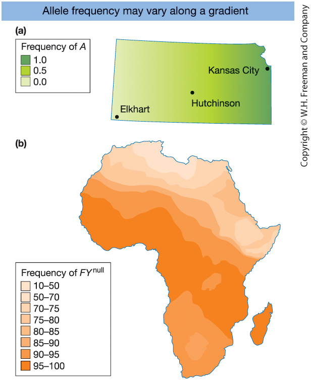{width=60%}

:::

::: {.column width="35%" }

**Figure 18-11**

(a) Hypothetical sunflower allele frequency gradient across Kansas  
(b) Duffy blood group allele ($FY^{0}$) frequency across Africa  

$\Rightarrow$ Geographic variation produces  
**population structure**

 

**Local equilibrium ≠ global equilibrium**

:::
:::

::: notes
These maps illustrate geographic gradients in allele frequency.

In panel (a), a hypothetical sunflower species shows a smooth gradient across Kansas.
The A allele is common in the northeast,
intermediate in the center,
and rare in the southwest.

In panel (b), the Duffy blood group allele FY⁰ shows strong geographic structure in Africa.
It is very common in central Africa,
less common in eastern and northern Africa,
and rare outside Africa.

Because individuals mate locally,
allele frequencies differ between regions.

Each region may satisfy Hardy–Weinberg equilibrium on its own.
However, when we combine individuals across regions,
we often observe excess homozygotes.

This is the key idea:
Local equilibrium does not imply global equilibrium.

Geographic structure alone can cause deviation from Hardy–Weinberg expectations.
:::

## The Inbreeding Coefficient ($F$)

::: {.columns}

::: {.column width="50%"}

**Definition**

Inbreeding increases the probability that:

$\Rightarrow$ Two alleles in an individual are  
**identical by descent (IBD)**

$$
F = P(\text{two alleles are IBD})
$$

IBD = both alleles trace back  
to the same ancestral copy.

:::

::: {.column width="50%"}

**Biological consequence**

As $F$ increases:

- Homozygosity increases
- Recessive alleles are more often expressed
- Risk of **inbreeding depression** increases

Risk depends on:

1. Frequency of deleterious alleles  
2. Degree of inbreeding ($F$)

:::

:::

::: notes

Inbreeding increases the chance that both alleles at a locus
come from the same ancestral allele copy.

When this happens, the alleles are identical by descent.

The inbreeding coefficient F
is the probability of this occurring.

As F increases,
expected homozygosity increases.

This raises the probability
that recessive deleterious alleles are expressed,
which can lead to inbreeding depression.

The impact depends both on allele frequency
and on F.

:::

## Example: Half-Sib Mating

::: {.columns}

::: {.column width="50%"}

Half-sibs share one common parent.

Offspring inbreeding coefficient:

$$
F = \frac{1}{8}
$$

If the shared parent is not inbred.

:::

::: {.column width="50%"}

**Interpretation**

At any locus:

$\Rightarrow$ 12.5% probability  
that two alleles are identical by descent.

If the common ancestor is already inbred:

$$
F = \frac{1}{8}(1 + F_A)
$$

:::

:::

::: notes

Half-siblings share one parent.

Tracing the inheritance path,
there is a probability of 1/8
that the offspring receives two alleles
that descend from the same ancestral copy.

This means 12.5% of loci
are expected to be homozygous due to identity by descent.

If the shared ancestor is already inbred,
that probability increases.

:::

## Inbreeding Coefficient: Path Method

For individual $X$ whose parents share ancestor $A$:

$$
F_X = \sum_A \left(\frac{1}{2}\right)^{n_1+n_2+1}(1+F_A)
$$

Where:

- $n_1$ = generations from $A$ to parent 1  
- $n_2$ = generations from $A$ to parent 2  
- $F_A$ = inbreeding coefficient of ancestor $A$

::: notes
This is the compact “path method” used in pedigrees.

The idea is: the offspring is inbred if the two alleles it receives can trace back to the same ancestral allele copy.

For each common ancestor A of the two parents, we count the number of generational steps from A down to each parent.
Those are n1 and n2.

Each parent must transmit the allele down the path to the offspring.
Each meiosis contributes a factor of 1/2, which is why we raise (1/2) to (n1 + n2 + 1).
The “+1” accounts for the final step of combining the two parental alleles into the offspring.

The term (1 + F_A) accounts for the possibility that the ancestor A is itself inbred.
If A is not inbred, then F_A = 0 and the factor becomes 1.

For a half-sib mating, the parents share one common parent A, and each is one generation from A.
So n1 = 1 and n2 = 1, giving F = 1/8 (or 12.5%) when A is not inbred.
:::

## Inbreeding and Genetic Disorder Risk

::: {.columns}

::: {.column width="65%"}

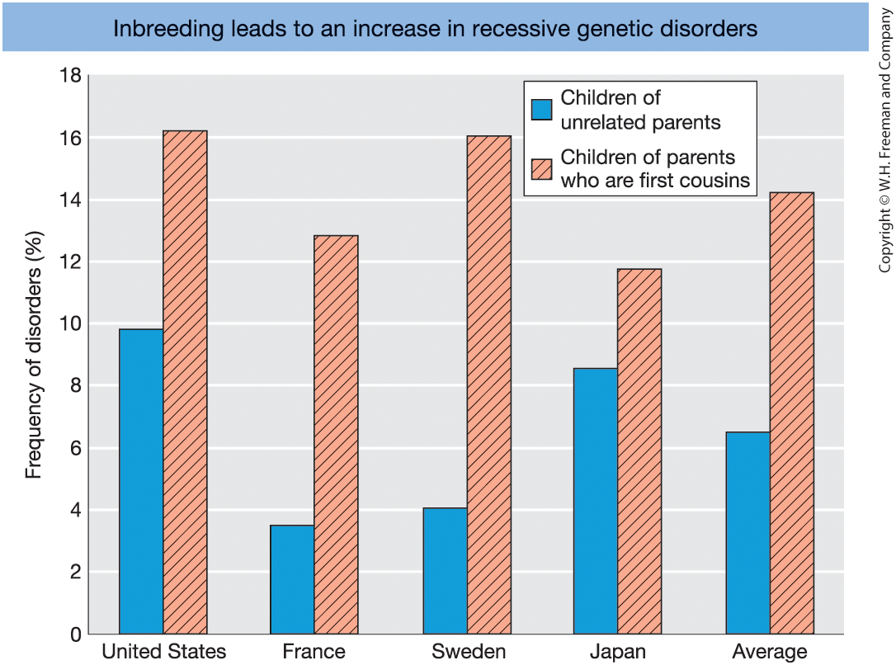{width=60%}

:::

::: {.column width="35%" }

**Figure 18-13** Frequency of genetic disorders among children of unrelated parents (blue columns) compared to that of children of parents who are first cousins (red columns with diagonal lines). [Data from C. Stern, Principles of Human Genetics, W. H. Freeman, 1973.]

:::
:::

::: notes
This figure compares the frequency of genetic disorders
among children of unrelated parents
and children of first-cousin marriages.

Across multiple countries,
the frequency of genetic disorders
is consistently higher among offspring of first cousins.

For example, the average frequency increases
from roughly 6 percent to about 14 percent.

Why does this happen?

First cousins share approximately one-eighth of their genes.
Their children therefore have an inbreeding coefficient of F = 1/16.

Because relatives share alleles inherited from common ancestors,
their offspring are more likely to be homozygous
for recessive deleterious alleles.

This increased homozygosity explains
the higher risk of inherited disorders.

Importantly, inbreeding does not create new deleterious alleles.
It increases the probability that existing recessive alleles are expressed.
:::

## Inbreeding Increases in Small Populations

::: {.columns}

::: {.column width="65%"}

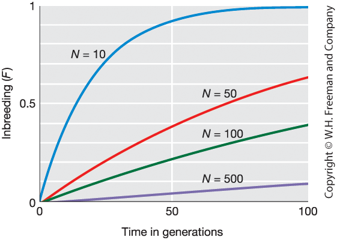{width=60%}

:::

::: {.column width="35%" }

**Figure 18-13**

Increase in inbreeding coefficient ($F$) over generations for different population sizes ($N$).

 

Smaller $N$ $\Rightarrow$ Faster increase in $F$

:::
:::

::: notes
This figure shows how the inbreeding coefficient F increases over time
in populations of different sizes.

The key pattern is very clear:

The smaller the population size,
the faster inbreeding accumulates.

In very small populations, such as N = 10,
F rises quickly and eventually approaches 1.
That means individuals become completely homozygous due to drift.

In larger populations, such as N = 500,
F increases much more slowly.

This occurs because random genetic drift
causes alleles to become identical by descent more rapidly
when population size is small.

Importantly, this increase in inbreeding happens
even without deliberate mating between relatives.

Finite population size alone leads to increasing homozygosity over time.

This is why small or isolated populations
are at higher risk of inbreeding depression
and loss of genetic variation.
:::

# 18.4 Sources and Structure of Genetic Variation

## Measuring Genetic Variation

::: {.columns}

::: {.column width="50%"}

**Theory: How do we measure variation?**

For a DNA region:

1. **Segregating sites ($S$)**  
   Number of polymorphic nucleotide positions

2. **Number of haplotypes ($N_H$)**  
   Distinct sequence types observed

3. **Allele frequencies ($p_i$)**  

4. **Gene diversity (GD)**  
   $$GD = 1 - \sum p_i^2$$

5. **Nucleotide diversity ($\pi$)**  
   Average pairwise nucleotide differences per site

:::

::: {.column width="50%"}

**Numerical example: G6PD (5102 bp)**

Sample:

- 47 men worldwide  
- 18 polymorphic sites  
- 5084 invariant sites  

Worldwide allele frequencies:

- $B = 0.83$
- $A^{-} = 0.13$
- $A = 0.04$

Regional diversity:

| Population   | Gene Diversity | Nucleotide Diversity |
|--------------|----------------|----------------------|
| Africans     | 0.47           | 0.0008               |
| Non-Africans | 0.00           | 0.0002               |

Africans show substantially higher genetic variation.

:::

:::

::: notes

The left panel introduces general measures of genetic variation.

Segregating sites, S, simply count how many positions are variable.
This depends strongly on sample size.

The number of haplotypes counts distinct sequence types,
but also increases with sampling effort.

Allele frequencies provide a more stable description.

From allele frequencies, we compute gene diversity,
which is the probability that two randomly chosen alleles differ.

Nucleotide diversity, pi,
averages pairwise differences across nucleotide sites.
It reflects the overall level of sequence variation.

The right panel shows the G6PD example.

Out of 5102 base pairs,
only 18 are polymorphic.

Worldwide allele frequencies show that the B allele dominates,
but there is regional variation.

In Africans, gene diversity and nucleotide diversity are substantially higher.

This illustrates two important principles:

First, most DNA sites are invariant.
Second, levels of variation can differ dramatically between populations.

These measures allow us to quantify and compare genetic diversity.

:::

## Nucleotide Diversity Across Species

::: {.columns}

::: {.column width="65%"}

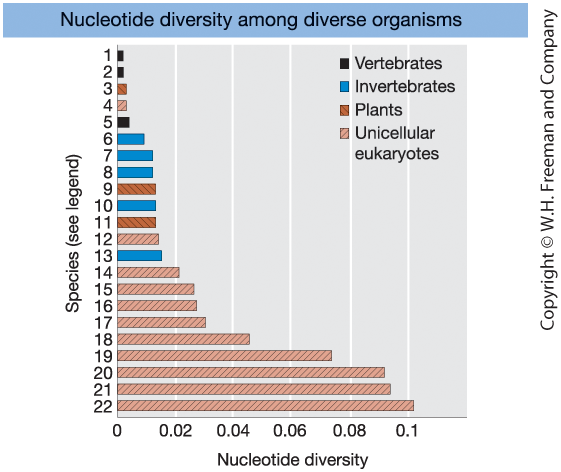{width=60%}

:::

::: {.column width="35%" }

**Figure 18-15**

Levels of nucleotide diversity  
at synonymous (silent) sites  
in diverse organisms.

 

Key pattern:

- Vertebrates $\Rightarrow$ low diversity  
- Invertebrates & plants $\Rightarrow$ moderate  
- Many unicellular eukaryotes $\Rightarrow$ high  

:::
:::

::: notes
This figure compares nucleotide diversity across many species.

The horizontal axis shows nucleotide diversity,
which measures the average probability that two sequences differ at a site.

Vertebrates, including humans and mice,
show relatively low nucleotide diversity —
typically below 0.005.

Invertebrates and plants tend to have higher diversity.

Many unicellular eukaryotes show even higher levels,
often above 0.02.

Why does this pattern occur?

Nucleotide diversity is strongly influenced by effective population size.

Species with large effective population sizes
retain more genetic variation.

Many unicellular organisms have enormous population sizes,
which leads to high diversity.

In contrast, vertebrates generally have smaller effective population sizes,
which leads to lower nucleotide diversity.

This pattern illustrates a key principle:
Genetic diversity reflects long-term effective population size.
:::

# 18.5 Evolutionary Forces

## Forces That Modulate Genetic Variation

::: {.columns}

::: {.column width="50%"}

**Evolutionary forces**

- **Mutation**  
  Creates new alleles  

- **Migration (gene flow)**  
  Introduces alleles from other populations  

- **Recombination**  
  Reshuffles alleles into new haplotypes  

- **Genetic drift**  
  Random sampling effects in finite populations  

- **Selection**  
  Differential reproductive success  

:::

::: {.column width="50%"}

**What these forces determine**

- How new alleles enter populations  
- How alleles are removed  
- How allele frequencies change over time  
- How allele combinations are structured  
- How populations diverge  

Together, these forces determine  
the evolutionary trajectory of populations.

:::

:::

::: notes

Population genetics seeks to explain
why allele frequencies change over time.

The left panel lists the five fundamental evolutionary forces.

Mutation generates new variation.

Migration, or gene flow,
moves alleles between populations.

Recombination reshuffles alleles,
creating new haplotypes.

Genetic drift causes random fluctuations
in allele frequencies due to finite population size.

Selection changes allele frequencies systematically
when some genotypes leave more offspring than others.

The right panel emphasizes what these forces control.

They determine how variation enters populations,
how it is removed,
how allele frequencies shift,
and how genetic structure emerges.

Together, they explain the evolutionary dynamics
of genetic variation.

:::

## Mutation: Source and Measurement

::: {.columns}

::: {.column width="50%"}

**Mutation: the source of new alleles**

Mutation introduces new alleles into the gene pool.

- Mutation rate = probability of change per generation  
- Symbol: $\mu$

Key points:

- SNP mutation rates are **low**
- Microsatellite mutation rates are **much higher**
- Large genomes $\Rightarrow$ many new mutations per generation

:::

::: {.column width="50%"}

**Estimating mutation rates**

Pedigree-based approach:

- Start with a known founder (often homozygous)
- Track descendants over generations
- Sequence genomes
- Count **new mutations**

Because mutations are rare,
many nucleotides must be sequenced
to estimate $\mu$ reliably.

:::

:::

::: notes

Mutation is the ultimate source of all genetic variation.
Without mutation, no new alleles could arise.

The mutation rate, denoted by mu,
is the probability that an allele changes
to another allelic form in one generation.

For SNPs, mutation rates per nucleotide are very low.
Microsatellites, in contrast,
mutate much more frequently.

Even though per-site mutation rates are low,
large genomes contain billions of nucleotides,
so many new mutations arise each generation.

Most new mutations are neutral,
some are deleterious,
and a few may be beneficial.

The right panel shows how we estimate mutation rates.

A common method is pedigree-based sequencing.
We compare DNA sequences of parents and offspring
and identify mutations that were not present in the parents.

Because mutations are rare,
we must sequence very large amounts of DNA
to observe enough events to estimate mu precisely.

:::

## Migration (Gene Flow) and Admixture

::: {.columns}

::: {.column width="50%"}

**Migration (gene flow)**

Movement of individuals or gametes
between populations.

Consequences:

- Introduces new alleles
- Increases genetic variation
- Reduces divergence among subpopulations
- Counteracts genetic drift

:::

::: {.column width="50%"}

**Genetic admixture**

Result of gene flow between previously separated populations.

- Individuals inherit DNA from multiple ancestral populations
- Genomes become mosaics of ancestry segments
- Common in humans and many other species

Admixture is the genomic signature of migration.

:::

:::

::: notes

Besides mutation, migration is the only way
to introduce new alleles into a population.

Migration, or gene flow,
occurs when individuals or gametes move between populations
and reproduce.

Gene flow increases genetic variation within populations
and reduces divergence between populations.

In this sense, migration counteracts genetic drift,
which tends to increase divergence.

The genomic consequence of migration is admixture.

When previously separated populations interbreed,
individual genomes become mosaics
containing segments of ancestry from different sources.

These ancestry blocks can be detected
using genome-wide genetic markers.

Admixture therefore provides direct evidence
of historical gene flow.

:::

## Recombination and New Haplotypes

::: {.columns}

::: {.column width="50%"}

**Parental haplotypes (before recombination)**

Consider two linked loci:

- Locus A: A / a  
- Locus B: B / b  

Suppose the original haplotypes are:

- $AB$  
- $ab$

These combinations are inherited together
because the loci are physically linked.

:::

::: {.column width="50%"}

**Recombinant haplotypes (after crossover)**

A crossover between loci A and B can generate:

- $Ab$  
- $aB$

Recombination:

- Does **not** create new alleles  
- Creates new combinations of existing alleles  
- Increases haplotype diversity  

Over time, recombination reshapes
patterns of genetic variation across loci.

:::

:::

::: notes

Recombination reshuffles alleles across loci during meiosis.

Importantly, recombination does not introduce new alleles.
Only mutation can do that.

Instead, recombination creates new combinations
of alleles that already exist in the population.

In this example, we start with two parental haplotypes:
AB and ab.

Because the loci are linked,
these combinations tend to be inherited together.

However, if a crossover occurs between the two loci,
we can generate two new haplotypes:
Ab and aB.

These are called recombinant haplotypes.

Recombination therefore increases haplotype diversity,
even if allele frequencies remain unchanged.

This reshuffling is crucial because
selection often acts on combinations of alleles,
not just individual loci.

:::

## Linkage Disequilibrium (LD)

::: {.columns}

::: {.column width="50%"}

**Linkage equilibrium**

Two loci are in linkage equilibrium  
when haplotypes occur as expected by chance.

If alleles combine independently:

$$
P_{AB} = p_A p_B
$$

That is, the frequency of haplotype $AB$  
equals the product of the allele frequencies.

 

**Linkage disequilibrium (LD)**

If:

$$
P_{AB} \neq p_A p_B
$$

then alleles are associated **non-randomly**  
across loci.

:::

::: {.column width="50%"}

**Measuring LD**

For two biallelic loci (A/a and B/b):

- Observed haplotype frequency: $P_{AB}$
- Expected frequency under independence: $p_A p_B$

Define:

$$
D = P_{AB} - p_A p_B
$$

Interpretation:

$D = 0 \quad \text{linkage equilibrium}$  

$D \neq 0 \quad \text{linkage disequilibrium}$

$D$ measures the magnitude and direction  
of deviation from independence.

:::

:::

::: notes

Linkage equilibrium occurs when alleles at two loci
combine independently of each other.

In that case, the frequency of a haplotype
equals the product of the individual allele frequencies.

For example, if allele A has frequency pA
and allele B has frequency pB,
then the expected frequency of haplotype AB
is simply pA times pB.

This reflects statistical independence.

Linkage disequilibrium occurs when this independence is violated.

If the observed haplotype frequency differs
from the product of allele frequencies,
then alleles are associated non-randomly.

Importantly, LD is a statistical concept.
It does not necessarily mean the loci are physically close,
although physical linkage can make LD persist.

The statistic D measures the difference
between observed and expected haplotype frequency.

If D equals zero, there is no LD.

If D is positive,
the haplotype occurs more often than expected.

If D is negative,
it occurs less often than expected.

Thus, D quantifies both
the magnitude and direction of association.

:::

## Dynamics of Linkage Disequilibrium

::: {.columns}

::: {.column width="50%"}

**How LD arises**

LD can arise when alleles become associated
non-randomly across loci.

Common causes:

- A **new mutation** appears on a single chromosome background  
  $\Rightarrow$ It is initially associated with nearby alleles  

- **Migration (admixture)** mixes populations  
  with different haplotype frequencies  

As a result, newly introduced alleles
begin in LD with neighboring loci.

:::

::: {.column width="50%"}

**LD decay by recombination**

Recombination gradually breaks down
non-random associations.

Let $r$ = recombination fraction between loci.

$$
D_{t+1} = (1-r)D_t
$$

- Small $r$ (tight linkage) $\Rightarrow$ slow decay  
- Large $r$ (loose linkage) $\Rightarrow$ rapid decay  
- $r = 0.5$ $\Rightarrow$ LD decays quickly  

Over generations, recombination erodes LD.

:::

:::

::: notes

LD is not static — it is dynamic.

First, how does LD arise?

When a new mutation occurs,
it appears on one specific chromosome.
That chromosome carries particular neighboring alleles.
Therefore, the new mutation begins in perfect LD
with nearby loci.

Migration can also create LD.
If two populations have different haplotype combinations,
mixing them produces non-random associations
between alleles.

Now consider decay.

Recombination breaks apart haplotypes.

The equation

D_{t+1} = (1 − r) D_t

shows that LD declines each generation
by a fraction equal to the recombination rate.

If r is small — meaning the loci are close together —
LD decays slowly.

If r approaches 0.5 — meaning the loci assort independently —
LD decays rapidly.

Thus, LD reflects a balance between forces that create it
and recombination, which breaks it down.

:::

## Linkage Equilibrium vs Linkage Disequilibrium

::: {.columns}

::: {.column width="65%"}

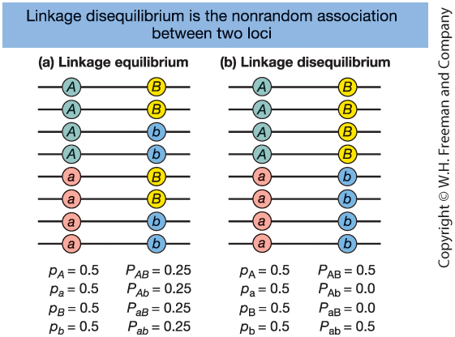{width=60%}

:::

::: {.column width="35%" }

**Figure 18-17**

Two loci (A and B), each with two alleles.

(a) **Linkage equilibrium**  
$\Rightarrow$ Alleles associate randomly  

(b) **Linkage disequilibrium (LD)**  
$\Rightarrow$ Non-random association of alleles  

:::
:::

::: notes
This figure illustrates the difference between linkage equilibrium and linkage disequilibrium.

Panel (a): Linkage equilibrium.
Allele frequencies at each locus are 0.5.
All four haplotypes (AB, Ab, aB, ab) occur at equal frequency (0.25).
This is what we expect if alleles at the two loci combine randomly.
Observed haplotype frequencies equal expected frequencies.

Panel (b): Linkage disequilibrium.
Allele frequencies are still 0.5 at each locus.
But only two haplotypes exist: AB and ab.
The recombinant haplotypes (Ab and aB) are absent.

This means alleles are associated non-randomly.
The A allele is always found with B,
and a is always found with b.

Even though allele frequencies are identical in both panels,
the haplotype structure is completely different.

That non-random association is what we call linkage disequilibrium.
:::

## Random Genetic Drift: Simulation Results

::: {.columns}

::: {.column width="50%"}

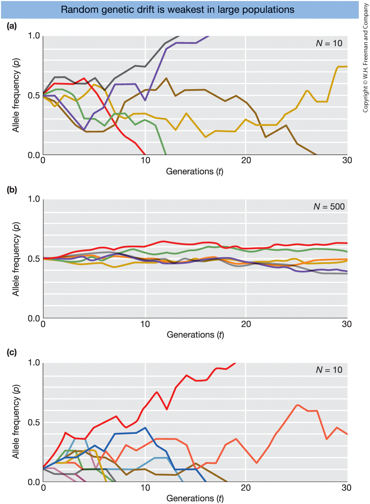{width=70%}

:::

::: {.column width="50%" }

**Figure 18-18**  
Simulations of random genetic drift.  

Each colored line = one simulated population  
tracked for 30 generations.

(a) Small population ($N = 10$), $p_0 = 0.5$  
(b) Large population ($N = 500$), $p_0 = 0.5$  
(c) Small population ($N = 10$), $p_0 = 0.1$

Hardy–Weinberg assumes an **infinitely large** population.

Real populations are finite.

In finite populations, allele frequencies change by chance:

**Random genetic drift**

:::

:::

::: notes

This figure shows computer simulations of random genetic drift.

Each colored line represents one population.
All populations begin with the same allele frequency,
but they evolve independently due to random sampling.

Panel (a): Small population, N = 10.
Allele frequencies fluctuate dramatically.
Some populations quickly reach fixation (p = 1),
others lose the allele (p = 0).

Panel (b): Large population, N = 500.
Fluctuations are much smaller.
Allele frequencies change slowly
and rarely reach fixation within 30 generations.

Panel (c): Small population starting with a rare allele (p₀ = 0.1).
Most populations lose the allele quickly.
Only rarely does the allele increase in frequency.

The key principle:

Genetic drift is stronger in small populations.

Hardy–Weinberg assumes an infinitely large population,
so allele frequencies remain constant.

In real, finite populations,
each generation is formed by random sampling of gametes.
This sampling error causes allele frequencies
to fluctuate from generation to generation.

These random fluctuations are called genetic drift.

Drift can lead to fixation or loss of alleles
purely by chance.

:::

## The Molecular Clock (Simple Version)

::: {.columns}

::: {.column width="50%"}

**Theory**

Neutral mutations accumulate over time.

If the mutation rate is constant,
DNA differences increase at a steady rate.

For two diverging species:

$$
d = 2 \mu t
$$

Rearranged:

$$
t = \frac{d}{2\mu}
$$

Where:

- $d$ = DNA sequence divergence  
- $\mu$ = mutation rate per generation  
- $t$ = time since divergence  

:::

::: {.column width="50%"}

**Interpretation and Example**

Both lineages accumulate mutations after they split.

The factor 2 reflects:
- Mutation in lineage 1  
- Mutation in lineage 2  

Example:

Humans and chimpanzees differ by ~1.8%  
at neutral sites.

Using the human mutation rate:

Estimated divergence ≈ 6 million years ago.

Assumptions:

- Mutations are neutral  
- Mutation rate is approximately constant  

:::

:::

::: notes

The molecular clock is based on a simple but powerful idea:

Neutral mutations accumulate at an approximately constant rate.

If two species split from a common ancestor,
each lineage begins accumulating new mutations independently.

That is why the equation includes a factor of 2 —
both lineages contribute to total divergence.

The equation states:

Sequence divergence equals
two times the mutation rate
times the time since divergence.

If we can estimate the mutation rate
and measure sequence divergence,
we can solve for time.

For example,
humans and chimpanzees differ by about 1.8% at neutral sites.

Using the estimated human mutation rate,
this corresponds to roughly 6 million years since divergence.

The molecular clock relies on key assumptions:

First, mutations being considered are neutral.
Second, the mutation rate is approximately constant over time.

When those assumptions are reasonable,
DNA can function as a biological clock.

:::

## The Domestication Bottleneck

::: {.columns}

::: {.column width="65%"}

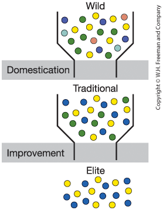{width=60%}

:::

::: {.column width="35%" }

**Crop domestication and improvement bottlenecks**

Wild population  
$\Rightarrow$ Traditional varieties  
$\Rightarrow$ Elite modern varieties  

Each step reduces genetic diversity.

Colored dots = different alleles.

:::
:::

::: notes
This figure illustrates two genetic bottlenecks.

First, during domestication,
humans sampled only a subset of individuals
from a wild population.

The wild population contains many alleles
— shown here as different colored dots.

When only some individuals are selected,
some alleles are lost by chance.

The resulting traditional crop population
has fewer alleles than the wild population.

Second, modern plant breeding creates another bottleneck.

Breeders select only a few elite lines
with desirable traits like high yield.

This further reduces genetic variation.

The key evolutionary idea is:
A bottleneck reduces genetic diversity
because only a subset of alleles passes through.

Lower diversity can increase vulnerability
to disease and environmental change.

That is why breeders sometimes cross
modern crops with wild relatives
to reintroduce lost variation.
:::

## Inbreeding

::: {.columns}

::: {.column width="50%"}

**Definition**

Inbreeding = mating between relatives.

Because relatives share alleles from common ancestors,
offspring are more likely to inherit
identical copies of an allele.

Genetic consequences:

- Increased **homozygosity**
- Decreased **heterozygosity**
- Higher probability of expressing
  **recessive deleterious alleles**

**Key concept:**  
Inbreeding increases homozygosity.

:::

::: {.column width="50%"}

**Biological consequences**

- Increased risk of inherited disorders  
- Possible **inbreeding depression**  
  (reduced survival or fertility)

However, in some species inbreeding can be advantageous:

- Common in self-pollinating plants  
  (e.g., rice, wheat, *Arabidopsis*)  
- Preserves beneficial allele combinations  
- Enables colonization from a single individual  

The effects depend on ecological context.

:::

:::

::: notes

Inbreeding refers to mating between related individuals.

Relatives share alleles inherited from common ancestors.
Therefore, their offspring have a higher probability
of receiving two copies of the same ancestral allele.

This increases homozygosity across the genome
and reduces heterozygosity.

The key genetic consequence is that recessive deleterious alleles
are more likely to be expressed.

This can increase the risk of inherited disorders.

The reduction in survival or reproductive success
that results from increased homozygosity
is called inbreeding depression.

However, inbreeding is not always harmful.

Many plant species are highly self-fertilizing.
Crops such as rice and wheat,
and the model plant Arabidopsis,
are predominantly inbred.

Selfing allows reproduction when mates are scarce,
helps establish new populations,
and preserves favorable allele combinations.

Thus, whether inbreeding is harmful or advantageous
depends on the species and ecological context.

The central population-genetic effect remains:
inbreeding increases homozygosity.

:::

## Natural Selection and Fitness

::: {.columns}

::: {.column width="50%"}

**Natural selection**

Individuals with certain heritable traits  
are more likely to survive and reproduce.

Key ingredients:

- Variation exists in populations  
- Traits are heritable  
- Individuals differ in reproductive success  
- Alleles linked to higher reproduction increase in frequency  

Evolution = change in allele frequencies over time.

:::

::: {.column width="50%"}

**Fitness**

Darwinian fitness = reproductive success.

Absolute fitness ($W$):  
Number of offspring produced.

Relative fitness ($w$):  
Fitness relative to the most successful genotype.

Example:

If the most successful genotype produces 10 offspring:

- 10 offspring → $w = 1.0$  
- 5 offspring → $w = 0.5$

Selection acts through differences in fitness.

:::

:::

::: notes

Natural selection explains adaptation.

Unlike mutation or drift,
selection produces directional change.

Three ingredients are required:
variation, heritability, and differences in reproductive success.

In population genetics terms,
selection changes allele frequencies
because some genotypes contribute more alleles to the next generation.

Fitness means reproductive success.

Absolute fitness is simply number of offspring.

Relative fitness rescales values so the fittest genotype has fitness 1.

Relative fitness is what determines how allele frequencies change.

:::

## Example: Selection on a Dominant Allele

::: {.columns}

::: {.column width="50%"}

**Genotype fitnesses**

| Genotype | Relative fitness ($w$) |
|----------|-----------------------|
| A/A      | 1.0 |
| A/a      | 1.0 |
| a/a      | 0.5 |

Allele A is beneficial and dominant.

Only $a/a$ individuals have reduced fitness.

:::

::: {.column width="50%"}

**Consequence**

Because A-containing genotypes  
produce more offspring,

Allele A increases in frequency.

Example:

Initial frequency: $p = 0.10$  
After one generation: $p = 0.17$

Selection increases the frequency  
of beneficial alleles.

:::

:::

::: notes

Here, allele A is beneficial and dominant.

Both A/A and A/a individuals have full fitness.
Only a/a individuals reproduce less.

Because A-containing genotypes
contribute more offspring,
they contribute more A alleles to the next generation.

After one generation,
the frequency of A increases.

This illustrates the core principle of natural selection:

Genotypes with higher fitness
increase in frequency over time.

:::

## Selection and Allele Frequency

::: {.columns}

::: {.column width="65%"}

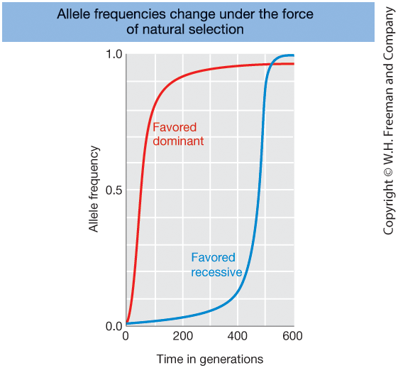{width=60%}

:::

::: {.column width="35%" }

**Figure 18-21**

Change in allele frequency over time for:

- Favored **dominant** allele (red)  
- Favored **recessive** allele (blue)

Both alleles increase due to natural selection,
but at different rates.

:::
:::

::: notes
This figure shows how natural selection changes allele frequencies over time.

Both alleles shown are beneficial.
However, one is dominant and one is recessive.

The dominant beneficial allele (red)
increases rapidly at the beginning.
This is because even heterozygotes benefit,
so selection can immediately act on it.

The recessive beneficial allele (blue)
increases very slowly at first.
When rare, it mostly exists in heterozygotes,
where its beneficial effect is not expressed.

Selection can only “see” the recessive allele
when it appears in homozygotes.

Once the recessive allele becomes more common,
its increase accelerates.

The key takeaway:

Dominance affects the speed of evolutionary change.

Selection acts on phenotypes,
and whether an allele is expressed in heterozygotes
determines how quickly it spreads.
:::

## Forms of Selection

::: {.columns}

::: {.column width="50%"}

**Natural selection**

 

**Directional selection**

- Allele frequency moves toward fixation or loss  
- Positive selection: favors beneficial alleles  
- Purifying selection: removes deleterious alleles  

 

**Balancing selection**

- Maintains multiple alleles  
- Example: heterozygote advantage  
- Produces stable equilibrium of allele frequencies  

:::

::: {.column width="50%"}

**Artificial selection**

Selection imposed by humans.

- Individuals with desired traits are chosen  
- Those individuals contribute more alleles  
- Favored alleles increase in frequency  

Examples:

- Dog breeds  
- Dairy cattle  
- Crop varieties  

Artificial selection = natural selection  
directed by humans.

:::

:::

::: notes

Natural selection does not always operate in the same way.

Directional selection pushes allele frequencies
in one direction.

Positive selection increases beneficial alleles.
If the allele reaches fixation,
this can produce a selective sweep.

Purifying selection removes harmful mutations
and maintains functional adaptations.

Balancing selection is different.
Instead of eliminating one allele,
it maintains genetic variation.

A classic example is heterozygote advantage,
where heterozygotes have higher fitness
than either homozygote.
This produces a stable equilibrium.

Selection can also be imposed by humans.

In artificial selection,
individuals with desired traits are chosen for reproduction.

Dogs, cattle, and crop plants
have been shaped by this process.

The genetic mechanism is identical:
Alleles associated with higher reproductive success
increase in frequency.

Artificial selection simply changes
who or what defines “fitness.”

:::

## Selective Sweep and Genetic Variation

::: {.columns}

::: {.column width="65%"}

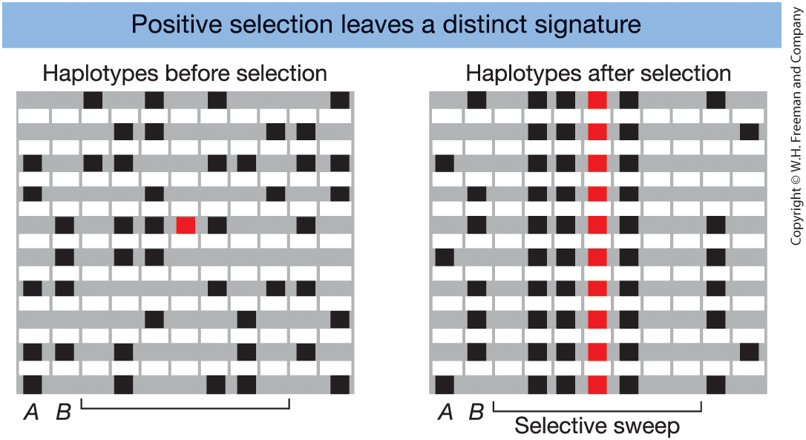{width=60%}

:::

::: {.column width="35%" }

**Figure 18-22**

Haplotypes before and after  
a beneficial allele (red)  
is swept to fixation.

After selection:

- Reduced genetic diversity  
- Increased linkage disequilibrium  
- One common haplotype dominates  

:::
:::

::: notes
This figure shows what happens during a selective sweep.

Before selection,
many different haplotypes exist in the population.
There is substantial genetic variation across the region.

A new beneficial mutation appears —
shown in red at the target locus.

Because it increases fitness,
this mutation rises rapidly in frequency.

Importantly,
it arose on a single chromosome.

As selection drives it toward fixation,
the entire surrounding haplotype
"hitchhikes" along with it.

As a result:

• Genetic diversity in this region drops.
• Many nearby loci become identical.
• Linkage disequilibrium increases.

Farther away from the selected site,
recombination has more opportunity
to break associations,
so diversity gradually returns.

The key idea:

Positive selection reduces variation locally
because nearby alleles hitchhike with the beneficial mutation.

This genomic pattern —
low diversity and high LD —
is evidence of a recent selective sweep.
:::

## Examples of Natural Selection in Humans

| Gene | Trait / Function | Population |
|------|------------------|------------|
| **G6PD** | Malaria resistance | Africans |
| **Hb (β-globin)** | Malaria resistance (sickle-cell) | Africans |
| **CCR5** | Resistance to HIV/AIDS | Europeans |
| **LCT** | Lactase persistence (milk digestion) | Europeans, Africans |
| **SLC24A5** | Skin pigmentation | Europeans |
| **MHC** | Infectious disease resistance | Multiple populations |

These genes show evidence of recent natural selection.

::: notes
This table shows real examples of natural selection
in modern human populations.

The first group of genes relates to resistance to pathogens.

G6PD and the β-globin gene (which causes sickle-cell anemia)
both provide protection against malaria.

These alleles reach high frequencies in regions
where malaria is common, such as central Africa.

This is a powerful example of natural selection
shaping human genetic variation.

CCR5 is another example.
A specific variant provides resistance to HIV infection.
This allele has been increasing in some populations.

The second group relates to diet.

The LCT gene allows adults to digest lactose.
In most mammals, lactase expression stops after childhood.
But in populations that historically relied on dairy farming,
alleles allowing adult milk digestion rose in frequency.

This is a clear example of gene–culture coevolution.

The third group relates to climate adaptation.

Genes such as SLC24A5 influence skin pigmentation.
These alleles vary in frequency across regions
with different levels of UV radiation.

The key message is:

Natural selection has acted on humans recently,
and it continues to act today.
:::

## Balancing Selection Maintains Genetic Diversity

::: {.columns}

::: {.column width="65%"}

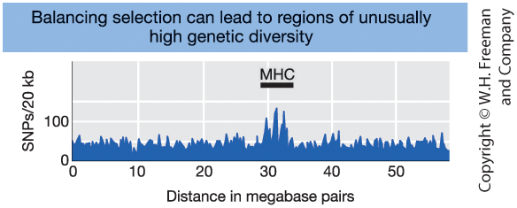{width=80%}

:::

::: {.column width="35%" }

**Figure 18-24**

Number of SNPs along chromosome 6.

The MHC region shows a spike of unusually high diversity.

Key idea: Balancing selection can maintain multiple alleles at a locus.

:::
:::

::: notes
Directional selection often reduces diversity,
because a beneficial allele sweeps to fixation.

Balancing selection has the opposite effect.

It maintains multiple alleles in a population.

The figure shows the number of SNPs
along a region of chromosome 6.

Most regions have moderate levels of diversity.

But the MHC region shows a dramatic spike —
much higher genetic diversity than surrounding regions.

The MHC contains genes involved in immune response,
including HLA genes.

One explanation for this high diversity
is heterozygote advantage.

Individuals with two different MHC alleles
may recognize a wider range of pathogens.

As a result, selection favors maintaining
multiple alleles rather than fixing just one.

Balancing selection leaves the genomic signature
of unusually high diversity.
:::

## Mutation as a Force Maintaining Variation

::: {.columns}

::: {.column width="50%"}

**Mutation–Drift Balance (Neutral Variation)**

Mutation introduces new alleles.  
Genetic drift removes variation.

At equilibrium:

Loss of heterozygosity (drift) = 
Gain of heterozygosity (mutation)

Equilibrium heterozygosity:

$$
\hat{H} = \frac{4N\mu}{1 + 4N\mu}
$$

- $N$ = population size  
- $\mu$ = mutation rate  
- $\hat{H}$ = equilibrium heterozygosity  

(Assumes no selection)

:::

::: {.column width="50%"}

**Mutation–Selection Balance (Deleterious Alleles)**

Mutation creates harmful alleles.  
Natural selection removes them.

At equilibrium:

New mutations =  
Alleles removed by selection

For a recessive deleterious allele:

$$
q_{eq} = \sqrt{\frac{\mu}{s}}
$$

- $\mu$ = mutation rate  
- $s$ = selection coefficient  
- $q_{eq}$ = equilibrium allele frequency  

:::

:::

::: notes

Mutation constantly introduces new alleles into populations.

What prevents variation from either exploding or disappearing?

In neutral regions of the genome,
variation reflects a balance between mutation and drift.

Mutation adds new alleles.
Drift removes variation through random sampling.

At equilibrium,
the loss of heterozygosity due to drift
equals the gain from mutation.

The equilibrium level depends on population size and mutation rate.
Large populations maintain more variation.
Small populations lose variation quickly.

Now consider deleterious alleles.

Mutation introduces harmful alleles,
and selection removes them.

However, mutation never stops.
Therefore, a low equilibrium frequency persists.

For recessive deleterious alleles,
the equilibrium frequency depends on
the square root of mutation rate divided by selection strength.

Stronger selection reduces equilibrium frequency.
Higher mutation increases it.

Thus, mutation maintains variation in two ways:
by balancing drift in neutral loci,
and by balancing selection at deleterious loci.

:::

# 18.6 Applications of Population Genetics

## Biological and Social Applications

::: {.columns}

::: {.column width="50%"}

**Real-world applications**

Population genetics informs:

- **Conservation biology**
  - Managing genetic diversity  
  - Preventing inbreeding depression  
  - Designing breeding programs  

- **Medical genetics**
  - Estimating disease risk  
  - Understanding recessive disorders  
  - Interpreting GWAS results  

- **Forensic science**
  - Calculating DNA match probabilities  
  - Accounting for population structure  

:::

::: {.column width="50%"}

**Core principles applied**

These applications rely on:

- Allele frequencies  
- Hardy–Weinberg equilibrium  
- Inbreeding and genetic drift  
- Linkage disequilibrium  
- Natural selection  

Population genetics connects  
DNA variation → population patterns → practical decisions.

:::

:::

::: notes

Population genetics is not just theoretical.

The same mathematical principles we use to model allele frequencies
are applied in real-world settings.

In conservation biology,
small populations are vulnerable to drift and inbreeding.
Genetic tools help maintain diversity
and reduce extinction risk.

In medical genetics,
Hardy–Weinberg equilibrium is used to estimate carrier frequencies.
Mutation–selection balance explains persistence of disease alleles.
Linkage disequilibrium underlies genome-wide association studies.

In forensic science,
DNA match probabilities are calculated using allele frequencies
and Hardy–Weinberg assumptions.
Population structure must be considered
to avoid biased estimates.

Thus, population genetics links abstract theory
to biological and societal applications.

:::

## Conservation Genetics

::: {.columns}

::: {.column width="50%"}

**Genetic risks in small populations**

When population size declines:

- **Genetic bottlenecks** reduce diversity  
- **Genetic drift** removes alleles randomly  
- **Inbreeding** increases homozygosity  
- Harmful recessive alleles become expressed  

Consequences:

- Loss of adaptive potential  
- Increased risk of **inbreeding depression**  
  (reduced survival and reproduction)

:::

::: {.column width="50%"}

**Management dilemma**

Key question:

Should conservation programs  
minimize inbreeding  
or allow it to purge deleterious alleles?

Theoretical idea:

- Inbreeding may expose harmful alleles  
- Selection could remove them (“purging”)

Empirical evidence:

- Inbreeding usually reduces fitness  
- Maintaining genetic diversity is generally safer  

:::

:::

::: notes

Conservation genetics focuses on the genetic consequences
of small population size.

When populations decline,
genetic bottlenecks reduce variation abruptly.

Genetic drift becomes stronger,
randomly removing alleles from the population.

Inbreeding increases because individuals
are more likely to mate with relatives.

This increases homozygosity across the genome.

As homozygosity increases,
recessive deleterious alleles are more likely to be expressed,
leading to inbreeding depression —
reduced survival or fertility.

A long-standing debate concerns purging.

The idea is that inbreeding exposes harmful alleles,
allowing natural selection to eliminate them.

In theory, this could reduce future genetic load.

However, empirical studies show that
inbreeding more often reduces fitness
than successfully purges deleterious variation.

Therefore, conservation strategies typically aim to:
maximize effective population size,
maintain gene flow,
and preserve genetic diversity.

The central goal is to maintain evolutionary potential.

:::

## Population Genetics in Medicine

::: {.columns}

::: {.column width="50%"}

**Why allele frequencies matter**

Population genetics allows us to:

- Estimate **carrier probabilities**
- Calculate **disease risk**
- Predict the impact of **inbreeding**
- Interpret population screening data

Using Hardy–Weinberg equilibrium:

- Genotype frequencies can be inferred  
  from allele frequencies
- Carrier frequencies can be estimated  
  even without pedigrees

:::

::: {.column width="50%"}

**Example: recessive disease**

Under Hardy–Weinberg:

- Disease frequency = $q^2$
- Allele frequency = $q = \sqrt{q^2}$
- Carrier frequency ≈ $2pq$

Effect of inbreeding:

$$
\text{Homozygote frequency} = q^2 + Fpq
$$

- $F$ = inbreeding coefficient  
- Inbreeding increases homozygosity  
- Recessive disease risk rises  

:::

:::

::: notes

Population genetics extends beyond family pedigrees.
It allows us to estimate disease risk
at the population level.

If we know the frequency of a recessive disease,
we can infer the allele frequency.

For a recessive disease,
the frequency of affected individuals equals q².
Therefore, the allele frequency q
is the square root of the disease frequency.

From q, we can estimate the carrier frequency,
approximately 2pq under Hardy–Weinberg equilibrium.

These calculations are widely used
in genetic counseling and public health screening.

Inbreeding changes the situation.

Inbreeding increases the probability
that two alleles are identical by descent.

The modified homozygote frequency becomes:

q² + Fpq

The term Fpq represents the excess
homozygotes due to inbreeding.

This explains why consanguineous marriages
increase the risk of recessive disorders.

Thus, population genetic theory
directly informs medical risk prediction.

:::

## DNA Forensics

::: {.columns}

::: {.column width="50%"}

**Genetic basis of forensic analysis**

DNA identification relies on:

- **Microsatellite markers (STRs)**  
  Highly polymorphic, multi-allelic loci  

- **Population allele frequencies**  
  Estimated from reference databases  

- **Hardy–Weinberg equilibrium**  
  Used to calculate genotype probabilities  

Multiple independent loci are analyzed  
to increase discriminatory power.

:::

::: {.column width="50%"}

**Statistical interpretation**

We evaluate:

$$
P(\text{match} \mid \text{different individuals})
$$

This is the probability that a random, unrelated person  
would share the same DNA profile.

Assuming independence across loci:

- Genotype probabilities are multiplied  
- Overall probability becomes extremely small  

Very small probability → strong statistical evidence  

:::

:::

::: notes

DNA evidence does not prove guilt directly.
It provides statistical evidence.

Forensic analysis typically uses short tandem repeats,
or STR markers.

STRs are highly polymorphic,
meaning they have many alleles,
which makes them very informative for identification.

To evaluate a match,
we use population allele frequency databases.

Under Hardy–Weinberg equilibrium,
we calculate genotype probabilities at each locus.

Assuming loci are independent,
we multiply probabilities across loci
to obtain the overall match probability.

This gives us:

The probability that a random, unrelated individual
would have the same DNA profile.

With many STR markers,
this probability can be extremely small —
often one in millions or billions.

Thus, population genetics converts
a DNA match into a quantitative statistical statement.

The strength of the evidence
depends on accurate allele frequency estimates
and correct assumptions about population structure.

:::

## Chapter 18 — The Population Genetics Framework

::: {.columns}

::: {.column width="50%"}

### 1️⃣ What We Observe

- DNA sequence variation  
- Allele and genotype frequencies  
- Linkage disequilibrium  
- Population differences  

These are measurable genetic patterns.

:::

::: {.column width="50%"}

### 2️⃣ Null Model

**Hardy–Weinberg equilibrium**

- Random mating  
- Infinite population  
- No mutation, migration, selection, or drift  

Defines the expectation of **no evolution**.

Deviations indicate evolutionary forces.

:::

:::

::: {.columns}

::: {.column width="50%"}

### 3️⃣ Evolutionary Forces

Allele frequencies change due to:

- Mutation  
- Migration  
- Recombination  
- Genetic drift  
- Natural selection  

**Evolution = change in allele frequencies over time**

:::

::: {.column width="50%"}

### 4️⃣ What These Forces Shape

- Genetic diversity  
- Population structure  
- Linkage disequilibrium  
- Genomic signatures of history  
- Applications in medicine, conservation, and forensics  

Population genetics connects  
**patterns → processes → consequences**

:::

:::

::: notes

This slide summarizes the entire chapter in one framework.

Start in the upper left.

Population genetics begins with observable patterns:
DNA variation, allele frequencies, genotype distributions,
linkage disequilibrium, and population differences.

These are measurable.

But patterns alone do not explain themselves.

That is where the null model comes in.

Hardy–Weinberg equilibrium defines what we expect
if evolution is not operating.

If mating is random and no forces act,
allele frequencies remain constant.

When real populations deviate from that expectation,
we infer evolutionary forces.

Those forces are listed in the lower left.

Mutation introduces new alleles.
Migration moves alleles between populations.
Recombination reshuffles variation.
Genetic drift changes frequencies randomly.
Natural selection changes them non-randomly.

In population genetics, evolution has a precise definition:
change in allele frequencies across generations.

Finally, the lower right panel shows what these forces shape.

They determine how much diversity exists,
how populations differ,
how loci are associated,
and how genomes carry signatures of past events.

They also inform real-world decisions
in medicine, conservation biology, and forensics.

So the core idea of this chapter is simple:

Population genetics explains why genetic patterns look the way they do,
by connecting observable variation
to the evolutionary forces that shape it.

That is the framework of the field.

:::

## Inbreeding and Identity by Descent (IBD)

::: {.columns}

::: {.column width="55%"}

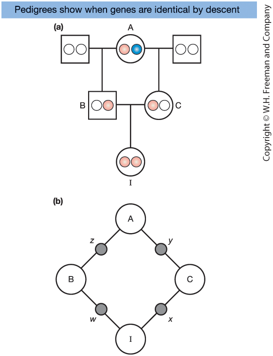{width=70%}

**Figure 18-12. Half-sib pedigree**

Closed loop:  
$I \rightarrow B \rightarrow A \rightarrow C \rightarrow I$

:::

::: {.column width="45%"}

Consider the half-sib pedigree in Figure 18-12:

- B and C are half-siblings  
- They share a common mother, A  
- Their daughter is I  

A has two gene copies:

- One from her mother (pink)  
- One from her father (blue)  

I is **inbred** because there is a closed ancestral loop in the pedigree.

If the two copies in I trace back to the same **physical copy** in A, they are **identical by descent (IBD)**.

The probability of this event is the **inbreeding coefficient**, $F_I$.

:::

:::

::: notes

Let’s start with the full pedigree in Figure 18-12.

B and C are half-siblings: they share the same mother, A, but have different fathers. Their daughter is I.

Notice the closed ancestral loop:
I → B → A → C → I.

Whenever you see a closed loop like this, the offspring can be inbred.

Now focus on A. She carries two physical copies of the gene—shown as a pink and a blue allele.

If I receives two alleles that both trace back to the same physical copy in A (both coming from A’s pink copy, or both from A’s blue copy), then I’s two alleles are identical by descent.

The probability that this happens is the inbreeding coefficient, $F_I$.

Next we compute this probability step by step.

:::

## Step 1: Simplify to the Closed Inbreeding Loop

::: {.columns}

::: {.column width="55%"}

{width=70%}

**Figure 18-12. Half-sib pedigree**

Closed loop:  
$I \rightarrow B \rightarrow A \rightarrow C \rightarrow I$

:::

::: {.column width="45%"}

Using Figure 18-12b (simplified format):

- Keep only individuals in the closed loop  
- Label transmitted alleles:

A → B transmits allele $z$  
A → C transmits allele $y$  
B → I transmits allele $w$  
C → I transmits allele $x$  

We want:

$$
F_I = P(w \sim x)
$$

That is, the probability that I’s two alleles are **IBD**.

:::

:::

::: notes

To calculate the inbreeding coefficient, we simplify the pedigree to the closed loop only.

Sex does not matter for this calculation—only allele transmission along parent–offspring links.

We label the transmitted alleles:
A transmits z to B and y to C.
Then B transmits w to I and C transmits x to I.

So the question becomes precise:

What is the probability that w and x are identical by descent?

Equivalently: what is the probability that both of I’s alleles trace back to the same ancestral copy in A?

Now we compute that probability in small steps.

:::

## Step 2: Assume Ancestor A Is Not Inbred

::: {.columns}

::: {.column width="55%"}

{width=70%}

**Figure 18-12. Half-sib pedigree**

Closed loop:  
$I \rightarrow B \rightarrow A \rightarrow C \rightarrow I$

:::

::: {.column width="45%"}

First assume:

$$
F_A = 0
$$

Now compute step by step:

1. B transmits to I the allele he inherited from A:

$$
P(w \sim z) = \frac{1}{2}
$$

2. C transmits to I the allele she inherited from A:

$$
P(x \sim y) = \frac{1}{2}
$$

3. The alleles $y$ and $z$ are the same physical copy in A:

$$
P(y \sim z) = \frac{1}{2}
$$

Multiply independent probabilities:

$$
F_I = \frac{1}{2} \times \frac{1}{2} \times \frac{1}{2}
      = \frac{1}{8}
$$

So the offspring of half-sib matings has:

$$
F_I = \frac{1}{8}
$$

:::

:::

::: notes

First assume A is not inbred, so her two gene copies are independent.

For I to be IBD at this locus, three independent events must occur:

First: B must pass to I the allele B received from A. Probability one half.

Second: C must pass to I the allele C received from A. Probability one half.

Third: the allele A passed to B and the allele A passed to C must be the same physical copy in A—both pink or both blue. Probability one half.

Because these events are independent, we multiply:

(1/2) × (1/2) × (1/2) = 1/8.

So in a half-sib mating, the offspring has $F_I = 1/8$.

Interpretation: there is a 12.5% chance that a locus is homozygous because the two alleles are identical by descent.

Pause here—this is the key result.

:::

## Step 3: What If Ancestor A Is Inbred?

::: {.columns}

::: {.column width="55%"}

{width=70%}

**Figure 18-12. Half-sib pedigree**

Closed loop:  
$I \rightarrow B \rightarrow A \rightarrow C \rightarrow I$

:::

::: {.column width="45%"}

If A is inbred:

- Her two gene copies may themselves be IBD  
- This increases the probability that $y$ and $z$ are IBD  

Probability that $y$ and $z$ are IBD:

- Same physical copy in A → $\frac{1}{2}$  
- Different physical copies, but those copies are themselves IBD → $\frac{1}{2}F_A$

So:

$$
P(y \sim z) = \frac{1}{2} + \frac{1}{2}F_A
            = \frac{1}{2}(1 + F_A)
$$

Now:

$$
F_I = \frac{1}{2} \times \frac{1}{2} \times 
      \frac{1}{2}(1+F_A)
$$

$$
F_I = \left(\frac{1}{2}\right)^3 (1+F_A)
$$

If $F_A = 0$:

$$
F_I = \frac{1}{8}
$$

:::

:::

::: notes

Now consider the more general case: what if A is inbred?

Then A’s two physical gene copies might already be identical by descent.

There are two ways that y and z can be IBD:

1) A passes the same physical copy to both B and C (pink/pink or blue/blue). Probability one half.

2) A passes different physical copies (pink and blue), but those copies are themselves IBD because A is inbred. Probability one half times $F_A$.

So:
P(y ~ z) = 1/2 + (1/2)F_A = (1/2)(1 + F_A).

Multiply again with the two transmissions down to I, and we get:
$F_I = (1/2)^3 (1 + F_A)$.

If A is not inbred, $F_A = 0$, and we recover 1/8.

This is exactly where the “(1 + F_A)” term in the general formula comes from.

:::

## General Path Formula for Inbreeding

::: {.columns}

::: {.column width="50%"}

**General formula**

For any individual $X$:

$$
F_X = \sum_A \left(\frac{1}{2}\right)^{n_1+n_2+1}(1+F_A)
$$

Where:

- $n_1$ = generations from ancestor $A$ to parent 1  
- $n_2$ = generations from ancestor $A$ to parent 2  
- $F_A$ = inbreeding coefficient of ancestor $A$  

Sum over all common ancestors $A$.

:::

::: {.column width="50%"}

**Interpretation**

- $n_1+n_2+1$ counts the number of **meioses** in the loop  
- Each meiosis contributes a factor of $\tfrac{1}{2}$  
- $(1 + F_A)$ adjusts for whether the ancestor is already inbred  

If the common ancestor is not inbred ($F_A = 0$):

$$
F_X = \left(\frac{1}{2}\right)^{n_1+n_2+1}
$$

:::

:::

::: notes

This is the compact “path method” version of what we just did.

Step 1 is always: identify the common ancestors shared by the two parents. If there are multiple, you add their contributions—this is why we sum over A.

For each ancestor A, count the number of generations from A down to parent 1 and to parent 2. That’s $n_1$ and $n_2$.

Then add 1 for the final step where the two parental alleles come together in the offspring. So $n_1+n_2+1$ is the number of meioses along the loop.

Each meiosis transmits an allele with probability one half, so we raise one half to that power.

Finally, $(1 + F_A)$ accounts for the possibility that ancestor A is already inbred, which increases the probability of identity by descent.

In the half-sib example: $n_1=1$, $n_2=1$, so the exponent is 3, giving $(1/2)^3 = 1/8$.

So the general formula is not magic—it is just the same loop logic written compactly.

:::

