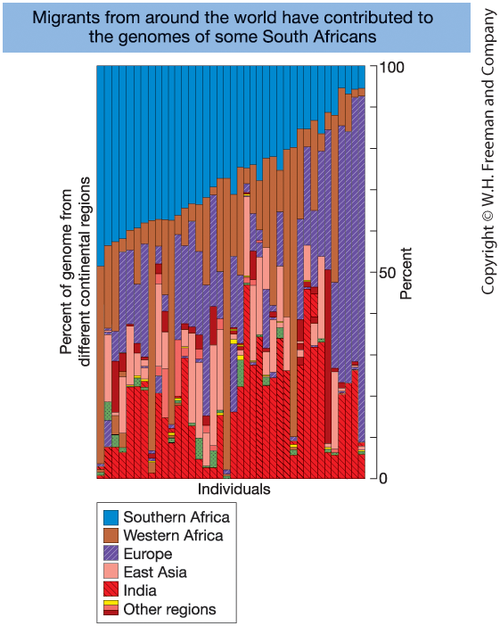
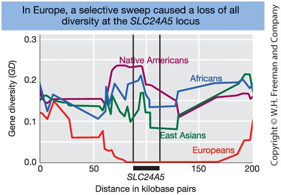

## Learning Goals — Population Genetics  

::: {.columns}

::: {.column width="60%"}

**1. Detecting Genetic Variation**

- Identify major types of DNA variation  
- Explain locus, allele, haplotype, and phase  

**2. Gene Pool & Hardy–Weinberg**

- Define the gene pool and calculate allele and genotype frequencies  
- State the Hardy–Weinberg law and its assumptions  
- Test for equilibrium and explain causes of deviation  

**3. Mating Systems & Inbreeding**

- Distinguish mating systems  
- Explain effects of nonrandom mating on genotype frequencies  
- Define inbreeding and describe its genetic consequences  

:::

::: {.column width="40%"}

**4. Evolutionary Forces**

- Describe how mutation, migration, recombination, drift, and selection change allele frequencies  
- Explain population size effects and genetic drift  
- Distinguish major forms of selection  
- Explain linkage disequilibrium and its decay  
- Recognize genomic signatures of selection, drift, and population structure  

:::

:::

::: notes

This chapter focuses on genetic variation at the population level.

The learning goals are organized into four main areas.

First, detecting genetic variation.
This includes identifying major types of DNA variation and understanding key concepts such as locus, allele, haplotype, and phase.
It also includes interpreting measures such as heterozygosity and nucleotide diversity.

Second, the gene pool and Hardy–Weinberg equilibrium.
This involves calculating allele and genotype frequencies, stating the Hardy–Weinberg law and its assumptions, and testing for deviations from equilibrium.

Third, mating systems and inbreeding.
This includes understanding how nonrandom mating alters genotype structure and recognizing the genetic consequences of inbreeding.

Fourth, evolutionary forces.
Mutation, migration, recombination, genetic drift, and natural selection change allele frequencies over time.
This section also includes linkage disequilibrium, its decay, and genomic signatures of selection, drift, and population structure.

The overall objective is not only to perform calculations, but to interpret what patterns of genetic variation reveal about evolutionary processes.

:::

## Why Study Population Genetics?

- Assess genetic disease risk  
- Evaluate how breeding practices affect genetic diversity  
- Understand risks of inbreeding in small or fragmented populations  
- Explore relationships among human populations  
- Study genomic adaptation to different environments  
- Explain how populations and species evolve  

::: notes

Population genetics addresses questions with clear societal relevance.

It provides tools to assess genetic disease risk
and to evaluate how breeding practices influence genetic diversity.

It helps determine whether small or fragmented populations
are vulnerable to inbreeding and loss of variation.

Beyond applied questions, it also addresses fundamental evolutionary issues.

How are human populations related?
How have genomes adapted to different environments?
And how do allele frequencies change over time?

In essence, population genetics connects molecular variation
to practical applications
and to the mechanisms that drive evolutionary change.

:::

## Population Genetics

::: {.columns}

::: {.column width="50%"}

**What Is a Population?**

- Individuals of the same species  
- An interbreeding group  
- A defined sampling unit  

A population is defined by **gene exchange**
and a shared contribution to future generations.

:::

::: {.column width="50%"}

**What Is Population Genetics?**

- Study of genetic variation within populations  
- Study of changes in allele frequencies over time  

Driven by evolutionary forces:

- Mutation  
- Migration (gene flow)  
- Recombination  
- Genetic drift  
- Natural selection  
- Mating systems  

Focus: how evolutionary forces shape allele frequencies across generations.

:::

:::

::: notes

First, what is meant by a population?

In biology, it refers to a group of individuals of the same species
that interbreed and exchange genes.

In genetics, it also refers to the group from which individuals are sampled
to estimate allele frequencies.

Population boundaries are therefore defined by gene exchange
and shared reproductive contribution.

What, then, is population genetics?

It is the study of genetic variation within populations
and the analysis of how allele frequencies change over time.

The emphasis is not on individual pedigrees,
but on the genetic composition of the population as a whole.

Allele frequencies change because of evolutionary forces:
mutation introduces new variation,
migration moves alleles between populations,
recombination reshuffles genetic material,
genetic drift causes random fluctuations,
natural selection drives systematic change,
and mating systems alter genotype structure.

Population genetics seeks to understand
how these forces interact
to shape genetic variation across generations.

:::

# 1. Detecting Genetic Variation

## DNA Variation in Populations

::: {.columns}

::: {.column width="50%"}

**DNA variation occurs at specific genomic locations**

- A **locus** = a position in the genome  
  - A single nucleotide  
  - Or a longer DNA region  

Humans are **diploid**  
→ two alleles at each autosomal locus  

At a locus, individuals may carry different **alleles**.

 

**Major types of genetic variation**

- Single nucleotide polymorphisms (**SNPs**)  
- Small insertions/deletions (indels)  
- Repeat-length variants (**microsatellites** / STRs)  
- Structural variants (CNVs, inversions)

:::

::: {.column width="50%"}

**SNPs**

- Single base substitution (A, C, G, or T)  
- Most abundant variant type  
- Usually biallelic  
- Relatively low mutation rate  

**Microsatellites (STRs)**

- Short motifs (2–6 bp) repeated in tandem  
- Alleles differ in repeat number  
- Often highly polymorphic  
- Higher mutation rate  

SNPs → abundant and relatively stable  
Microsatellites → highly variable

:::

:::

::: notes

Population genetics examines variation at specific genomic locations,
called loci.

A locus is simply a position in the genome.
It may refer to a single nucleotide
or to a longer DNA region.

Humans are diploid,
meaning two copies of each autosomal chromosome are present.
At each locus, an individual therefore carries two alleles,
one inherited from each parent.

Genetic variation occurs at multiple scales:
single-base substitutions,
small insertions or deletions,
repeat-length variants,
and larger structural changes.

The primary focus here is on SNPs and microsatellites.

SNPs are single nucleotide substitutions.
They are abundant across the genome,
usually biallelic,
and mutate at relatively low rates.

Microsatellites consist of short repeated motifs.
Alleles differ in the number of repeats.
They mutate more rapidly
and are often highly polymorphic.

In simple terms,
SNPs are abundant and relatively stable,
whereas microsatellites are fewer in number
but highly variable.

:::

## Visualizing Genetic Variation

 

{fig-align="center" width=80%}

 

**Figure 18-1.** Aligned DNA sequences from seven chromosomes.
Asterisks indicate SNPs. Indels and a microsatellite region are also shown.

::: notes
This figure shows aligned DNA sequences from seven different chromosomes.

Each row represents a chromosome from a different individual.
Each column represents a nucleotide position.

Notice that most positions are identical across individuals.
These are conserved sites.

The asterisks mark single nucleotide polymorphisms, or SNPs.
At these positions, at least one individual has a different base.

We also see insertions and deletions — called indels.
These occur when a stretch of nucleotides is either missing or inserted in some individuals.

Finally, the figure shows a microsatellite region.
This is a short repeated sequence.
Different individuals have different numbers of repeats.

The key idea:
A locus can exhibit several types of variation —
single-base differences, small insertions or deletions, and repeat-length variation.

All of these contribute to genetic diversity in populations.
:::

## From DNA to Genotype Data

::: {.columns}

::: {.column width="60%"}

Genomic technologies allow measurement of variation
at thousands to millions of loci.

 

**Marker-based genotyping**

- Assay predefined variants  
  (SNP arrays, STR panels)  
- Efficient for large sample sizes  

**Sequencing-based approaches**

- Discover and genotype variants simultaneously  
- Provide more comprehensive genomic information  

Large genotype datasets across many loci
form the foundation of population genetic analysis.

:::

::: {.column width="40%"}

{width=70%}

**Figure 18-2. Microarray for SNP genotyping**

- Each dot = one SNP  
- Red/green = homozygous  
- Yellow = heterozygous  

:::

:::

::: notes

Modern genomic technologies allow us to measure variation
at thousands to millions of loci across the genome.

There are two main strategies.

Marker-based genotyping assays predefined variants,
such as SNP arrays or STR panels.
These methods are efficient for large sample sizes,
but they only capture known variants.

Sequencing-based approaches directly read DNA sequence.
They allow both discovery and genotyping of variants.
Sequencing provides richer information,
but requires more computational processing.

In both cases, the result is a large genotype matrix:
many individuals by many loci.
That dataset forms the foundation of population genetic analysis.

The figure shows a SNP microarray.
Each dot represents a single SNP.
Color indicates genotype —
red and green are homozygous,
yellow is heterozygous.

Technological advances like this
made modern population genetics possible.

:::

## The Genotype Matrix

::: {.columns}

::: {.column width="50%"}

After genotyping, data are organized into an n × m matrix.

- n = number of individuals (rows)  
- m = number of loci (columns)  
- Each cell = genotype at one locus for one individual  

 

**Common SNP Coding (biallelic loci)**

| Code | Genotype |
|------|----------|
| 0 | Homozygous reference |
| 1 | Heterozygous |
| 2 | Homozygous alternative |

:::

::: {.column width="50%"}

|        | SNP₁ | SNP₂ | SNP₃ | … |
|--------|------|------|------|---|
| Ind₁   | 0    | 1    | 2    |   |
| Ind₂   | 1    | 1    | 0    |   |
| Ind₃   | 2    | 0    | 1    |   |
| …      |      |      |      |   |

 

Biological data → Numerical matrix → Statistical analysis

:::

:::

::: notes

After genotyping, the data are organized into a matrix.

Each row represents an individual.
Each column represents a locus, typically a SNP.

Each entry encodes the genotype at that locus.
For biallelic SNPs, numeric coding is commonly used:
0, 1, or 2,
representing the number of alternative alleles carried by the individual.

The result is an n by m matrix,
with n individuals and m loci.

This structure is fundamental.
It converts biological information
into a numerical representation suitable for quantitative analysis.

From this matrix, allele frequencies can be calculated.
Measures such as heterozygosity and linkage disequilibrium can be derived.
Statistical models can then be applied.

The transformation from biological variation
to matrix representation
is what enables modern population genetics and genomics.

:::

## Linked Loci, Haplotypes, and Phase

::: {.columns}

::: {.column width="55%"}

Loci are arranged along chromosomes.

- Physically close loci recombine less frequently  
- Nearby alleles tend to be inherited together  

These allele combinations on a single chromosome
are called **haplotypes**.

  

**Definition:**  
A haplotype = a set of alleles at multiple loci  
located on the same chromosome copy.

:::

::: {.column width="45%"}

**Example: Two linked loci**

- Locus A: A / a  
- Locus B: B / b  

Possible haplotypes: **AB, Ab, aB, ab**

 

**Phase**

- Genotype: alleles present at loci (unphased)  
- Haplotype: alleles on one chromosome (phased)  

The same genotype can correspond to different phases.

:::

:::

::: notes

So far, loci have been treated as independent.

In reality, loci are arranged along chromosomes.
If two loci are physically close,
recombination between them is less likely.

When recombination is rare,
alleles at nearby loci tend to be inherited together.

This leads to the concept of a haplotype.

A haplotype is the set of alleles
located on a single chromosome copy.

Because humans are diploid,
each individual carries two haplotypes
for any given chromosomal region.

For two linked loci, uppercase A and uppercase B,
four haplotypes are possible:

uppercase A with uppercase B,  
uppercase A with lowercase b,  
lowercase a with uppercase B,  
and lowercase a with lowercase b.

Here, uppercase letters denote one allele,
and lowercase letters denote the alternative allele.

A genotype specifies which alleles are present.
Phase specifies which alleles occur together
on the same chromosome.

For example, an individual may have
genotype uppercase A–lowercase a at the first locus,
and uppercase B–lowercase b at the second locus.

One possible phase is
uppercase A with uppercase B
on one chromosome,
and lowercase a with lowercase b
on the other chromosome.

Another possible phase is
uppercase A with lowercase b
on one chromosome,
and lowercase a with uppercase B
on the other chromosome.

These individuals share the same genotype,
but differ in phase.

This distinction becomes essential
when analyzing recombination
and understanding linkage disequilibrium.

:::

## Inheritance of Haplotypes

::: {.columns}

::: {.column width="55%"}

**Mother**

Haplotype 1:  A ─── B  
Haplotype 2:  a ─── b  

 

**Father**

Haplotype 1:  A ─── b  
Haplotype 2:  a ─── B  

:::

::: {.column width="45%"}

### Case 1: No Crossover Between A and B

Transmitted haplotypes remain intact.

Example offspring:

A ─── B  
a ─── B  

Haplotypes: **A B / a B**  
Genotype: **A a B B**

 

### Case 2: Crossover Between A and B

Recombination creates new haplotypes.

Example recombinant haplotypes:

A ─── b  
a ─── B  

New allele combinations become possible.

:::

:::

::: notes

This slide illustrates how haplotypes are transmitted,
with and without recombination.

Each parent carries two chromosome copies,
each corresponding to one haplotype.

The mother carries
uppercase A with uppercase B,
and lowercase a with lowercase b.

The father carries
uppercase A with lowercase b,
and lowercase a with uppercase B.

During reproduction,
one chromosome copy is transmitted from each parent.

If no crossover occurs between locus A and locus B,
haplotypes are inherited intact.

For example,
the offspring may inherit
uppercase A with uppercase B from the mother,
and lowercase a with uppercase B from the father.

The resulting genotype is
uppercase A–lowercase a at the first locus,
and uppercase B–uppercase B at the second locus.

If a crossover occurs between the two loci,
the chromosome segments are reshuffled.

This can generate recombinant haplotypes,
such as uppercase A with lowercase b,
or lowercase a with uppercase B.

Recombination therefore creates new allele combinations
and increases genetic diversity.

:::

## Visualizing Haplotypes and Their Relationships

::: {.columns}

::: {.column width="70%"}

{width=100%}

:::

::: {.column width="30%" }

**Figure 18-4.**  
(a) Six haplotypes (A–F) from aligned DNA sequences.  
(b) Haplotype network showing mutational relationships.  

  - Circles = haplotypes
  - Branches = mutations

:::

:::

::: notes
Panel (a) shows aligned DNA sequences from several chromosomes.
From these sequences, we identify six distinct haplotypes, labeled A through F.

Each haplotype represents a unique combination of alleles across the loci shown.

Panel (b) translates this sequence information into a haplotype network.

In the network:
- Each circle represents one haplotype.
- Lines connecting circles represent mutational steps.
- The number of differences between haplotypes corresponds to the mutations along the branches.

Closely connected haplotypes differ by only one or a few mutations.
More distant haplotypes differ at multiple sites.

This type of network helps us visualize evolutionary relationships among haplotypes.

Instead of just listing differences at individual SNPs, the network shows how haplotypes are related and how they may have evolved from one another.
:::

## Haplotype Network for Human mtDNA

::: {.columns}

::: {.column width="70%"}

{width=100%}

:::

::: {.column width="30%" }

**Figure 18-6** Human mitochondrial DNA haplotype network mapped globally.

- The ancestral **L haplogroup** appears in Africa  
- Derived haplogroups spread worldwide  
- Supports the *Out of Africa* model  

:::

:::

::: notes

This figure shows a haplotype network of human mitochondrial DNA,
projected onto a world map.

Each circle represents a haplogroup.
The size of a circle typically reflects its frequency.
Lines connecting circles represent mutational steps.

The ancestral haplogroup, labeled uppercase L,
is found in Africa.
This indicates that modern human mitochondrial diversity
originated in Africa.

From haplogroup L,
derived lineages emerged.
One important branch, L3,
gave rise to haplogroups that migrated out of Africa.

These derived haplogroups spread into Europe,
Asia, Oceania,
and eventually the Americas.

This pattern supports the Out of Africa model
of modern human origins.

The key takeaway is that haplotype networks
allow reconstruction of evolutionary history
and migration patterns.

Because mitochondrial DNA is inherited maternally
and does not undergo recombination,
it preserves clear lineage relationships over time.

:::

# 2. Gene Pool Concept and Hardy–Weinberg

## The Gene Pool Concept

::: {.columns}

::: {.column width="50%"}

{width=90%}

:::

::: {.column width="50%"}

**Figure 18-7. A Frog Gene Pool**

Gene pool = total collection of alleles  
in a population at a given time.

- Population size: **N = 16** (diploid)

- Total alleles at one locus: **2N = 32**

Genotype counts:  

- 5 **AA**  
- 8 **Aa**  
- 3 **aa**

Allele counts:  
- **18 A**  
- **14 a**

:::

:::

::: notes

The gene pool refers to the total collection of alleles
in a breeding population at a given time.

In this example, there are 16 frogs.
Because frogs are diploid,
each individual carries two alleles at this locus.

The total number of alleles is therefore 2N,
which equals 32.

From the figure, the genotype counts are:

5 individuals with genotype
uppercase A–uppercase A,

8 individuals with genotype
uppercase A–lowercase a,

and 3 individuals with genotype
lowercase a–lowercase a.

To describe the gene pool,
alleles are counted rather than genotypes.

Each uppercase A–uppercase A individual
contributes two uppercase A alleles.

Each uppercase A–lowercase a individual
contributes one uppercase A allele
and one lowercase a allele.

Each lowercase a–lowercase a individual
contributes two lowercase a alleles.

Counting carefully:

Five uppercase A–uppercase A individuals
contribute ten uppercase A alleles.

Eight uppercase A–lowercase a individuals
contribute eight uppercase A alleles
and eight lowercase a alleles.

Three lowercase a–lowercase a individuals
contribute six lowercase a alleles.

In total,
there are 18 uppercase A alleles
and 14 lowercase a alleles.

This simple counting procedure
forms the foundation for calculating allele frequencies,
which are central to population genetics.

:::

## Genotype Frequencies

::: {.columns}

::: {.column width="50%"}

**Definition**

Genotype frequency = proportion of individuals  
with a given genotype.

 

For a diploid locus with alleles A and a:

$$
f(AA) = \frac{\#AA}{N}
$$

$$
f(Aa) = \frac{\#Aa}{N}
$$

$$
f(aa) = \frac{\#aa}{N}
$$

Genotype frequencies sum to 1:

$$
f(AA) + f(Aa) + f(aa) = 1
$$

:::

::: {.column width="50%"}

**Example (N = 16 frogs)**

Counts:

- 5 AA  
- 8 Aa  
- 3 aa  

Frequencies:

$$
f(AA) = \frac{5}{16} = 0.31
$$

$$
f(Aa) = \frac{8}{16} = 0.50
$$

$$
f(aa) = \frac{3}{16} = 0.19
$$

Check:
$$
0.31 + 0.50 + 0.19 = 1
$$

:::

:::

::: notes

Genotype frequency is the proportion of individuals
with a particular genotype in the population.

It is calculated by dividing
the number of individuals with that genotype
by the total population size, N.

Because these are proportions,
the genotype frequencies must sum to one.
They form a probability distribution
over the possible genotypes at the locus.

For a locus with alleles uppercase A and lowercase a,
the possible genotypes are:

uppercase A–uppercase A,  
uppercase A–lowercase a,  
and lowercase a–lowercase a.

In the frog example,
each genotype count is divided by 16.

This yields a frequency of
0.31 for uppercase A–uppercase A,

0.50 for uppercase A–lowercase a,

and 0.19 for lowercase a–lowercase a.

Adding these values gives one,
as expected.

These frequencies describe
the genetic composition of the population
at this locus.

:::

## Allele Frequencies

::: {.columns}

::: {.column width="50%"}

**Definition**

Instead of counting genotypes, we count **alleles**.

For a diploid population:

$$
\text{Total alleles} = 2N
$$

Let:

- $p$ = frequency of allele A  
- $q$ = frequency of allele a  

Then:

$$
p = \frac{\#A}{2N}
\qquad
q = \frac{\#a}{2N}
$$

Allele frequencies sum to 1:

$$
p + q = 1
$$

:::

::: {.column width="50%"}

**Example (N = 16 frogs)**

Total alleles:

$$
2N = 2 \times 16 = 32
$$

Allele counts:

- 18 A  
- 14 a  

Frequencies:

$$
p = \frac{18}{32} = 0.56
$$

$$
q = \frac{14}{32} = 0.44
$$

Check:
$$
0.56 + 0.44 = 1
$$

:::

:::

::: notes

The gene pool can be described more compactly
by counting alleles rather than genotypes.

Because individuals are diploid,
each carries two alleles at a locus.
In a population of size N,
the total number of alleles is therefore 2N.

In the frog example, N equals 16,
so there are 32 alleles in total.

From the genotype counts:

Each uppercase A–uppercase A individual
contributes two uppercase A alleles.

Each uppercase A–lowercase a individual
contributes one uppercase A allele
and one lowercase a allele.

Each lowercase a–lowercase a individual
contributes two lowercase a alleles.

This results in 18 copies of uppercase A
and 14 copies of lowercase a.

Define p as the frequency of uppercase A,
and q as the frequency of lowercase a.

Dividing by 32 gives
p equals 0.56
and q equals 0.44.

Because these are proportions,
they must sum to one.

The entire gene pool at this locus
is now summarized by just two numbers:
p and q.

This simplification allows derivation
of Hardy–Weinberg equilibrium next.

:::

## From Alleles to Genotypes: Hardy–Weinberg Law

::: {.columns}

::: {.column width="50%"}

**Hardy–Weinberg Law**

If mating is random:

$$
f(AA) = p^2
$$

$$
f(Aa) = 2pq
$$

$$
f(aa) = q^2
$$

$$
p^2 + 2pq + q^2 = 1
$$

 

If Hardy–Weinberg assumptions hold, **allele frequencies remain constant across generations** and the population is in equilibrium.

:::

::: {.column width="50%"}

**Why does this work?**

Allele frequency = probability of drawing that allele from the gene pool.

 

Let:

- $p$ = frequency of allele A  
- $q$ = frequency of allele a  

Under random union of gametes:

$$
f(AA) = p \times p = p^2
$$

$$
f(aa) = q \times q = q^2
$$

$$
f(Aa) = p q + q p = 2pq
$$

:::

:::

::: notes

First, consider the result.

Under random mating,
genotype frequencies are:

uppercase A–uppercase A with frequency p squared,

uppercase A–lowercase a with frequency 2 p q,

and lowercase a–lowercase a with frequency q squared.

These three frequencies sum to one.
That is,
p squared plus 2 p q plus q squared equals one.

This relationship is known as the Hardy–Weinberg law.

If the Hardy–Weinberg assumptions hold,
allele frequencies remain constant across generations.
The population is then said to be in equilibrium.

Why does this result hold?

Because allele frequencies can be interpreted as probabilities.

If p is the frequency of uppercase A,
then p is also the probability
that a randomly chosen gamete carries uppercase A.

Similarly, q is the probability
that a randomly chosen gamete carries lowercase a.

Under random union of gametes,
probabilities are multiplied.

The probability of uppercase A–uppercase A
is p multiplied by p,
which equals p squared.

The probability of lowercase a–lowercase a
is q multiplied by q,
which equals q squared.

For the heterozygous genotype,
there are two possible combinations:

uppercase A from one parent
and lowercase a from the other,

or lowercase a from one parent
and uppercase A from the other.

Each combination has probability p q.

Adding them gives 2 p q.

Hardy–Weinberg equilibrium therefore follows directly
from basic probability
under random mating.

If observed genotype frequencies deviate
from these expectations,
one or more evolutionary forces must be acting.

:::

## Why Hardy–Weinberg Matters

- Provides a **null model** for evolution  
- Predicts genotype frequencies from allele frequencies  
- Allows detection of evolutionary forces  
- Defines when a population is in **equilibrium**

::: notes

Hardy–Weinberg is foundational in population genetics.

It provides a baseline expectation —
a null model.

If observed genotype frequencies match
p squared, 2pq, and q squared,
the population is consistent with random mating
and the absence of evolutionary forces.

If they deviate,
something is acting —
selection, non-random mating, drift, or structure.

Hardy–Weinberg does not explain how evolution occurs.
It tells us what happens when evolutionary forces are absent.

For that reason,
it is the starting point of population genetic theory.

:::

## Hardy–Weinberg: Assumptions and Violations

::: {.columns}

::: {.column width="50%"}

**Hardy–Weinberg applies only if:**

1. Random mating  
2. No selection  
3. No mutation  
4. No migration  
5. Infinitely large population  

These conditions define the **null model**.

:::

::: {.column width="50%"}

**Violations occur when:**

- **Non-random mating**  
- **Natural selection**  
- **Population structure**  
- **Mutation or migration**  
- **Finite population size (genetic drift)**  

Deviations from Hardy–Weinberg  
indicate evolutionary forces are acting.

:::

:::

::: notes

Hardy–Weinberg equilibrium is a null model.
It describes genotype frequencies
when evolutionary forces are absent.

For the model to hold,
several assumptions must be satisfied.

Mating must be random.

There must be no natural selection.

There must be no mutation
and no migration.

And the population must be infinitely large.
In practice, this means
that random sampling effects are negligible.

If any of these assumptions are violated,
genotype frequencies may deviate
from Hardy–Weinberg expectations.

Non-random mating alters genotype proportions.

Selection changes genotype frequencies
through differences in reproductive success.

Population structure can also create deviations.
This is known as the Wahlund effect.

A finite population size introduces genetic drift,
which causes random fluctuations in allele frequencies.

When deviations from Hardy–Weinberg are observed,
the conclusion is that one or more evolutionary forces are acting.

:::

## From Genotype to Allele Frequencies

::: {.columns}

::: {.column width="50%"}

**Mathematical relationship**

At a locus with alleles A and a:

Let genotype frequencies be:

$$
f(AA), \quad f(Aa), \quad f(aa)
$$

Then allele frequencies are:

$$
p = f(AA) + \tfrac{1}{2} f(Aa)
$$

$$
q = f(aa) + \tfrac{1}{2} f(Aa)
$$

$$
p + q = 1
$$

:::

::: {.column width="50%"}

**Intuition**

Each individual carries two alleles.

- AA contributes two A alleles  
- Aa contributes one A and one a  
- aa contributes two a alleles  

Heterozygotes contribute half to each allele.

Allele frequencies are weighted averages  
of genotype frequencies.

:::

:::

::: notes

Now consider the reverse relationship.

Earlier, Hardy–Weinberg equilibrium allowed prediction
of genotype frequencies from allele frequencies.

Here, genotype frequencies are given,
and allele frequencies are derived.

Each individual carries two alleles.
Therefore, allele frequencies depend on how genotypes
contribute alleles to the gene pool.

An individual with genotype
uppercase A–uppercase A
contributes only uppercase A alleles.

An individual with genotype
lowercase a–lowercase a
contributes only lowercase a alleles.

An individual with genotype
uppercase A–lowercase a
contributes one uppercase A allele
and one lowercase a allele.

Because frequencies are proportions,
a heterozygote contributes half of its frequency
to uppercase A
and half to lowercase a.

This gives the relationships:

p equals f of uppercase A–uppercase A
plus one half of f of uppercase A–lowercase a,

and

q equals f of lowercase a–lowercase a
plus one half of f of uppercase A–lowercase a.

Allele frequencies are therefore
weighted averages of genotype frequencies.

This relationship allows movement
between genotype space and allele space,
which is essential for testing
Hardy–Weinberg equilibrium.

:::

## Hardy–Weinberg Test: Theory and Example

::: {.columns}

::: {.column width="55%"}

**Hardy–Weinberg Test (Theory Template)**

 

|                      | A/A | A/G | G/G | Sum |
|----------------------|-----|-----|-----|-----|
| **Observed number ($O$)**  | $N_{AA}$ | $N_{AG}$ | $N_{GG}$ | $N$ |
| **Observed frequency** | $\dfrac{N_{AA}}{N}$ | $\dfrac{N_{AG}}{N}$ | $\dfrac{N_{GG}}{N}$ | $1$ |
| **Expected frequency** | $p^2$ | $2pq$ | $q^2$ | $1$ |
| **Expected number ($E$)** | $Np^2$ | $N(2pq)$ | $Nq^2$ | $N$ |
| **$\chi^2$ contribution** | $\dfrac{(N_{AA}-E_{AA})^2}{E_{AA}}$ | $\dfrac{(N_{AG}-E_{AG})^2}{E_{AG}}$ | $\dfrac{(N_{GG}-E_{GG})^2}{E_{GG}}$ | $\chi^2$ |

 

**Estimated frequency of allele A**

$$
p = \frac{2n_{AA} + n_{AG}}{2N}
$$

The frequency of allele G:

$$
q = 1 - p
$$

since $p + q = 1$.

:::

::: {.column width="45%"}

**Example: SNP rs9272426 (HLA-DQA1)**

 

|                      | A/A   | A/G   | G/G   | Sum |
|----------------------|-------|-------|-------|-----|
| **Observed number**  | 17    | 55    | 12    | 84  |
| **Observed frequency** | 0.202 | 0.655 | 0.143 | 1   |
| **Expected frequency** | 0.281 | 0.498 | 0.221 | 1   |
| **Expected number**  | 23.574 | 41.851 | 18.574 | 84  |
| **$\chi^2$ contribution** | 1.833 | 4.131 | 2.327 | 8.29 |

 

**Allele frequency:**

$$
p = \frac{2n_{AA}+n_{AG}}{2N}
= \frac{2\cdot17 + 55}{2\cdot84}
= 0.53,
\quad
q = 0.47
$$
**HWE Test:** 

$$
\chi^2 = 8.29,
\quad
df = 1,
\quad
p = 0.004
$$
Since $p < 0.05$, the SNP deviates from Hardy–Weinberg equilibrium.

:::

:::

::: notes

The left panel shows the general structure
of a Hardy–Weinberg test.

We begin with observed genotype counts:
uppercase A–uppercase A,
uppercase A–uppercase G,
and uppercase G–uppercase G.

From these counts,
observed genotype frequencies are calculated.

Allele frequencies p and q
are then estimated from the data.

Using Hardy–Weinberg expectations,
expected genotype frequencies are computed:
p squared,
2 p q,
and q squared.

Multiplying each expected frequency by N
gives the expected genotype counts.

For each genotype class,
a chi-square contribution is calculated:

observed minus expected,
squared,
divided by expected.

Summing across genotype classes
gives the total chi-square statistic.

The right panel shows a real example.

Applying the same procedure to this SNP,
the total chi-square value equals 8.29.

Because the allele frequency p
is estimated from the sample,
the test has one degree of freedom.

The value 8.29 is then compared
to the chi-square distribution
with one degree of freedom
to determine statistical significance.

If the statistic exceeds the critical value,
Hardy–Weinberg equilibrium is rejected.

This example illustrates
how the theoretical framework
becomes a formal statistical test.

:::

## The Chi-Square Test for Hardy–Weinberg Equilibrium

::: {.columns}

::: {.column width="50%"}

**Computation**

We test whether observed genotype counts
deviate from Hardy–Weinberg expectations.

For each genotype class:

$$
\chi^2_i = \frac{(O - E)^2}{E}
$$

- $O$ = observed count  
- $E$ = expected count under HWE  

Total test statistic:

$$
\chi^2 = \sum \frac{(O - E)^2}{E}
$$

:::

::: {.column width="50%"}

**Inference**

Compare $\chi^2$ to the chi-square distribution with **1 degree of freedom** for a biallelic locus.

  

If $\chi^2$ exceeds the critical value → reject HWE.

  

Significant deviation suggests:

- Non-random mating  
- Selection  
- Population structure  
- Genetic drift  

:::

:::

::: notes

This slide formalizes the statistical test.

For each genotype class,
the observed count is compared
to the expected count under Hardy–Weinberg equilibrium.

The difference between observed and expected
is squared,
and then divided by the expected value.

Dividing by the expected count
scales the deviation
relative to the size of the class.

These contributions are summed
across genotype classes
to obtain the total chi-square statistic.

For a biallelic locus,
the test has one degree of freedom.

There are three genotype classes.
However, genotype frequencies must sum to one,
which imposes one constraint.

In addition,
the allele frequency p
is estimated from the sample,
which removes another degree of freedom.

Therefore,
degrees of freedom equal
three minus one minus one,
which equals one.

The calculated chi-square value
is compared to the chi-square distribution
with one degree of freedom.

If the statistic exceeds the critical value,
Hardy–Weinberg equilibrium is rejected.

A statistically significant deviation indicates
that one or more evolutionary forces
may be influencing the population.

:::

# 3. Mating Systems and Inbreeding

## Random Mating and Hardy–Weinberg

::: {.columns}

::: {.column width="50%"}

**Random mating (HWE assumption)**

- Individuals mate independently of genotype  
- No genotype-based mate preference  

If random mating holds:

- Genotype frequencies follow $p^2, 2pq, q^2$  
- Allele frequencies remain constant  

:::

::: {.column width="50%"}

**If mating is not random**

Hardy–Weinberg proportions may fail.

Common causes:

- Assortative mating  
- Disassortative mating  
- Population subdivision  
- Inbreeding  

Non-random mating primarily alters  
**genotype frequencies**.

:::

:::

::: notes

Random mating is one of the central assumptions
of Hardy–Weinberg equilibrium.

It means that individuals mate independently
of their genotype at the locus under consideration.

Importantly, randomness is locus-specific.

Individuals may choose mates based on many traits,
but as long as genotype at this particular locus
does not influence mating,
the assumption holds.

If random mating holds,
genotype frequencies in the next generation
follow p squared,
2 p q,
and q squared.

Under the full Hardy–Weinberg assumptions,
allele frequencies remain constant across generations.

If mating is not random,
Hardy–Weinberg genotype proportions may fail.

A key insight is that non-random mating
primarily changes genotype frequencies,
not allele frequencies.

For example,
assortative mating increases homozygosity,
while disassortative mating increases heterozygosity.

Population subdivision can also produce
a deficit of heterozygotes.
This is known as the Wahlund effect.

Inbreeding, examined next,
systematically increases homozygosity
in predictable ways.

:::

## Mate Choice and Genotype Frequencies

::: {.columns}

::: {.column width="50%"}

**Positive assortative mating**

- Similar individuals mate  
- Example: tall × tall  

Effect:

- Excess of **homozygotes**  
- Deviation from HWE proportions  
- Allele frequencies unchanged (in the absence of other forces)  

:::

::: {.column width="50%"}

**Negative assortative mating**

- Dissimilar individuals mate  
- Example: self-incompatibility (S locus) in *Brassica*  

Effect:

- Excess of **heterozygotes**  
- Deviation from HWE proportions  
- Allele frequencies unchanged (in the absence of other forces)  

:::

:::

::: notes

Now consider how mate choice
affects genotype frequencies.

In positive assortative mating,
individuals preferentially mate with similar partners.

If similarity has a genetic basis,
this increases the probability
that identical alleles are paired in offspring.

The result is an excess of homozygotes
relative to Hardy–Weinberg expectations.

Importantly, assortative mating by itself
does not change allele frequencies in a single generation.
It changes how alleles are combined into genotypes.

In negative assortative mating,
individuals preferentially mate with genetically dissimilar partners.

This increases the probability
that different alleles are paired,
producing an excess of heterozygotes.

A classic example is self-incompatibility
at the S locus in plants such as Brassica,
where pollen carrying a matching S allele is rejected.
This mechanism promotes heterozygosity.

The central point is that non-random mating
alters genotype frequencies
even when allele frequencies remain constant.

This distinction is essential
for interpreting deviations
from Hardy–Weinberg equilibrium.

:::

## Disassortative Mating: The MHC Example

::: {.columns}

::: {.column width="50%"}

**Major Histocompatibility Complex (MHC)**

- Central to immune recognition  
- Highly polymorphic  
- May influence mate choice  

 

**Evolutionary consequence**

- Preference for different MHC genotypes  
- Increased heterozygosity  
- Potential fitness advantage  

:::

::: {.column width="50%"}

**Example: HLA-DQA1 (Tuscany sample) shows heterozygote excess**

 

|                      | A/A   | A/G   | G/G   | Sum |
|----------------------|-------|-------|-------|-----|
| **Observed number**  | 17    | 55    | 12    | 84  |
| **Observed frequency** | 0.202 | 0.655 | 0.143 | 1   |
| **Expected frequency** | 0.281 | 0.498 | 0.221 | 1   |
| **Expected number**  | 23.574 | 41.851 | 18.574 | 84  |
| **$\chi^2$ contribution** | 1.833 | 4.131 | 2.327 | 8.29 |

:::

:::

::: notes

This slide provides a biological example
of negative assortative mating.

The Major Histocompatibility Complex,
or MHC,
is central to immune recognition.
It encodes proteins that present pathogen-derived peptides to immune cells.

MHC genes are highly polymorphic,
with many alleles maintained in populations.

In several vertebrate species,
including humans,
MHC genotype has been suggested to influence mate choice,
possibly through odor-mediated mechanisms.

This represents disassortative mating:
individuals preferentially choose genetically dissimilar partners.

The evolutionary consequence is increased heterozygosity
at MHC loci.

MHC heterozygotes may recognize
a broader range of pathogens,
which can confer a fitness advantage.

In the Tuscany sample at the HLA-DQA1 locus,
observed genotype counts are:

17 individuals with genotype
uppercase A–uppercase A,

55 individuals with genotype
uppercase A–uppercase G,

and 12 individuals with genotype
uppercase G–uppercase G.

Relative to Hardy–Weinberg expectations,
there is an excess of heterozygotes.

The chi-square statistic equals 8.29,
which exceeds the critical value
for one degree of freedom.

This suggests a statistically significant deviation
from Hardy–Weinberg equilibrium.

Such a pattern is consistent with
disassortative mating
or balancing selection
favoring heterozygotes.

This example illustrates how biological mechanisms
can generate predictable deviations
from Hardy–Weinberg proportions.

:::

## Spatial Mating and Population Structure

::: {.columns}

::: {.column width="50%"}

**Isolation by distance**

- Individuals mate locally  
- Gene flow declines with distance  
- Gradual geographic differences in allele frequencies  

:::

::: {.column width="50%"}

**Population structure**

- Subpopulations differ in allele frequencies  
- Each may follow HWE locally  

If pooled:

→ Excess of **homozygotes**  
→ **Wahlund effect**

:::

:::

::: notes

Now the focus shifts from individual mate choice
to spatial structure.

In many species, mating occurs locally.
As geographic distance increases,
gene flow decreases.

Over time, this produces gradual geographic differences
in allele frequencies.
This pattern is known as isolation by distance.

More generally, a species may consist
of partially isolated subpopulations.

Each subpopulation can follow
Hardy–Weinberg equilibrium internally,
with its own allele frequencies.

However, if individuals from genetically distinct subpopulations
are pooled into a single sample,
an excess of homozygotes is often observed.

The reason is straightforward.

Heterozygosity depends on allele frequency.
When groups with different allele frequencies are combined,
the overall expected heterozygosity
is lower than predicted
from the pooled allele frequency.

This reduction in heterozygosity
is called the Wahlund effect.

Importantly, no evolutionary force
needs to be acting within subpopulations.
The deviation arises purely from hidden population structure.

This has major practical implications.

A deficit of heterozygotes
does not automatically imply selection or inbreeding.
It may simply reflect unrecognized structure
in the sampled population.

:::

## Geographic Gradients in Allele Frequency

::: {.columns}

::: {.column width="65%"}

{width=60%}

:::

::: {.column width="35%"}

**Figure 18-11**

(a) Hypothetical sunflower allele frequency gradient (Kansas)  
(b) Duffy blood group allele ($FY^{0}$) across Africa  

$\Rightarrow$ Geographic variation creates  
**population structure**

 

**Local HWE ≠ global HWE**

:::
:::

::: notes

These maps illustrate geographic gradients,
also called clines,
in allele frequency.

In panel (a),
a hypothetical sunflower species
shows a smooth spatial change in allele frequency across Kansas.

The uppercase A allele
is common in one region,
intermediate in another,
and rare elsewhere.

In panel (b),
the Duffy blood group allele,
pronounced F Y zero,
shows strong geographic structure across Africa.

This allele is common in parts of central Africa,
less common in other regions,
and rare outside Africa.

The high frequency in central Africa
is associated with resistance to malaria,
illustrating how selection can shape geographic patterns.

Because individuals tend to mate locally,
allele frequencies differ across space.

Each local region may satisfy
Hardy–Weinberg equilibrium internally.

However, if individuals from different regions
are pooled into a single sample,
populations with different allele frequencies are mixed.

This produces a deficit of heterozygotes —
the Wahlund effect.

The key idea is simple:

Local equilibrium
does not imply global equilibrium.

Geographic structure alone
can generate deviations
from Hardy–Weinberg expectations.

:::

## Summary: Violations of Random Mating

::: {.columns}

::: {.column width="80%"}

| Mechanism | Changes Allele Frequencies? | Changes Genotype Frequencies? | Typical Pattern |
|-----------|-----------------------------|-------------------------------|-----------------|
| Positive assortative mating | No | Yes | Excess homozygotes |
| Negative assortative mating | No | Yes | Excess heterozygotes |
| Inbreeding | No (initially) | Yes | Excess homozygotes |
| Isolation by distance | Yes (across space) | Yes | Gradual geographic structure |
| Population subdivision | Yes (between groups) | Yes | Wahlund effect |

:::

:::

::: notes

This table summarizes how violations of random mating
affect genetic variation.

The key distinction is whether a mechanism
changes allele frequencies,
genotype frequencies,
or both.

Positive assortative mating increases homozygosity
without necessarily altering allele frequencies.

Negative assortative mating increases heterozygosity,
again without necessarily changing allele frequencies.

Inbreeding also increases homozygosity.
Initially, allele frequencies remain unchanged,
but genotype frequencies shift.

Isolation by distance introduces spatial structure.
Allele frequencies differ gradually across geography,
and genotype frequencies vary accordingly.

Population subdivision produces differences
in allele frequencies between groups.
Each subpopulation may follow Hardy–Weinberg equilibrium locally.

However, when subpopulations are pooled,
a deficit of heterozygotes appears.
This is the Wahlund effect.

The central takeaway is this:

A deviation from Hardy–Weinberg equilibrium
does not automatically imply selection.

Different mechanisms produce distinct patterns,
and interpretation requires understanding
the underlying population structure.

:::

## Inbreeding

::: {.columns}

::: {.column width="50%"}

**Definition**

Inbreeding = mating between relatives.

Because relatives share alleles from common ancestors,
offspring are more likely to inherit
two identical copies of an allele.

Genetic consequences:

- Increased **homozygosity**
- Decreased **heterozygosity**
- Higher probability of expressing
  **recessive deleterious alleles**

**Key concept:**  
Inbreeding increases homozygosity.

:::

::: {.column width="50%"}

**Biological consequences**

- Increased risk of inherited disorders  
- Possible **inbreeding depression**  
  (reduced survival or fertility)

However, in some species inbreeding can be advantageous:

- Common in self-pollinating plants  
  (e.g., rice, wheat, *Arabidopsis*)  
- Preserves beneficial allele combinations  
- Enables colonization from a single individual  

The effects depend on ecological context.

:::

:::

::: notes

Inbreeding refers to mating between related individuals.

Relatives share alleles inherited from common ancestors.
As a result, their offspring have an increased probability
of receiving two copies of the same ancestral allele.

These alleles are described as identical by descent.

The population-genetic consequence
is increased homozygosity across the genome
and reduced heterozygosity.

Importantly, inbreeding changes genotype frequencies,
but does not by itself change allele frequencies.

The key genetic risk is that recessive deleterious alleles
are more likely to be expressed in homozygous form.

This can increase the probability of inherited disorders.

The reduction in survival or reproductive success
associated with increased homozygosity
is called inbreeding depression.

However, inbreeding is not universally harmful.

Many plant species are predominantly self-fertilizing.
Crops such as rice and wheat,
and the model plant Arabidopsis,
are largely inbred.

Self-fertilization allows reproduction when mates are scarce,
facilitates colonization,
and preserves favorable allele combinations.

Whether inbreeding is harmful or advantageous
depends on the species,
the genetic load,
and the ecological context.

The central population-genetic effect remains:
inbreeding increases homozygosity.

:::

## Inbreeding and Identity by Descent (IBD)

::: {.columns}

::: {.column width="45%"}

{width=80%}

:::

::: {.column width="55%"}

Consider the half-sib pedigree in **Figure 18-12**:

- B and C are half-siblings  
- They share a common mother, A  
- Their daughter is I  

A has two gene copies:

- One from her mother (pink)  
- One from her father (blue)  

I is **inbred** because there is a closed ancestral loop.

- If I’s two alleles trace back to the same **physical gene copy** in A, they are **identical by descent (IBD)**.

- The probability of this event is the **inbreeding coefficient**, $F_I$.

:::

:::

::: notes

Consider the pedigree shown in Figure 18-12.

Individuals B and C are half-siblings.
They share the same mother, A,
but have different fathers.
Their offspring is individual I.

Notice the closed ancestral loop:
I descends from B,
B descends from A,
A is also an ancestor of C,
and C is the other parent of I.

Whenever such a closed loop exists,
the offspring can be inbred.

Now focus on individual A.
She carries two physical copies of the gene,
represented here as a pink copy and a blue copy.

If I inherits two alleles
that both trace back to the same physical gene copy in A —
either both from the pink copy
or both from the blue copy —
then those alleles are identical by descent.

Identical by descent means
that the two alleles originate
from the same ancestral gene copy.

This differs from identical in state,
which simply means the alleles have the same sequence,
but may not share the same ancestral origin.

The probability that I’s two alleles
are identical by descent
is called the inbreeding coefficient,
denoted F sub I.

Thus, the inbreeding coefficient
quantifies the probability
of identity by descent at a locus.

:::

## Inbreeding and Genetic Disorder Risk

::: {.columns}

::: {.column width="65%"}

{width=60%}

:::

::: {.column width="35%" }

**Figure 18-13** Frequency of genetic disorders among children of unrelated parents (blue columns) compared to that of children of parents who are first cousins (red columns with diagonal lines). [Data from C. Stern, Principles of Human Genetics, W. H. Freeman, 1973.]

:::
:::

::: notes

This figure compares the frequency of genetic disorders
among children of unrelated parents
and children of first-cousin marriages.

Across multiple countries,
the frequency of genetic disorders
is consistently higher among offspring of first cousins.

In many populations,
the risk is approximately doubled,
although the exact increase varies across studies.

Why does this occur?

First cousins share, on average,
one-eighth of their genome identical by descent.

Their children therefore have
an inbreeding coefficient of F equals one over sixteen.

Because relatives share alleles inherited from common ancestors,
their offspring have a higher probability
of being homozygous
for recessive deleterious alleles.

This increased homozygosity explains
the elevated risk of inherited disorders.

Importantly,
inbreeding does not create new deleterious alleles.

It increases the probability
that existing recessive alleles
are inherited in homozygous form
and therefore expressed.

:::

## Inbreeding Increases in Small Populations

::: {.columns}

::: {.column width="65%"}

{width=60%}

:::

::: {.column width="35%" }

**Figure 18-13**

Increase in inbreeding coefficient ($F$) over generations for different population sizes ($N$).

 

Smaller $N$ $\Rightarrow$ Faster increase in $F$

:::
:::

::: notes

This figure shows how the inbreeding coefficient, F,
increases over time
in populations of different sizes.

The key pattern is clear:

The smaller the population size,
the faster inbreeding accumulates.

In very small populations,
such as N equals 10,
and in the absence of mutation and migration,
F rises rapidly and eventually approaches one.

When F approaches one,
individuals become completely homozygous
because alleles have become identical by descent through drift.

In larger populations,
such as N equals 500,
F increases much more slowly.

This occurs because random genetic drift
causes lineages to coalesce more quickly
in small populations than in large ones.

Importantly,
this increase in inbreeding occurs
even without intentional mating between relatives.

Finite population size alone
leads to increasing homozygosity over time.

This explains why small or isolated populations
are at higher risk of inbreeding depression
and progressive loss of genetic variation.

:::

## Genotype Frequencies Under Inbreeding

::: {.columns}

::: {.column width="50%"}

Let:

- $p$ = frequency of allele A  
- $q$ = frequency of allele a  
- $F$ = inbreeding coefficient  

Under inbreeding, genotype frequencies are:

$$
f(AA) = p^2 + Fpq
$$

$$
f(Aa) = 2pq(1 - F)
$$

$$
f(aa) = q^2 + Fpq
$$

:::

::: {.column width="50%"}

**Interpretation**

- Homozygotes increase by $Fpq$  
- Heterozygotes decrease by $2Fpq$  

 

If $F = 0$ → Hardy–Weinberg  

If $F = 1$ → Complete homozygosity  

 

Allele frequencies remain:

$$
p + q = 1
$$

:::

:::

::: notes

The inbreeding coefficient F
can be translated directly
into population genotype frequencies.

Recall that F is the probability
that the two alleles at a locus
are identical by descent.

Under Hardy–Weinberg equilibrium,
genotype frequencies are
p squared,
2 p q,
and q squared.

Inbreeding does not change allele frequencies.
Instead, it changes how alleles are paired into genotypes.

A fraction F of individuals
have two alleles that are identical by descent.
Those individuals must be homozygous.

The remaining fraction,
one minus F,
form genotypes by random union of gametes
and therefore follow Hardy–Weinberg proportions.

Thus, genotype frequencies are a mixture:

With probability F,
alleles are identical by descent,
producing only homozygotes.

With probability one minus F,
alleles combine randomly,
producing p squared,
2 p q,
and q squared.

Combining these components gives:

f of uppercase A–uppercase A
equals p squared plus F p q.

f of uppercase A–lowercase a
equals 2 p q multiplied by one minus F.

f of lowercase a–lowercase a
equals q squared plus F p q.

Notice the pattern:

Each homozygote increases by F p q.

The heterozygote decreases by 2 F p q.

Importantly,
allele frequencies remain unchanged.

If F equals zero,
Hardy–Weinberg proportions are recovered.

If F equals one,
all individuals are homozygous,
with frequencies p for uppercase A–uppercase A
and q for lowercase a–lowercase a.

This equation links pedigree inbreeding
to population-level genotype structure.

:::

# 4.Mesurement of Genetic Variation

## Measuring Genetic Variation

::: {.columns}

::: {.column width="50%"}

**How do we quantify DNA variation?**

For a DNA region:

1. **Segregating sites ($S$)**  
   Number of polymorphic nucleotide positions  

2. **Number of haplotypes ($H$)**  
   Distinct sequence types observed  

3. **Allele frequencies ($p_i$)**  

4. **Gene diversity (expected heterozygosity)**  
   $$ GD = 1 - \sum p_i^2 $$  
   Probability that two alleles differ  

5. **Nucleotide diversity ($\pi$)**  
   Average pairwise nucleotide differences per site  

:::

::: {.column width="50%"}

**Example: G6PD (5102 bp)**

 

| Measure | Total | Africans | Non-Africans |
|----------|-------|----------|--------------|
| Sample size | 47 | 16 | 31 |
| Segregating sites | 18 | 14 | 7 |
| Haplotypes | 12 | 9 | 6 |
| Gene diversity | 0.22 | 0.47 | 0.00 |
| Nucleotide diversity ($\pi$) | 0.0006 | 0.0008 | 0.0002 |

 

Africans show higher genetic diversity.

:::

:::

::: notes

This slide introduces common measures
used to quantify DNA sequence variation.

Segregating sites, S,
count the number of nucleotide positions
that are polymorphic in the sample.

The number of haplotypes, H,
counts the distinct DNA sequence types observed.

Allele frequencies provide the foundation
for more informative measures.

Gene diversity,
also called expected heterozygosity,
equals one minus the sum of squared allele frequencies.

It can be interpreted as
the probability that two randomly chosen alleles
from the population are different.

Nucleotide diversity, pronounced pi,
measures the average number of nucleotide differences
between two sequences,
per site.

Unlike gene diversity,
which focuses on allele frequencies at a locus,
pi captures sequence-level divergence across the region.

Now consider the G6PD example.

Across 5102 base pairs,
only 18 sites are polymorphic.
Most positions are identical across individuals.

Genetic diversity is higher in Africans
than in non-Africans,
both in terms of gene diversity
and nucleotide diversity.

Two important lessons emerge.

First,
genetic variation is sparse relative to genome length.

Second,
levels of diversity can differ substantially
between populations.

These statistics allow quantitative comparison
of genetic variation across populations and genomic regions.

:::

## Nucleotide Diversity Across Species

::: {.columns}

::: {.column width="60%"}

{width=60%}

:::

::: {.column width="35%" }

**Figure 18-15**

Levels of nucleotide diversity  
at synonymous (silent) sites  
in diverse organisms.

 

Key pattern:

- Vertebrates $\Rightarrow$ low diversity  
- Invertebrates & plants $\Rightarrow$ moderate  
- Many unicellular eukaryotes $\Rightarrow$ high  

:::
:::

::: notes

This figure compares nucleotide diversity
across a wide range of species.

The horizontal axis shows nucleotide diversity,
pronounced pi.

Pi measures the average probability
that two randomly chosen DNA sequences
differ at a given nucleotide site.

Vertebrates, including humans and mice,
show relatively low nucleotide diversity —
typically below zero point zero zero five.

Invertebrates and many plant species
tend to have higher diversity.

Many unicellular eukaryotes
show even higher levels,
often exceeding zero point zero two.

Why does this pattern occur?

Nucleotide diversity is strongly influenced
by effective population size.

In simple terms,
pi is proportional to
effective population size multiplied by mutation rate.

Species with large effective population sizes
retain more genetic variation over time.

Many unicellular organisms
have enormous population sizes,
which allows them to maintain high diversity.

In contrast,
vertebrates generally have smaller effective population sizes,
which leads to lower nucleotide diversity.

The key principle is this:

Genetic diversity reflects long-term effective population size.

It is a record of how large a population
has been over evolutionary time.

:::

# 5. Evolutionary Forces

## Forces That Shape Genetic Variation

::: {.columns}

::: {.column width="50%"}

**Fundamental evolutionary forces**

- **Mutation**  
  Generates new alleles  

- **Migration (gene flow)**  
  Moves alleles between populations  

- **Recombination**  
  Reshuffles alleles into new haplotypes  

- **Genetic drift**  
  Random sampling in finite populations  

- **Selection**  
  Differential reproductive success  

:::

::: {.column width="50%"}

**What these forces determine**

- Introduction of new variation  
- Loss or fixation of alleles  
- Changes in allele frequencies  
- Patterns of linkage and haplotypes  
- Genetic divergence among populations  

Together, these forces determine  
the evolutionary trajectory of populations.

:::

:::

::: notes

Population genetics seeks to explain
how and why allele frequencies change over time.

Five fundamental evolutionary forces
govern this process.

Mutation introduces new alleles into populations.
It is the ultimate source of genetic variation.

Migration, also called gene flow,
moves alleles between populations
and can reduce genetic differences between them.

Recombination reshuffles alleles along chromosomes,
creating new haplotypes.
Importantly, recombination changes combinations of alleles,
but does not by itself change allele frequencies.

Genetic drift produces random fluctuations
in allele frequencies
because populations are finite.
Its effects are strongest in small populations.

Selection changes allele frequencies systematically
when some genotypes leave more offspring than others.

Together, these forces determine
how genetic variation arises,
how it is redistributed,
how allele frequencies change,
and how populations diverge through time.

They define the evolutionary dynamics
of genetic variation.

:::

## Mutation: Source and Measurement

::: {.columns}

::: {.column width="50%"}

**Mutation: the origin of new alleles**

Mutation introduces new genetic variation into the gene pool.

- Mutation rate = probability of change per site per generation  
- Symbol: $\mu$

Typical rates:

- SNPs (humans): $\mu \approx 1\times 10^{-8}$ per site per generation  
- Microsatellites (STRs): $\mu \approx 10^{-4}$–$10^{-3}$ per locus per generation  

Genome scale:

- Humans: ~50–100 new point mutations per individual per generation  

:::

::: {.column width="50%"}

**Estimating mutation rates**

Pedigree-based sequencing:

- Sequence parents and offspring  
- Identify **de novo mutations**  
- Count new mutations per generation  

Because mutations are rare,
large numbers of nucleotides must be sequenced
to estimate $\mu$ accurately.

:::

:::

::: notes

Mutation is the ultimate source of new genetic variation.
Without mutation, evolution would eventually run out of raw material.

A mutation is simply a change in DNA sequence.
At the molecular level, it can be a single base substitution,
a small insertion or deletion,
or a larger structural change.

We quantify mutation using the mutation rate, denoted by the symbol mu.
This is the probability that a given site changes per generation.

In humans, the mutation rate for single nucleotide polymorphisms — SNPs —
is approximately one times ten to the minus eight per site per generation.
That may sound extremely small,
but remember that the human genome contains about three billion base pairs.

When you multiply a very small probability
by a very large number of sites,
you obtain roughly fifty to one hundred new point mutations
in every individual per generation.

Other types of genetic markers mutate much faster.
Microsatellites, also called short tandem repeats,
have mutation rates around ten to the minus four
to ten to the minus three per locus per generation.
This is several orders of magnitude higher than SNPs.

These differences in mutation rate explain why
microsatellites were historically useful
for studying recent evolutionary events and pedigree relationships.

How do we estimate mutation rates?

The most direct method is pedigree-based sequencing.
We sequence the genomes of parents and their offspring,
and then identify mutations that are present in the child
but absent in both parents.
These are called de novo mutations.

Because mutation is rare,
we must sequence very large numbers of nucleotides
to obtain accurate estimates of mu.
Statistically, rare events require large sample sizes.

So mutation is both rare and powerful:
rare at each site,
but powerful at the genome level
because it continuously injects new variation
into the gene pool.

:::

## Migration (Gene Flow) and Admixture

::: {.columns}

::: {.column width="50%"}

**Migration (gene flow)**

Movement of individuals or gametes  
between populations that reproduce successfully.

Consequences:

- Introduces new alleles into populations  
- Changes allele frequencies  
- Increases within-population variation  
- Reduces genetic divergence among populations  
- Counteracts genetic drift  

:::

::: {.column width="50%"}

**Genetic admixture**

Gene flow between previously separated populations.

- Individuals inherit ancestry from multiple populations  
- Genomes become mosaics of ancestry segments  
- Common in humans and many species  

Admixture is the genomic signature of migration.

:::

:::

::: notes

In addition to mutation,
migration is a fundamental evolutionary force.

Migration, also called gene flow,
occurs when individuals or gametes move between populations
and contribute offspring to the recipient population.

When migrants reproduce successfully,
they introduce new alleles into the population.

This directly changes allele frequencies.

Gene flow typically increases genetic variation
within populations
and reduces genetic differences among populations.

In this sense,
migration counteracts genetic drift,
which tends to cause populations to diverge over time.

The genomic consequence of migration is admixture.

When previously separated populations interbreed,
their descendants inherit DNA from multiple ancestral sources.

As a result,
individual genomes become mosaics,
containing chromosomal segments
derived from different populations.

These ancestry segments can be identified
using genome-wide genetic markers.

Admixture therefore provides
a measurable genomic signature
of historical migration events.

:::

## Migration and Genetic Admixture

::: {.columns}

::: {.column width="65%"}

{width=60%}

:::

::: {.column width="35%"}

**Figure 18-16. Genetic admixture in individuals of mixed ancestry (South Africa).**

Each vertical bar represents one individual.  
Colors indicate genomic segments inherited  
from different ancestral populations.

Admixture reflects historical migration  
and interbreeding between populations.

:::

:::

::: notes

This figure illustrates genetic admixture,
which is the genomic signature of migration.

Each vertical bar represents one individual.

The different colors show
the proportion of that individual’s genome
inherited from different ancestral populations.

Importantly,
individuals do not belong to a single ancestry category.

Instead,
their genomes are mosaics,
composed of chromosomal segments
derived from multiple ancestral sources.

This pattern arises when previously separated populations
interbreed over generations.

Migration introduces alleles from different populations.

Recombination then reshuffles the genome
each generation,
breaking chromosomes into smaller ancestry segments.

Over time,
these ancestry tracts become shorter,
but the mixed ancestry signal remains detectable.

This figure illustrates a key principle:

Migration increases genetic variation within populations
and reduces sharp genetic boundaries between populations.

Admixture therefore provides
direct genomic evidence
of historical gene flow.

:::

## Recombination and New Haplotypes

::: {.columns}

::: {.column width="50%"}

**Parental haplotypes (before recombination)**

Consider two linked loci:

- Locus A: A / a  
- Locus B: B / b  

Suppose the original haplotypes are:

- $AB$  
- $ab$

Because the loci are physically close,
these allele combinations are often inherited together.

:::

::: {.column width="50%"}

**Recombinant haplotypes (after crossover)**

A crossover between loci A and B can generate:

- $Ab$  
- $aB$

Recombination:

- Does **not** create new alleles  
- Creates new combinations of existing alleles  
- Reduces linkage disequilibrium  
- Increases haplotype diversity  

Over time, recombination reshapes
associations between loci.

:::

:::

::: notes

Recombination reshuffles alleles between loci during meiosis.

Importantly,
recombination does not introduce new alleles.
Only mutation creates new alleles.

Instead,
recombination creates new combinations
of alleles that already exist.

In this example,
we begin with two parental haplotypes:
uppercase A–uppercase B,
and lowercase a–lowercase b.

Because the loci are physically close on the chromosome,
these allele combinations are often inherited together.

If a crossover occurs between the two loci,
new haplotypes can be produced:
uppercase A–lowercase b,
and lowercase a–uppercase B.

These are called recombinant haplotypes.

Recombination therefore increases haplotype diversity
without changing allele frequencies.

Over time,
recombination reduces linkage disequilibrium —
that is,
the statistical association between alleles at different loci.

By breaking down associations between loci,
recombination reshapes the structure of genetic variation
across the genome.

:::

## Linkage Disequilibrium (LD)

::: {.columns}

::: {.column width="50%"}

**Linkage equilibrium**

Two loci are in linkage equilibrium  
when alleles combine independently.

If independent:

$$
P_{AB} = p_A p_B
$$

The haplotype frequency  
equals the product of allele frequencies.

 

**Linkage disequilibrium (LD)**

If:

$$
P_{AB} \neq p_A p_B
$$

alleles are associated **non-randomly**  
across loci.

:::

::: {.column width="50%"}

**Measuring LD**

For two biallelic loci (A/a and B/b):

- Observed haplotype frequency: $P_{AB}$
- Expected under independence: $p_A p_B$

Define:

$$
D = P_{AB} - p_A p_B
$$

Interpretation:

- $D = 0$ → linkage equilibrium  
- $D > 0$ → excess of $AB$ haplotypes  
- $D < 0$ → deficit of $AB$ haplotypes  

$D$ measures the magnitude and direction  
of statistical association between loci.

:::

:::

::: notes

Linkage equilibrium means that alleles at two loci
combine independently into haplotypes.

Statistically, this means the loci behave as independent variables.

If the frequency of allele uppercase A
is p sub A,
and the frequency of allele uppercase B
is p sub B,
then the expected frequency of haplotype
uppercase A–uppercase B
is p sub A multiplied by p sub B.

This is simply the multiplication rule of probability
under independence.

Linkage disequilibrium occurs
when this independence is violated.

If the observed frequency of haplotype
uppercase A–uppercase B
differs from p sub A times p sub B,
then the alleles are statistically associated.

Importantly,
linkage disequilibrium is a statistical property
of haplotypes.

Physical linkage can generate LD,
but LD can also arise from selection,
population structure,
genetic drift,
or recent admixture.

The statistic D measures the deviation
between observed and expected haplotype frequency.

D equals P sub AB
minus p sub A times p sub B.

If D equals zero,
the loci are in linkage equilibrium.

If D is positive,
the uppercase A–uppercase B haplotype
occurs more often than expected.

If D is negative,
it occurs less often than expected.

One important limitation is that
the magnitude of D depends on allele frequencies.

For that reason,
other standardized measures such as D-prime or r-squared
are often used in practice.

Thus, D captures both
the magnitude and direction
of statistical association between loci.

:::

## Dynamics of Linkage Disequilibrium

::: {.columns}

::: {.column width="50%"}

**How LD arises**

LD arises when alleles become associated  
non-randomly across loci.

Common causes:

- A **new mutation** appears on a single chromosome  
  → initially in strong LD with nearby alleles  

- **Migration (admixture)** mixes populations  
  with different haplotype frequencies  

- **Genetic drift** in finite populations  

New alleles typically begin in LD  
with their chromosomal background.

:::

::: {.column width="50%"}

**LD decay by recombination**

Recombination breaks down  
non-random associations.

Let $r$ = recombination fraction between loci.

$$
D_{t+1} = (1-r)D_t
$$

- Small $r$ (tight linkage) → slow decay  
- Large $r$ (loose linkage) → rapid decay  
- $r = 0.5$ → fastest decay (independent assortment)  

Over generations:

$$
D_t = (1-r)^t D_0
$$

:::

:::

::: notes

Linkage disequilibrium is dynamic.
It is constantly being created and broken down.

First, how does LD arise?

When a new mutation occurs,
it appears on a single chromosome.
That chromosome carries specific neighboring alleles.

As a result,
the new mutation begins in strong linkage disequilibrium
with its chromosomal background.

Migration can also generate LD.
If two populations have different haplotype structures,
mixing them produces non-random allele associations.

Genetic drift in small populations
can also create LD
through random sampling effects.

Now consider how LD decays.

Recombination breaks apart haplotypes during meiosis.

The recursion equation

D sub t plus 1
equals
open parenthesis one minus r close parenthesis
times D sub t

shows that each generation,
LD is reduced by a factor of one minus r.

If r is small,
meaning the loci are tightly linked,
LD decays slowly.

If r is large,
meaning loci recombine frequently,
LD decays quickly.

When r equals zero point five,
the loci assort independently,
and LD decays at the fastest possible rate.

More generally,

D sub t
equals
open parenthesis one minus r close parenthesis
to the power t
times D sub zero.

This shows that LD decays exponentially over time.

LD therefore reflects a balance
between forces that create non-random association
and recombination,
which erodes that association.

:::

## Linkage Equilibrium vs Linkage Disequilibrium

::: {.columns}

::: {.column width="65%"}

{width=60%}

:::

::: {.column width="35%"}

**Figure 18-17**

Two loci (A and B), each with two alleles.

(a) **Linkage equilibrium**  
→ Alleles associate randomly  

(b) **Linkage disequilibrium (LD)**  
→ Non-random association of alleles  

:::

:::

::: notes

This figure illustrates the difference
between linkage equilibrium
and linkage disequilibrium.

Panel (a) shows linkage equilibrium.

At each locus,
allele frequencies are zero point five.

All four haplotypes —
uppercase A–uppercase B,
uppercase A–lowercase b,
lowercase a–uppercase B,
and lowercase a–lowercase b —
occur at equal frequency,
zero point two five.

This is what we expect
if alleles at the two loci combine independently.

Observed haplotype frequencies
equal expected frequencies.

Panel (b) shows linkage disequilibrium.

The allele frequencies are still zero point five
at each locus.

However,
only two haplotypes are present:
uppercase A–uppercase B
and lowercase a–lowercase b.

The recombinant haplotypes —
uppercase A–lowercase b
and lowercase a–uppercase B —
are absent.

This means alleles are associated non-randomly.

Uppercase A is always found with uppercase B,
and lowercase a is always found with lowercase b.

Importantly,
allele frequencies are identical in both panels.

What differs is how alleles are combined into haplotypes.

Linkage disequilibrium therefore describes
non-random combinations of alleles,
not differences in allele frequencies.

:::

## Random Genetic Drift: Simulation Results

::: {.columns}

::: {.column width="50%"}

{width=70%}

:::

::: {.column width="50%" }

**Figure 18-18**  
Simulations of random genetic drift  

Each colored line = one simulated population  
tracked for 30 generations.

(a) Small population ($N = 10$, $p_0 = 0.5$)  
(b) Large population ($N = 500$, $p_0 = 0.5$)  
(c) Small population ($N = 10$, $p_0 = 0.1$)

Hardy–Weinberg assumes an **infinitely large** population.

Real populations are finite.

In finite populations, allele frequencies change by chance:

**Random genetic drift**

:::

:::

::: notes

This figure shows computer simulations
of random genetic drift.

Each colored line represents one population.

All populations begin with the same allele frequency,
but they evolve independently
due to random sampling of gametes.

Panel (a):
Small population,
N equals 10,
with initial allele frequency
p sub zero equals zero point five.

Allele frequencies fluctuate dramatically.

Some populations quickly reach fixation,
meaning p equals one.

Others lose the allele,
meaning p equals zero.

Panel (b):
Large population,
N equals 500,
with the same starting frequency.

Fluctuations are much smaller.

Allele frequencies change slowly
and rarely reach fixation
within 30 generations.

Panel (c):
Small population,
starting with a rare allele,
p sub zero equals zero point one.

Most populations lose the allele quickly.

Only rarely does the allele increase in frequency.

The key principle is this:

Genetic drift is stronger in small populations.

Hardy–Weinberg equilibrium assumes
an infinitely large population,
so allele frequencies remain constant.

In real, finite populations,
each generation is formed by random sampling.

This sampling error causes allele frequencies
to fluctuate over time.

These random fluctuations are called genetic drift.

Drift can lead to fixation or loss of alleles
purely by chance,
without any selection.

:::

## Natural Selection and Fitness

::: {.columns}

::: {.column width="50%"}

**Natural selection**

Individuals with certain heritable traits  
are more likely to survive and reproduce.

 

Key ingredients:

- Genetic variation exists in populations  
- Traits are heritable  
- Individuals differ in reproductive success  
- Alleles associated with higher reproduction increase in frequency  

Evolution = change in allele frequencies over generations.

:::

::: {.column width="50%"}

**Fitness**

Darwinian fitness = reproductive success.

 

Absolute fitness ($W$):  
Expected number of offspring produced.

 

Relative fitness ($w$):  
Fitness relative to the most successful genotype.

 

Example:

If the most successful genotype produces 10 offspring:

- 10 offspring → $w = 1.0$  
- 5 offspring → $w = 0.5$

Selection acts through differences in fitness.

:::

:::

::: notes

Natural selection explains adaptation.

Unlike mutation or genetic drift,
which introduce variation or change allele frequencies randomly,
selection produces systematic, directional change.

For natural selection to occur,
three ingredients are required:

First, genetic variation must exist.

Second, traits must be heritable.

Third, individuals must differ in reproductive success.

In population genetics terms,
selection changes allele frequencies
because some genotypes contribute more alleles
to the next generation than others.

Fitness refers to reproductive success.

Absolute fitness,
denoted uppercase W,
is the expected number of offspring produced.

Relative fitness,
denoted lowercase w,
rescales fitness values
so that the most successful genotype
has fitness equal to one.

Relative fitness determines
how allele frequencies change over time.

Evolution, in this framework,
is defined as change in allele frequencies across generations.

Selection drives those changes
when genotypes differ in fitness.

:::

## Example: Selection on a Dominant Beneficial Allele

::: {.columns}

::: {.column width="50%"}

**Genotype fitnesses**

| Genotype | Relative fitness ($w$) |
|----------|-----------------------|
| A/A      | 1.0 |
| A/a      | 1.0 |
| a/a      | 0.5 |

Allele A is beneficial and dominant.

Only $a/a$ individuals have reduced fitness.

:::

::: {.column width="50%"}

**Effect on allele frequency**

After selection:

- A/A and A/a survive equally well  
- $a/a$ individuals contribute fewer offspring  

Result:

- Frequency of allele A increases  
- Frequency of allele a decreases  

Selection reduces the frequency  
of the low-fitness genotype.

:::

:::

::: notes

In this example,
allele uppercase A is beneficial and dominant.

Both uppercase A–uppercase A
and uppercase A–lowercase a
individuals have full relative fitness,
equal to one.

Only lowercase a–lowercase a individuals
have reduced fitness,
here equal to zero point five.

Because lowercase a–lowercase a individuals
produce fewer offspring,
fewer copies of allele lowercase a
are transmitted to the next generation.

As a result,
the frequency of allele uppercase A increases,
and the frequency of allele lowercase a decreases.

An important principle follows.

When a beneficial allele is dominant,
selection acts directly against the recessive genotype.

However,
once the recessive allele becomes rare,
it is mostly found in heterozygotes.

Because heterozygotes have full fitness,
the recessive allele can persist in the population
at low frequency.

This explains why recessive deleterious alleles
are often difficult to eliminate completely
by selection.

:::

## Selection and Allele Frequency

::: {.columns}

::: {.column width="65%"}

{width=60%}

:::

::: {.column width="35%" }

**Figure 18-21**

Change in allele frequency over time for:

- Favored **dominant** allele (red)  
- Favored **recessive** allele (blue)

Both alleles increase due to natural selection,
but at different rates.

:::
:::

::: notes

This figure shows how natural selection
changes allele frequencies over time.

In both cases,
the allele shown is beneficial.

However,
one allele is dominant,
and the other is recessive.

The dominant beneficial allele,
shown in red,
increases rapidly at the beginning.

This occurs because
both uppercase A–uppercase A
and uppercase A–lowercase a individuals
have higher fitness.

Even when rare,
the allele is expressed in heterozygotes,
so selection can act on it immediately.

In contrast,
the recessive beneficial allele,
shown in blue,
increases very slowly at first.

When rare,
it is mostly found in heterozygotes,
where its beneficial effect is not expressed.

Selection can only act on the recessive allele
when it appears in homozygous form.

Once the recessive allele becomes more common,
homozygotes become more frequent,
and its increase accelerates.

The key takeaway is this:

Dominance affects the speed of evolutionary change.

Selection acts on phenotypes,
but allele frequency change depends
on how genotype fitness translates
into differences in reproductive success.

Whether an allele is expressed in heterozygotes
strongly influences how quickly it spreads.

:::

## General Model of Selection

::: {.columns}

::: {.column width="50%"}

### Allele Frequency After Selection

For two alleles A and a:

Genotype fitnesses:

$$
w_{AA}, \quad w_{Aa}, \quad w_{aa}
$$

Mean fitness:

$$
\bar{w} = p^2 w_{AA} + 2pq w_{Aa} + q^2 w_{aa}
$$

Allele frequency in next generation:

$$
p' = \frac{p^2 w_{AA} + pq\, w_{Aa}}{\bar{w}}
$$

:::

::: {.column width="50%"}

### Interpretation

- Selection acts on **genotypes**, not alleles  
- Genotypes with higher fitness contribute more offspring  
- The numerator counts transmission of allele **A** after selection  
- The denominator rescales by mean population fitness  

If $w_{AA}$ and $w_{Aa}$ are high → allele **A** increases  

If $w_{aa}$ is low → allele **a** decreases  

 

Selection changes allele frequencies  
through differences in reproductive success.

:::

:::

::: notes

This equation summarizes the general model
for allele frequency change under selection.

Start with genotype frequencies
under Hardy–Weinberg:
p squared,
two p q,
and q squared.

Each genotype has a relative fitness:
w sub A A,
w sub A a,
and w sub a a.

After selection,
genotype frequencies are multiplied by their fitness.

The total of these weighted values
is the mean fitness,
pronounced w-bar.

Mean fitness represents
the average reproductive success
of the population.

To obtain proper frequencies after selection,
we divide by w-bar.
This normalization ensures that
genotype frequencies sum to one.

Now consider the numerator of p prime.

Allele uppercase A
is transmitted by
uppercase A–uppercase A individuals,
which contribute two copies,
and by uppercase A–lowercase a individuals,
which contribute one copy.

That is why the numerator is
p squared times w sub A A
plus p q times w sub A a.

Notice an important principle:

Selection acts on genotypes,
not directly on alleles.

Allele frequencies change
because genotypes differ in fitness.

If fitness differences persist,
allele frequencies will shift
generation after generation.

This equation provides
the general deterministic model
for selection in an infinite population.

:::

## Example: Selection on a Dominant Beneficial Allele

::: {.columns}

::: {.column width="55%"}

| Genotype | HW freq | Fitness ($w$) | After selection | Normalized freq ($f'$) |
|----------|---------|---------------|-----------------|------------------------|
| A/A | 0.01 | 1.0 | 0.01 | 0.017 |
| A/a | 0.18 | 1.0 | 0.18 | 0.303 |
| a/a | 0.81 | 0.5 | 0.405 | 0.681 |

 

Assume initial allele frequencies:

$$
p = 0.10, \qquad q = 0.90
$$

Under Hardy–Weinberg:

$$
p^2 = 0.01,\quad 2pq = 0.18,\quad q^2 = 0.81
$$

Mean fitness:

$$
\bar{w} = 0.01 + 0.18 + 0.405 = 0.595
$$

:::

::: {.column width="45%"}

**New Allele Frequency**

$$
p' = f'(AA) + \tfrac12 f'(Aa)
$$

$$
p' = 0.017 + 0.152 = 0.169
$$

$$
0.10 \rightarrow 0.17
$$

**Interpretation**

- Selection reduces contribution of $a/a$
- A-containing genotypes transmit more alleles
- Allele A increases in frequency

 

Selection changes allele frequencies  
through differential reproductive success.

:::

:::

::: notes

This table shows the full logic of selection
step by step.

First,
we calculate Hardy–Weinberg genotype frequencies
from the initial allele frequency.

With p equals zero point one
and q equals zero point nine,
we obtain:

p squared equals zero point zero one,
two p q equals zero point one eight,
and q squared equals zero point eight one.

Next,
we multiply each genotype frequency
by its relative fitness.

This gives genotype frequencies
after selection,
but before normalization.

Notice that the total is now
less than one.

The sum,
zero point five nine five,
is the mean fitness of the population,
pronounced w-bar.

Because selection reduces the contribution
of the low-fitness genotype,
the total number of surviving offspring
is reduced relative to the original population.

To convert these values into proper frequencies,
we divide each by the mean fitness.

This normalization step
ensures that genotype frequencies sum to one
in the next generation.

Finally,
we compute the new allele frequency.

Allele uppercase A
is contributed by
uppercase A–uppercase A individuals
and by half of uppercase A–lowercase a individuals.

So p prime equals
zero point zero one seven
plus zero point one five two,
which equals approximately zero point one six nine.

The allele frequency increases
from zero point one zero
to approximately zero point one seven
in a single generation.

The key takeaway is this:

Selection acts on genotypes,
but allele frequencies change as a consequence
of differential reproductive success.

:::

## Forms of Selection

::: {.columns}

::: {.column width="50%"}

**Natural selection**

 

**Directional selection**

- Allele frequency moves toward fixation or loss  
- Positive selection: favors beneficial alleles  
- Purifying selection: removes deleterious alleles  

 

**Balancing selection**

- Maintains multiple alleles in the population  
- Example: heterozygote advantage  
- Produces stable equilibrium allele frequencies  

:::

::: {.column width="50%"}

**Artificial selection**

Selection imposed by humans.

- Individuals with desired traits are chosen  
- Those individuals contribute more offspring  
- Favored alleles increase in frequency  

Examples:

- Dog breeds  
- Dairy cattle  
- Crop varieties  

Artificial selection = natural selection  
directed by humans.

:::

:::

::: notes

Natural selection can operate in different ways.

Directional selection changes allele frequencies
in a consistent direction.

Positive selection increases the frequency
of beneficial alleles.
If the allele reaches fixation,
this may produce a selective sweep.

Purifying selection,
also called negative selection,
removes deleterious alleles
from the population.

Both positive and purifying selection
are forms of directional selection.

Balancing selection operates differently.

Instead of eliminating one allele,
it maintains multiple alleles
within the population.

A classic example is heterozygote advantage,
where heterozygotes have higher fitness
than either homozygote.

In this case,
selection produces a stable equilibrium
of allele frequencies.

Selection can also be imposed by humans.

In artificial selection,
individuals with desired traits
are chosen for reproduction.

Over generations,
alleles associated with those traits
increase in frequency.

Dogs, dairy cattle,
and crop varieties
are products of artificial selection.

The genetic mechanism is identical
to natural selection.

The only difference
is that humans determine
which traits are favored.

:::

## Selective Sweep and Genetic Variation

::: {.columns}

::: {.column width="65%"}

{width=60%}

:::

::: {.column width="35%"}

**Figure 18-22**

Haplotypes before and after  
a beneficial allele (red)  
sweeps to fixation.

 

After selection:

- Reduced genetic diversity  
- Increased linkage disequilibrium  
- One dominant haplotype  

:::
:::

::: notes

This figure illustrates a selective sweep.

Before selection,
many different haplotypes exist in the population.
There is substantial genetic variation
across the genomic region.

A new beneficial mutation appears,
shown in red at the target locus.

Because it increases fitness,
this mutation rises rapidly in frequency.

Importantly,
the mutation originates on a single chromosome.

As selection drives it toward fixation,
the surrounding chromosomal segment
is carried along with it.

This process is called genetic hitchhiking.

As a result:

Genetic diversity in the region declines.

Many nearby loci become identical,
because they descend from the same ancestral chromosome.

Linkage disequilibrium increases,
since alleles near the selected site
are strongly associated.

Farther from the selected site,
recombination occurs more frequently.

Recombination breaks down associations,
so genetic diversity gradually returns with distance.

The key idea is this:

Positive selection can reduce genetic variation locally,
because nearby alleles hitchhike with the beneficial mutation.

This pattern —
low diversity combined with high linkage disequilibrium —
is the genomic signature of a recent selective sweep.

This example illustrates what is known
as a hard selective sweep,
where a single new mutation rises to fixation.

:::

## Selective Sweep and Genetic Variation

::: {.columns}

::: {.column width="65%"}

{width=70%}

:::

::: {.column width="35%"}

**Figure 18-23. Gene diversity near the SLC24A5 locus on chromosome 15.**

 

Gene diversity is strongly reduced in Europeans  
around the SLC24A5 locus.

This pattern is consistent with  
a **recent selective sweep**.

:::

:::

::: notes

This figure shows a real genomic example
of a selective sweep.

The horizontal axis represents genomic position
along a region of chromosome 15,
spanning approximately two million base pairs.

The vertical axis shows gene diversity,
which measures the probability
that two randomly chosen alleles differ.

The gene SLC24A5
is located near the center of this region.

This gene plays a role in skin pigmentation.

Notice that in European populations,
gene diversity drops sharply,
approaching zero,
around this locus.

In contrast,
African, East Asian,
and Native American populations
retain substantially higher diversity
in the same genomic region.

This pattern is consistent
with a recent selective sweep
in European populations.

A beneficial mutation increased rapidly in frequency.

As it rose toward fixation,
nearby linked alleles were carried along —
a process known as genetic hitchhiking.

Because the sweep occurred relatively recently,
recombination has not yet restored genetic variation
around the selected site.

The key principle is this:

Strong positive selection
reduces genetic variation locally
around the beneficial mutation.

A localized reduction in diversity,
combined with increased linkage disequilibrium,
is a hallmark of a recent selective sweep.

:::

## Examples of Natural Selection in Humans

| Gene | Trait / Function | Population(s) |
|------|------------------|---------------|
| **G6PD** | Malaria resistance | African populations |
| **HBB (β-globin)** | Malaria resistance (sickle-cell trait) | African, Mediterranean, South Asian populations |
| **CCR5** | Reduced susceptibility to HIV | European populations |
| **LCT** | Lactase persistence (milk digestion) | European and some African populations |
| **SLC24A5** | Skin pigmentation | European populations |
| **MHC** | Infectious disease resistance | Multiple populations |

 

These genes show evidence of recent natural selection.

::: notes

This table presents well-studied examples
of natural selection in human populations.

Several examples involve resistance to infectious disease.

G6PD variants
and the HBB gene,
which includes the sickle-cell allele,
provide protection against malaria.

In the case of sickle-cell,
heterozygotes have increased resistance to malaria,
while homozygotes for the sickle allele
can develop severe disease.

This is a classic example
of balancing selection through heterozygote advantage.

CCR5 provides another example.
A specific deletion variant
reduces susceptibility to HIV infection.
The historical selective pressure that increased its frequency
is still debated,
but the allele shows signatures consistent with selection.

Other examples relate to diet.

The LCT gene allows adults to digest lactose.
In most mammals,
lactase expression declines after childhood.

However,
in populations with a long history of dairy farming,
alleles allowing adult milk digestion
rose in frequency.

This is a clear example
of gene–culture coevolution.

Finally,
SLC24A5 influences skin pigmentation.
Allele frequencies vary geographically,
consistent with adaptation to different levels
of ultraviolet radiation.

The MHC region
is another powerful example.
It shows high diversity across many populations,
reflecting balancing selection
driven by pathogen exposure.

The key message is this:

Natural selection has shaped human genetic variation
in the recent past,
and evolutionary processes continue to operate today.

:::

## Balancing Selection Maintains Genetic Diversity

::: {.columns}

::: {.column width="65%"}

{width=80%}

:::

::: {.column width="35%"}

**Figure 18-24**

Number of SNPs along chromosome 6.

 

The MHC region shows a pronounced spike  
of unusually high genetic diversity.

 

Key idea:  
Balancing selection can maintain multiple alleles at a locus.

:::
:::

::: notes

Directional selection often reduces genetic diversity.

When a beneficial allele sweeps to fixation,
nearby variation is lost.

Balancing selection has the opposite effect.

Instead of eliminating variation,
it maintains multiple alleles in the population.

This figure shows the number of SNPs
along a region of chromosome 6.

Most genomic regions show moderate levels of diversity.

However,
the MHC region displays a striking spike —
much higher genetic diversity
than surrounding regions.

The MHC,
or Major Histocompatibility Complex,
contains genes involved in immune recognition,
including the HLA genes.

One explanation for this elevated diversity
is heterozygote advantage.

Individuals carrying two different MHC alleles
may recognize a broader range of pathogens.

As a result,
selection favors maintaining multiple alleles
rather than fixing a single optimal variant.

The key principle is this:

Balancing selection produces
unusually high genetic diversity
at the selected locus.

This genomic pattern
is the opposite of a selective sweep.

:::

## Mutation as a Force Maintaining Variation

::: {.columns}

::: {.column width="50%"}

### Mutation–Drift Balance (Neutral Variation)

Mutation introduces new alleles.  
Genetic drift removes variation.

At equilibrium:

Loss of heterozygosity (drift)  
= Gain of heterozygosity (mutation)

Equilibrium heterozygosity:

$$
\hat{H} = \frac{4N_e\mu}{1 + 4N_e\mu}
$$

- $N_e$ = effective population size  
- $\mu$ = mutation rate per site  
- $\hat{H}$ = equilibrium heterozygosity  

(Neutral loci, no selection)

:::

::: {.column width="50%"}

### Mutation–Selection Balance (Deleterious Alleles)

Mutation creates deleterious alleles.  
Selection removes them.

At equilibrium:

Rate of new mutations  
= Rate of removal by selection

For a recessive deleterious allele:

$$
q_{eq} = \sqrt{\frac{\mu}{s}}
$$

- $\mu$ = mutation rate  
- $s$ = selection coefficient  
- $q_{eq}$ = equilibrium allele frequency  

(Assumes complete recessivity)

:::

:::

::: notes

Mutation constantly introduces new alleles into populations.

But why does genetic variation not increase without limit?
And why is it not completely eliminated by drift or selection?

First, consider neutral variation.

At neutral loci,
genetic diversity reflects a balance
between mutation and genetic drift.

Mutation introduces new alleles.
Genetic drift removes variation
through random sampling in finite populations.

At equilibrium,
the loss of heterozygosity due to drift
equals the gain of heterozygosity from mutation.

The equilibrium heterozygosity
is approximately

H-hat equals
four N sub e mu
divided by
one plus four N sub e mu.

This expression shows that
genetic diversity depends primarily
on effective population size
and mutation rate.

Large populations with high mutation rates
maintain more variation.

Now consider deleterious alleles.

Mutation continuously creates harmful alleles,
while natural selection removes them.

At equilibrium,
the number of new deleterious mutations introduced each generation
equals the number removed by selection.

For a completely recessive deleterious allele,
the equilibrium frequency equals

the square root of
mu divided by s.

Stronger selection
reduces the equilibrium frequency.

Higher mutation rates
increase it.

Thus, mutation maintains variation
in two distinct ways:

Through mutation–drift balance at neutral loci,
and through mutation–selection balance
at deleterious loci.

These equilibria are foundational results
in theoretical population genetics.

:::

## Mutation Maintains Genetic Variation

::: {.columns}

::: {.column width="50%"}

**Neutral Variation: Mutation vs Drift**

- Mutation creates new alleles  
- Genetic drift removes variation  

In small populations:

- Drift is strong  
- Diversity is low  

In large populations:

- Drift is weak  
- Diversity is higher  

 

Key idea:  
Genetic diversity reflects a balance between mutation and drift.

:::

::: {.column width="50%"}

**Deleterious Alleles: Mutation vs Selection**

- Mutation continuously creates harmful alleles  
- Natural selection removes them  

 

Even harmful alleles persist at low frequency  
because mutation never stops.

 

Stronger selection → lower frequency  
Higher mutation rate → higher frequency  

 

Key idea:  
Mutation prevents genetic variation from disappearing completely.

:::

:::

::: notes

Mutation is the ultimate source of new genetic variation.

But why does variation not disappear?
And why does it not increase without limit?

First, consider neutral variation.

Mutation introduces new alleles.
Genetic drift removes variation through random sampling.

In small populations,
drift is strong,
so diversity is low.

In large populations,
drift is weaker,
so more variation is maintained.

Genetic diversity therefore reflects a balance
between mutation adding variation
and drift removing it.

Now consider deleterious alleles.

Mutation continuously produces harmful mutations.

Natural selection removes them.

However, mutation never stops.

This means that even harmful alleles
remain present at low frequencies.

If selection is strong,
the allele remains rare.

If mutation rate is high,
the allele frequency is slightly higher.

The important principle is this:

Mutation maintains genetic variation,
even when other forces remove it.

Without mutation,
all variation would eventually disappear.

:::

# 18.6 Applications of Population Genetics

## Biological and Social Applications

::: {.columns}

::: {.column width="50%"}

**Real-world applications**

Population genetics informs:

- **Conservation biology**
  - Managing genetic diversity  
  - Preventing inbreeding depression  
  - Designing sustainable breeding programs  

- **Medical genetics**
  - Estimating carrier and disease risk  
  - Understanding recessive disorders  
  - Interpreting GWAS findings  

- **Forensic science**
  - Calculating DNA match probabilities  
  - Accounting for population structure  

:::

::: {.column width="50%"}

**Core principles applied**

These applications rely on:

- Allele frequencies  
- Hardy–Weinberg equilibrium  
- Inbreeding and genetic drift  
- Linkage disequilibrium  
- Natural selection  

Population genetics connects  

DNA variation → population patterns → real-world decisions.

:::

:::

::: notes

Population genetics is not only theoretical.
Its principles are applied widely in biology and society.

In conservation biology,
small populations are vulnerable to genetic drift and inbreeding.
Genetic analysis helps maintain diversity,
reduce inbreeding depression,
and design sustainable breeding strategies.

In medical genetics,
Hardy–Weinberg equilibrium is used
to estimate carrier frequencies for recessive disorders.
Mutation–selection balance explains
why some disease alleles persist in populations.
Linkage disequilibrium forms the foundation
of genome-wide association studies.

In forensic science,
DNA match probabilities are calculated
using allele frequencies
and Hardy–Weinberg assumptions.
Population structure must be considered carefully
to avoid biased probability estimates.

The key message is this:

Population genetics links molecular variation
to population-level patterns
and ultimately to practical decisions
in conservation, medicine, and law.

:::

## Conservation Genetics

::: {.columns}

::: {.column width="50%"}

### Genetic Risks in Small Populations

When population size declines:

- **Genetic bottlenecks** reduce diversity  
- **Genetic drift** removes alleles randomly  
- **Inbreeding** increases homozygosity  
- Recessive deleterious alleles become expressed  

Consequences:

- Reduced adaptive potential  
- Increased risk of **inbreeding depression**  
  (reduced survival or reproduction)

:::

::: {.column width="50%"}

### Management Dilemma

Key question:

Should conservation programs  
minimize inbreeding  
or allow inbreeding to purge deleterious alleles?

 

Theoretical argument:

- Inbreeding exposes harmful alleles  
- Selection may remove some of them (“purging”)

Empirical evidence:

- Inbreeding often reduces fitness  
- Maintaining genetic diversity is generally safer  

:::

:::

::: notes

Conservation genetics examines the genetic consequences
of small population size.

When populations decline sharply,
genetic bottlenecks reduce variation in a single generation.

Genetic drift becomes stronger,
randomly eliminating alleles.

In small populations,
individuals are also more likely to mate with relatives,
increasing inbreeding.

Inbreeding increases homozygosity across the genome.

As homozygosity rises,
recessive deleterious alleles are more likely to be expressed.

This can lead to inbreeding depression,
which means reduced survival,
reduced fertility,
or both.

A long-standing debate concerns purging.

The theoretical idea is that
inbreeding exposes harmful alleles,
allowing natural selection to remove them from the population.

In principle,
this could reduce genetic load over time.

However,
empirical studies show that
inbreeding more often reduces population fitness
than successfully eliminates deleterious alleles.

For this reason,
most conservation strategies aim to:

Increase effective population size,
maintain gene flow between populations,
and preserve genetic diversity.

The central objective is to maintain
long-term evolutionary potential.

:::

## Population Genetics in Medicine

::: {.columns}

::: {.column width="50%"}

### Why Allele Frequencies Matter

Population genetics allows us to:

- Estimate **carrier frequencies**
- Calculate **disease risk**
- Predict the impact of **inbreeding**
- Interpret population screening data

Using Hardy–Weinberg equilibrium:

- Genotype frequencies can be inferred  
  from allele frequencies
- Carrier frequencies can be estimated  
  without pedigrees

:::

::: {.column width="50%"}

### Example: Recessive Disease

Under Hardy–Weinberg:

- Disease frequency = $q^2$
- Allele frequency = $q = \sqrt{q^2}$
- Carrier frequency = $2pq$

Effect of inbreeding:

$$
\text{Homozygote frequency} = q^2 + Fpq
$$

- $F$ = inbreeding coefficient  
- Inbreeding increases homozygosity  
- Recessive disease risk increases  

:::

:::

::: notes

Population genetics allows us to estimate disease risk
at the population level,
even without detailed family pedigrees.

Consider a recessive disorder.

Under Hardy–Weinberg equilibrium,
the frequency of affected individuals
equals q squared.

If we observe the disease frequency,
we can calculate the allele frequency q
by taking the square root.

Once we know q,
we can compute the carrier frequency.

Under Hardy–Weinberg,
the carrier frequency equals 2 p q.

These calculations are widely used
in genetic counseling
and population screening programs.

Now consider inbreeding.

Inbreeding increases the probability
that two alleles are identical by descent.

Under inbreeding,
the homozygote frequency becomes

q squared plus F p q.

The additional term,
F p q,
represents the excess homozygotes
caused by inbreeding.

This explains why consanguineous marriages
increase the risk of recessive disorders.

The key point is:

Population genetic theory
provides a quantitative framework
for estimating medical risk.

:::

## DNA Forensics

::: {.columns}

::: {.column width="50%"}

### Genetic Basis of Forensic Analysis

DNA identification relies on:

- **Microsatellite markers (STRs)**  
  Highly polymorphic, multi-allelic loci  

- **Population allele frequencies**  
  Estimated from reference databases  

- **Hardy–Weinberg equilibrium**  
  Used to calculate genotype probabilities  

Multiple independent loci are analyzed  
to increase discriminatory power.

:::

::: {.column width="50%"}

### Statistical Interpretation

We evaluate the **random match probability**:

$$
P(\text{match} \mid \text{unrelated individual})
$$

This is the probability that a random person  
would share the same DNA profile.

 

Assuming independence across loci:

- Genotype probabilities are multiplied  
- Overall probability becomes extremely small  

Very small probability → strong statistical evidence  

:::

:::

::: notes

DNA evidence does not prove guilt directly.
It provides statistical evidence.

Forensic analysis typically uses short tandem repeats,
or STR markers.

STRs are highly polymorphic,
meaning they have many alleles.
This makes them highly informative
for distinguishing individuals.

To evaluate a match,
we use population allele frequency databases.

Under Hardy–Weinberg equilibrium,
we calculate genotype probabilities at each locus.

For heterozygotes,
the probability equals 2 p q.
For homozygotes,
it equals p squared.

Assuming loci are independent —
that is, in linkage equilibrium —
we multiply probabilities across loci.

This produces the random match probability:

The probability that a random,
unrelated individual
would share the same DNA profile.

With many STR markers,
this probability can become extremely small —
often one in millions or billions.

Population genetics therefore converts
a DNA match
into a quantitative statistical statement.

The reliability of this statement depends on:

Accurate allele frequency estimates,
appropriate population reference data,
and correct assumptions about independence.

:::

## Chapter 18 — The Population Genetics Framework

::: {.columns}

::: {.column width="50%"}

**What We Observe**

- DNA sequence variation  
- Allele and genotype frequencies  
- Linkage disequilibrium  
- Population differences  

These are measurable genetic patterns.

:::

::: {.column width="50%"}

**The Null Model**

**Hardy–Weinberg equilibrium**

- Random mating  
- Infinite population (no drift)  
- No mutation, migration, or selection  

Defines the expectation of **no evolutionary change** => Deviations indicate evolutionary forces.

:::

:::

::: {.columns}

::: {.column width="50%"}

**Evolutionary Forces**

Allele frequencies change due to:

- Mutation  
- Migration (gene flow)  
- Recombination  
- Genetic drift  
- Natural selection  

**Evolution = change in allele frequencies over time**

:::

::: {.column width="50%"}

**What These Forces Shape**

- Genetic diversity  
- Population structure  
- Linkage disequilibrium  
- Genomic signatures of history  
- Applications in medicine, conservation, and forensics  

Population genetics connects  

**patterns → processes → consequences**

:::

:::

::: notes

This slide summarizes the entire chapter
within a single conceptual framework.

Start in the upper left.

Population genetics begins with observable patterns:
DNA variation, allele frequencies,
genotype distributions,
linkage disequilibrium,
and differences between populations.

These are measurable quantities.

However, patterns alone do not explain themselves.

That is where the null model comes in.

Hardy–Weinberg equilibrium defines
what we expect in the absence of evolutionary forces.

If mating is random,
the population is infinitely large,
and no mutation, migration, or selection occurs,
allele frequencies remain constant.

This defines no evolutionary change.

When real populations deviate from this expectation,
we infer that evolutionary forces are operating.

Those forces are listed in the lower left panel.

Mutation introduces new alleles.
Migration moves alleles between populations.
Recombination reshuffles alleles.
Genetic drift changes frequencies randomly in finite populations.
Natural selection changes them non-randomly.

In population genetics,
evolution has a precise definition:
a change in allele frequencies across generations.

Finally, the lower right panel shows what these forces shape.

They determine levels of genetic diversity,
the structure of populations,
patterns of linkage disequilibrium,
and the genomic signatures of past events.

They also inform applications
in medicine, conservation biology, and forensic science.

The central idea of this chapter is:

Population genetics explains
why genetic patterns look the way they do,
by connecting observable variation
to the evolutionary processes that shape it.

That is the framework of the field.

:::

## The Molecular Clock (Simple Version)

::: {.columns}

::: {.column width="50%"}

### Theory

Neutral mutations accumulate over time.

If the mutation rate is constant,
DNA differences increase approximately linearly.

For two diverging species:

$$
d = 2 \mu t
$$

Rearranged:

$$
t = \frac{d}{2\mu}
$$

Where:

- $d$ = sequence divergence  
- $\mu$ = mutation rate per lineage per generation  
- $t$ = time since divergence (in generations)

:::

::: {.column width="50%"}

### Interpretation and Example

Both lineages accumulate mutations after divergence.

The factor 2 reflects:

- Mutation in lineage 1  
- Mutation in lineage 2  

 

Example:

Humans and chimpanzees differ by ~1.8%  
at neutral sites.

Using typical mutation rate estimates:

Estimated divergence ≈ 5–7 million years ago.

Assumptions:

- Mutations are neutral  
- Mutation rate is approximately constant  

:::

:::

::: notes

The molecular clock is based on a simple but powerful idea:

Neutral mutations accumulate at an approximately constant rate.

If two species split from a common ancestor,
each lineage accumulates mutations independently.

That is why the equation includes a factor of two.

Total sequence divergence equals
two times the mutation rate
times the time since divergence.

The mutation rate here is per lineage,
per generation.

The time calculated from the equation
is measured in generations.
To convert to years,
we multiply by generation time.

If we can measure sequence divergence
and estimate the mutation rate,
we can estimate divergence time.

For example,
humans and chimpanzees differ
by roughly 1.8 percent at neutral sites.

Using commonly estimated mutation rates
and human generation times,
this gives a divergence time
on the order of five to seven million years.

The molecular clock relies on key assumptions.

First,
the mutations considered must be approximately neutral.

Second,
the mutation rate must be roughly constant over time.

When those assumptions are reasonable,
DNA sequence divergence can be used
as a biological clock.

:::

## The Domestication Bottleneck

::: {.columns}

::: {.column width="65%"}

{width=60%}

:::

::: {.column width="35%"}

**Crop domestication and breeding bottlenecks**

Wild population  
$\Rightarrow$ Traditional varieties  
$\Rightarrow$ Elite modern varieties  

Each step involves genetic sampling  
and reduces diversity.

Colored dots = different alleles.

:::
:::

::: notes

This figure illustrates two sequential genetic bottlenecks
during crop domestication.

First, consider domestication itself.

Humans selected only a subset of individuals
from a large wild population.

The wild population contains many alleles,
represented here by different colored dots.

When only some individuals are chosen,
many alleles are lost simply by chance.

This sampling event creates a domestication bottleneck.

The resulting traditional crop population
contains fewer alleles
than the original wild population.

Second, modern breeding creates another bottleneck.

Breeders select a small number of elite lines
with desirable traits,
such as high yield or uniform growth.

This further reduces genetic diversity.

From a population genetics perspective,
a bottleneck is a sharp reduction in population size
that reduces genetic variation
through random sampling.

Reduced diversity can limit adaptive potential
and increase vulnerability
to disease or environmental change.

For this reason,
plant breeders sometimes cross
modern crop varieties with wild relatives
to reintroduce lost genetic variation.

This example illustrates how
human-driven selection
can reshape genetic diversity
over relatively short evolutionary timescales.

:::

## Step 1: Simplify to the Closed Inbreeding Loop

::: {.columns}

::: {.column width="45%"}

{width=80%}

:::

::: {.column width="55%"}

Using Figure 18-12b (simplified format):

- Keep only individuals in the closed loop  
- Label transmitted alleles:

A → B transmits allele $z$  
A → C transmits allele $y$  
B → I transmits allele $w$  
C → I transmits allele $x$  

 

We want:

$$
F_I = P(w \text{ is IBD with } x)
$$

Probability that I’s two alleles are identical by descent.

:::

:::

::: notes

To calculate the inbreeding coefficient,
the pedigree is simplified to the closed loop only.

This example assumes an autosomal locus.

For autosomal inheritance,
transmission probabilities depend only on parent–offspring links,
not on whether an individual is male or female.

Label the transmitted alleles as follows:

Individual A transmits allele z to B,
and allele y to C.

Then B transmits allele w to I,
and C transmits allele x to I.

The question can now be stated precisely:

What is the probability that allele w and allele x
are identical by descent?

In other words,
what is the probability that both of I’s alleles
trace back to the same physical gene copy in A?

The next step is to compute this probability
by following possible transmission paths through the loop.

:::

## Step 2: Assume Ancestor A Is Not Inbred

::: {.columns}

::: {.column width="45%"}

{width=80%}

:::

::: {.column width="55%"}

If A is not inbred, then $F_A = 0$.

We compute $F_I$ step by step:

1. B transmits to I the allele inherited from A:

$$
P(w \text{ is IBD with } z) = \frac{1}{2}
$$

2. C transmits to I the allele inherited from A:

$$
P(x \text{ is IBD with } y) = \frac{1}{2}
$$

3. The alleles $y$ and $z$ come from the same physical copy in A:

$$
P(y \text{ is IBD with } z) = \frac{1}{2}
$$

Multiply independent probabilities:

$$
F_I = \frac{1}{2} \times \frac{1}{2} \times \frac{1}{2}
      = \frac{1}{8}
$$

Therefore, for half-sib mating:

$$
F_I = \frac{1}{8}
$$

:::

:::

::: notes

We now assume that ancestor A is not inbred.
This means her two gene copies are independent.

For I to be identical by descent at this locus,
three independent transmission events must occur.

First:
B must transmit to I
the allele B originally received from A.
The probability is one half.

Second:
C must transmit to I
the allele C originally received from A.
The probability is also one half.

Third:
The allele A passed to B
and the allele A passed to C
must be the same physical gene copy in A.

Because A is not inbred,
her two copies are independent,
and the probability that both transmissions
trace back to the same copy
is one half.

Since these three events are independent,
we multiply their probabilities:

one half times one half times one half
equals one eighth.

Therefore,
for offspring of half-sibling matings,

F sub I equals one eighth.

This means there is a 12.5 percent probability
that the two alleles at a locus
are identical by descent.

:::

## Step 3: What If Ancestor A Is Inbred?

::: {.columns}

::: {.column width="45%"}

{width=80%}

:::

::: {.column width="55%"}

If A is inbred:

- Her two gene copies may themselves be IBD  
- This increases the probability that $y$ and $z$ are IBD  

Probability that $y$ and $z$ are IBD:

- Same physical copy in A → $\frac{1}{2}$  
- Different physical copies in A,  
  but those copies are IBD → $\frac{1}{2}F_A$

Therefore:

$$
P(y \text{ is IBD with } z)
= \frac{1}{2} + \frac{1}{2}F_A
= \frac{1}{2}(1 + F_A)
$$

Now:

$$
F_I = \frac{1}{2} \times \frac{1}{2} \times 
      \frac{1}{2}(1+F_A)
$$

$$
F_I = \left(\frac{1}{2}\right)^3 (1+F_A)
$$

If $F_A = 0$:

$$
F_I = \frac{1}{8}
$$

:::

:::

::: notes

Now consider the more general case:
what if ancestor A is inbred?

If A is inbred,
her two physical gene copies may already be
identical by descent.

There are two mutually exclusive ways
that y and z can be identical by descent.

First:
A passes the same physical copy
to both B and C.
That probability is one half.

Second:
A passes two different physical copies,
but those two copies are themselves
identical by descent because A is inbred.

The probability of passing different copies
is one half.
The probability that those copies are IBD
is F sub A.

So this case contributes one half times F sub A.

Adding the two cases gives:

one half plus one half times F sub A,
which equals one half times
one plus F sub A.

This explains the appearance
of the term one plus F sub A
in the general formula.

Multiplying again
by the two independent transmissions
down to I,
we obtain:

F sub I equals
one half cubed
times one plus F sub A.

If A is not inbred,
F sub A equals zero,
and we recover one eighth.

This is the recursive structure
underlying the general path-counting formula.

:::

## General Path Formula for Inbreeding

::: {.columns}

::: {.column width="50%"}

### General Formula (Autosomal Locus)

For any individual $X$:

$$
F_X = \sum_A \left(\frac{1}{2}\right)^{n_1+n_2+1} (1 + F_A)
$$

Where:

- $n_1$ = generations from ancestor $A$ to parent 1  
- $n_2$ = generations from ancestor $A$ to parent 2  
- $F_A$ = inbreeding coefficient of ancestor $A$  

Sum over all common ancestors $A$.

:::

::: {.column width="50%"}

### Interpretation

- $n_1 + n_2 + 1$ = number of **meioses** in the loop  
- Each meiosis contributes a factor of $\tfrac{1}{2}$  
- $(1 + F_A)$ adjusts for ancestor inbreeding  

If $F_A = 0$:

$$
F_X = \left(\frac{1}{2}\right)^{n_1+n_2+1}
$$

Each common ancestor contributes one independent loop.

:::

:::

::: notes

This is the compact path-counting formula
for the inbreeding coefficient
at an autosomal locus.

The first step is always to identify
the common ancestors shared by the two parents.

If there are multiple common ancestors,
each one contributes separately,
and we sum their contributions.

For each common ancestor A,
count the number of generations
from A down to parent 1.
That is n sub 1.

Then count the number of generations
from A down to parent 2.
That is n sub 2.

The term n sub 1 plus n sub 2 plus 1
counts the total number of meioses
in the closed loop connecting
the two parental alleles through ancestor A.

Each meiosis transmits an allele
with probability one half.

Therefore,
we raise one half
to the power n sub 1 plus n sub 2 plus 1.

The term one plus F sub A
adjusts for the possibility
that ancestor A is already inbred.

If A is not inbred,
F sub A equals zero,
and the formula reduces to
one half raised to that exponent.

In the half-sib example,
n sub 1 equals 1,
n sub 2 equals 1,
so the exponent equals 3.

That gives one half cubed,
which equals one eighth.

So this general formula
is simply the same loop logic
written in compact mathematical form.

It is not a new idea —
just a systematic way
to count transmission paths.

:::

<!-- This is for narration button -->

<!-- This is for speaker notes toogle - need more work -->

<!--  -->
