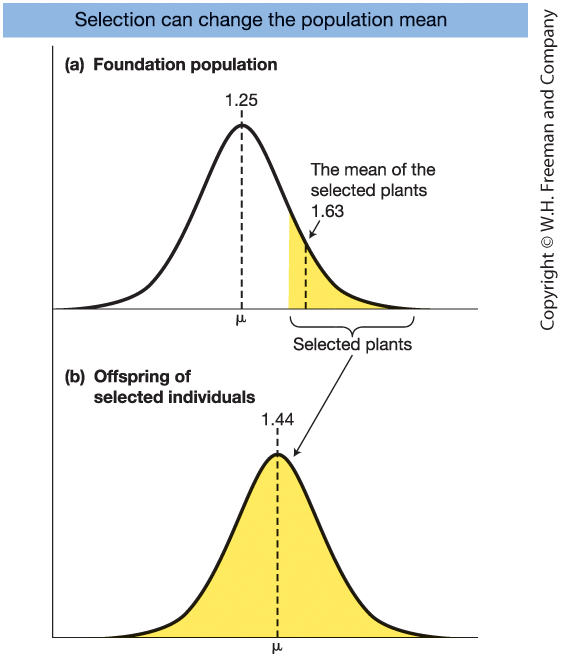
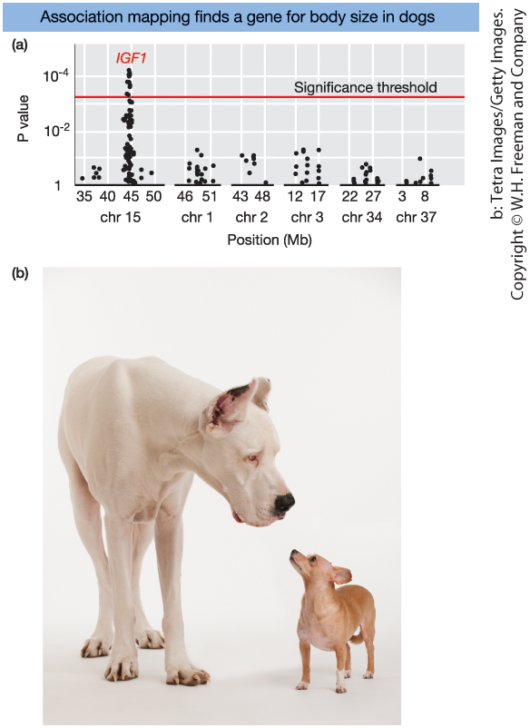
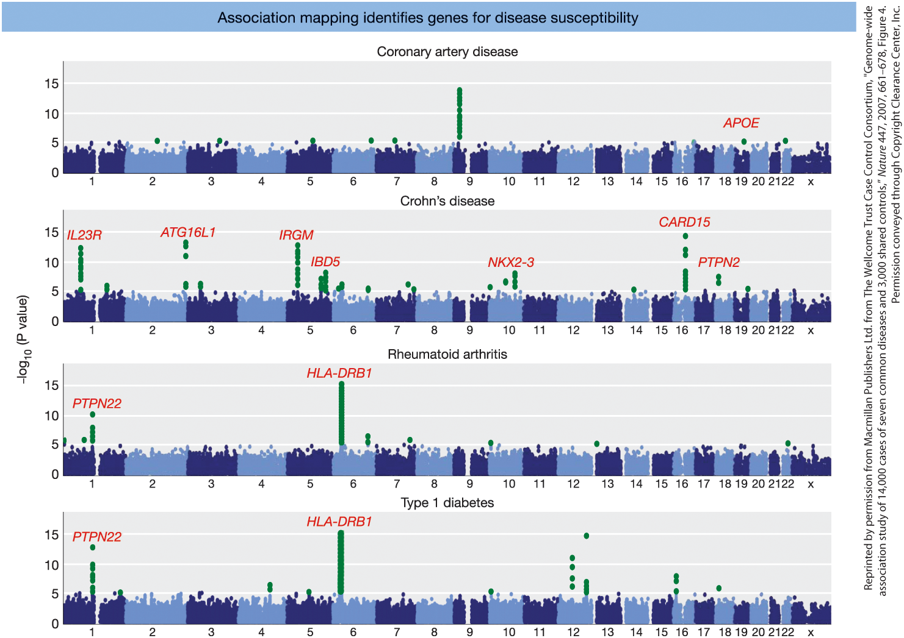
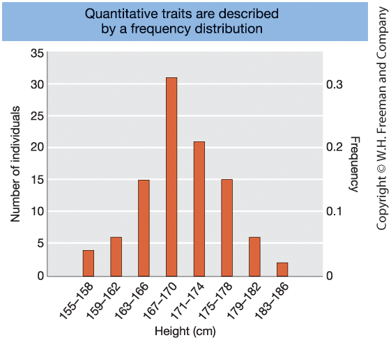
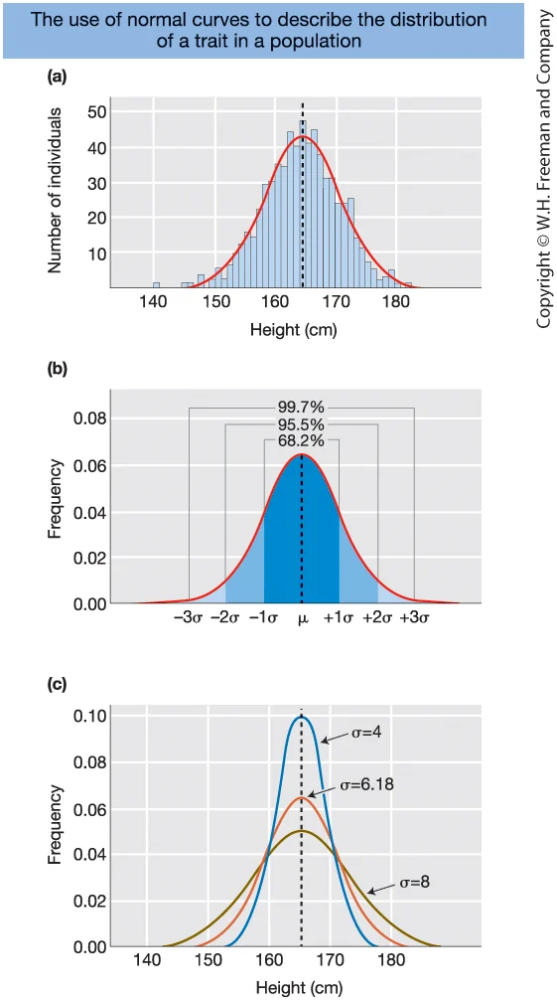

## Learning Goals - Quantitative Genetics

**1. Measuring Quantitative Variation**

- Understand how mathematical models and statistical methods are used to study complex traits  

**2. A Simple Genetic Model**

- Assess the relative contributions of genetic and environmental factors to phenotypic variation  

**3. Heritability**

- Calculate and interpret **broad-sense heritability**  
- Calculate and interpret **narrow-sense heritability**  
- Use parental phenotypes to predict offspring phenotypes  

**4. Mapping Quantitative Traits**

- Explain the principle behind association mapping studies


::: notes

In quantitative genetics, our focus shifts from single-gene traits to quantitative traits — traits that vary continuously, such as height, milk yield, blood pressure, or crop yield.

First, we look at how to measure quantitative variation. We use mathematical models and statistical methods to describe and analyze complex traits. This is really where genetics meets statistics.

Next, we introduce a simple genetic model. This model allows us to separate phenotypic variation into genetic and environmental components, and to assess how much each contributes to the trait.

We then study heritability. Broad-sense heritability measures the total genetic contribution to phenotypic variation. Narrow-sense heritability focuses specifically on additive genetic effects, which are especially important because they allow us to predict offspring phenotypes from parental phenotypes.

Finally, we discuss the principle behind association mapping studies. These approaches test for statistical associations between genetic variants and traits, helping us identify loci that contribute to quantitative variation.

By the end of this chapter, you should understand how quantitative traits are analyzed, how heritability is interpreted, and how genetic loci contributing to complex traits can be identified.

:::


## What Are Complex (Quantitative) Traits?

Quantitative (complex) traits:

- Show a **continuous range of variation**
- Do **not** follow simple Mendelian ratios
- Are influenced by:
  - **Multiple genes** (Polygenic)
  - **Environmental factors**

Examples:

- Human height, Blood pressure, Crop yield, Milk production

**Multifactorial hypothesis**

- Many Mendelian loci (each with a small effect)
- Environmental contributions

::: notes

Complex traits differ fundamentally from the Mendelian traits we studied earlier. Instead of clear, discrete categories—like Mendel's purple vs. white flowers—we see a **continuous spectrum**.

Take human height: people aren't just "tall" or "short." They vary across a bell curve. This variation comes from two sources: **multiple genes**, each contributing a small nudge to the phenotype, and **environmental factors** like nutrition and lifestyle.

Historically, this caused a massive rift in biology. When Mendel’s laws were rediscovered in 1900, scientists couldn't see how his "discrete units" could possibly explain "continuous variation." 

On one side, the **Biometricians** argued that continuous traits were too complex for Mendel's laws. On the other, the **Mendelians** focused only on discrete traits and ignored the rest.

The resolution was the **Multifactorial Hypothesis**. It proved that if you have enough Mendelian loci—each following Mendel’s laws but each having only a tiny effect—the result is a smooth, continuous distribution. 

This slide represents the **birth of Quantitative Genetics**: the synthesis that unified Mendelian inheritance with the statistical description of variation.

:::


## What Is Quantitative Genetics?

Quantitative genetics:

- Uses **mathematical models**
- Applies **statistical methods**
- Studies inheritance of complex traits

Central goal is to **define the genetic architecture of a trait**:

- Number of genes involved
- Size of their effects
- Population-specific variation

::: notes

Classic Mendelian analysis is powerful, but it does not work for continuous variation. Because we cannot sort individuals into simple categories like "tall" or "short" with expected 3-to-1 ratios, we must turn to the language of **mathematics and statistics**.

A central concept you will hear throughout this course is **Genetic Architecture**. This refers to the full landscape of genetic factors influencing a trait. 

When we talk about architecture, we are asking: 
First, how many genes are involved? Is it ten, or ten thousand? 
Second, what is the size of their effects? Do a few "major" genes do most of the work, or is the trait driven by thousands of "tiny" effects? 
And finally, how does this vary between populations? 

For example, the genetic architecture of blood pressure may differ between two populations if their allele frequencies or environments are different. 

Mapping this architecture is one of the grand challenges of modern biology, with massive implications for personalized medicine, sustainable agriculture, and livestock breeding.

:::


## Measuring Quantitative Variation


::: {.columns}

::: {.column width="50%"}

To study complex traits, we need basic statistical tools:

<br>

- **Mean** → describes differences between groups  
- **Variance** → quantifies variation within groups  
- **Normal distribution** → describes how variation is distributed  

<br>

Quantitative genetics focuses on traits with **complex inheritance**.

:::

::: {.column width="50%"}

**Mean**

$$
\bar{x} = \frac{1}{n} \sum_{i=1}^{n} x_i
$$

**Variance**

$$
\mathrm{Var}(X) = \frac{1}{n-1} \sum_{i=1}^{n} (x_i - \bar{x})^2
$$

**Normal distribution**

$$
f(x) = \frac{1}{\sqrt{2\pi\sigma^2}}
\exp\left(-\frac{(x-\mu)^2}{2\sigma^2}\right)
$$
:::

:::

::: notes

To understand quantitative traits, we first need basic statistical tools.

The mean allows us to compare groups — for example, average height in two populations.

Variance tells us how much individuals differ around the mean. Two populations may have the same average, but very different levels of variation.

Many quantitative traits follow an approximately normal, bell-shaped distribution. This distribution plays a central role in quantitative genetics.

Quantitative genetics focuses on traits that do not follow simple Mendelian ratios. Instead, they are influenced by multiple genes and environmental factors.

:::


## Types of Traits and Inheritance

::: {.columns}

::: {.column width="50%"}

**Continuous traits**

- Infinite range of values (e.g., height)  
- Typically influenced by many genes and the environment  

**Categorical traits**

- Discrete groups (e.g., purple vs. white flowers)  
- May follow simple or complex inheritance  

:::

::: {.column width="50%"}

**Threshold traits**

- Categorical outcome  
- Underlying liability is quantitative (e.g., type 2 diabetes)  

**Meristic traits**

- Countable values (e.g., clutch size)  
- Quantitative but not continuous  

:::

:::

::: notes

Quantitative traits come in several forms, and it is important not to confuse the type of trait with the type of inheritance.

Continuous traits can take on an infinite range of values. Height is a classic example. If measured precisely enough, there are infinitely many possible values.

Categorical traits fall into distinct groups. Some follow simple Mendelian inheritance, such as flower color in classic pea experiments. However, many categorical traits — especially diseases — involve complex inheritance.

Threshold traits are a special case. The observed outcome is categorical — for example, affected or not affected — but the underlying liability is quantitative. Type 2 diabetes is a good example. Disease occurs once an individual’s underlying risk passes a certain threshold.

Meristic traits are countable traits. For example, a bird can lay one, two, or three eggs — but not two and a half. These traits are discrete, yet still quantitative in nature.

The key message is this: complex traits are defined by complex inheritance, not by whether the phenotype is continuous or categorical.

:::


## The Mean

::: {.columns}

::: {.column width="50%"}

**Definition**

When studying quantitative traits, we usually sample from a population.

<br>

Sample mean:

$$
\bar{X} = \frac{1}{n} \sum_{i=1}^{n} X_i
$$

<br>

Population mean:

$$
\mu
$$

The mean describes the **center** of the data.

:::

::: {.column width="50%"}

**Example**

Height (cm) for 5 individuals:  
168, 172, 170, 174, 166

<br>

$$
\bar{X} = \frac{168 + 172 + 170 + 174 + 166}{5}
$$

<br>

$$
\bar{X} = \frac{850}{5} = 170
$$

We use $\bar{X}$ to estimate the true population mean $\mu$.

:::

:::

::: notes

When studying quantitative traits, we usually cannot measure the entire population.  
Instead, we take a random sample.

If the sample is truly random, it provides an unbiased estimate of population parameters.

The sample mean is calculated by adding up all observed values and dividing by the number of observations.  

Formally, we write this as one over n times the sum of all observations, but conceptually it simply means: add everything up and divide by n.

We use X-bar to denote the sample mean.  
The true population mean is denoted by the Greek letter mu.

Because traits such as height vary among individuals, the phenotype is a random variable.  
Sampling therefore introduces natural variation due to chance.

On the left, you see the formal definition of the sample mean and how it differs from the population mean.

On the right, we compute the mean for a small example.  
Even though the sample size here is only five individuals, the exact same computation applies whether n equals 5, 100, or 10,000.

The key idea is this:

The sample mean is our best estimate of the unknown population mean.

:::


## Mean Using Frequencies

::: {.columns}

::: {.column width="50%"}

**Definition (Grouped Data)**

If data are grouped into classes:

$$
\bar{X} = \frac{\sum f_i X_i}{n}
$$

- $f_i$ = frequency of class $i$  
- $X_i$ = value or midpoint of class $i$  
- $n = \sum f_i$

The mean is a **weighted average**.

:::

::: {.column width="50%"}

**Example**

Suppose height data are grouped:

| Height (cm) | Frequency ($f_i$) |
|-------------|-------------------|
| 165 | 2 |
| 170 | 3 |
| 175 | 1 |

Total $n = 6$

$$
\bar{X} =
\frac{(2 \cdot 165) + (3 \cdot 170) + (1 \cdot 175)}{6}
$$

$$
\bar{X} =
\frac{1015}{6}
= 169.2 \text{ cm}
$$

:::

:::

::: notes

Sometimes we do not have access to individual observations.  
Instead, data are grouped into classes with associated frequencies.

In that case, we compute a weighted mean.

Each class value is multiplied by how often it occurs, and we then divide by the total number of observations.

On the left, the formula shows that the mean is a weighted average.  
The total sample size equals the sum of all class frequencies.

On the right, we see a small example.

We multiply each height by its frequency:
two times 165,
three times 170,
and one time 175.

We then divide by the total number of individuals, which is six.

In larger datasets, classes often represent intervals, such as 165–169 cm.  
In that case, we use the class midpoint as the value $X_i$.

The grouped mean allows us to summarize populations and compare groups.

For example, if one group averages 170 cm and another averages 166 cm,  
we can begin to ask whether the difference is due to genetics, environment, or both.

Later, we will connect this idea to how variance can be partitioned into genetic and environmental components.

:::


## The Variance

::: {.columns}

::: {.column width="50%"}

**Definition**

Variance describes the spread of the data.

Deviation from the mean:

$$
d_i = X_i - \bar{X}
$$

Population variance:

$$
\sigma^2 = \frac{\sum (X_i - \mu)^2}{n}
$$

Standard deviation:

$$
\sigma = \sqrt{\sigma^2}
$$

:::

::: {.column width="50%"}

**Example**

Using the sample: 168, 172, 170, 174, 166  

Mean:
$$
\bar{X} = 170
$$

Deviations:
-2, 2, 0, 4, -4  

Squared deviations:
4, 4, 0, 16, 16  

Sum of squares:
$$
40
$$

Variance (using n=5):
$$
\sigma^2 = \frac{40}{5} = 8
$$

Standard deviation:
$$
\sigma = \sqrt{8} \approx 2.83 \text{ cm}
$$

:::

:::

::: notes

The mean tells us the center of the distribution, but it does not tell us how spread out the values are.

Variance measures the average squared deviation from the mean.

On the left, we define deviations as each observation minus the mean.

Because positive and negative deviations cancel each other out, we square them before averaging.

The population variance is simply the mean of these squared deviations.

The standard deviation is the square root of the variance, which brings the units back to centimeters.

On the right, we use the same five heights:

168, 172, 170, 174, 166.

We already calculated the mean as 170.

The deviations are:
minus 2, plus 2, zero, plus 4, and minus 4.

Squaring removes the signs:
4, 4, 0, 16, and 16.

The sum of squared deviations is 40.

Dividing by 5 gives a variance of 8.

Taking the square root gives a standard deviation of about 2.83 centimeters.

In real statistical analyses, when working with a sample, we usually divide by n minus 1 instead of n.  
But the principle remains the same.

Variance and standard deviation quantify how much individuals differ from the mean.

Later, this idea becomes central when we partition phenotypic variance into genetic and environmental components.

:::


## The Normal Distribution

::: {.columns}

::: {.column width="50%"}

**Definition**

Many biological traits follow an approximately **normal distribution**.

A normal distribution is fully defined by:

- Mean: $\mu$  
- Variance: $\sigma^2$  
  (or standard deviation $\sigma$)

<br>

Probability density function:

$$
f(x) = \frac{1}{\sigma \sqrt{2\pi}} 
\exp\left( -\frac{(x - \mu)^2}{2\sigma^2} \right)
$$

:::

::: {.column width="50%"}

**Key Properties**

- Bell-shaped curve  
- Symmetric around the mean $\mu$  
- Spread determined by $\sigma$  
- Total area under the curve = 1  

<br>

Central role in quantitative genetics:

- Describing quantitative traits  
- Modeling phenotypic variation  
- Partitioning genetic and environmental variance  

:::

:::

::: notes

On the left, we introduce the normal distribution.

Many biological traits follow an approximately normal, bell-shaped distribution.

The normal distribution is completely determined by two parameters:

The mean, μ — which determines the center of the distribution.

The variance, σ² — or equivalently the standard deviation σ — which determines the spread.

The probability density function shown here gives the exact mathematical form of the curve.

Notice that the exponential term contains (x − μ)² divided by 2σ².
This means values close to μ have higher probability density,
while extreme values become increasingly rare.

On the right, we summarize key properties.

The curve is symmetric around μ.

Changing μ shifts the distribution left or right.

Changing σ changes the spread.
A larger σ produces a wider, flatter curve.
A smaller σ produces a narrower, taller curve.

The total area under the curve equals 1,
because the distribution represents total probability.

This structure is central to quantitative genetics.

When we later partition phenotypic variance into genetic and environmental components,
we are effectively partitioning σ² — the variance of a normally distributed trait.

:::


## Normal Distribution (Effect of μ and σ)


```{r}
library(ggplot2)

params <- data.frame(
  mu = c(0, 0, 1),
  sigma = c(1, 2, 1),
  label = c("μ = 0, σ = 1",
            "μ = 0, σ = 2",
            "μ = 1, σ = 1")
)

x <- seq(-6, 6, length.out = 600)

df <- do.call(rbind, lapply(1:nrow(params), function(i) {
  mu <- params$mu[i]
  sigma <- params$sigma[i]
  data.frame(
    x = x,
    fx = dnorm(x, mean = mu, sd = sigma),
    mu = mu,
    label = params$label[i]
  )
}))

ggplot(df, aes(x, fx, color = label)) +
  geom_line(linewidth = 1.3) +
  geom_vline(aes(xintercept = mu, color = label),
             linetype = "dashed",
             linewidth = 1, show.legend=FALSE) +
  labs(
    x = "x",
    y = "Density",
    color = NULL
  ) +
  theme_minimal(base_size = 18) +
  theme(
    legend.position = "right",
    legend.text = element_text(size = 14)
  )
```

::: notes

Here we see three normal distributions.

The dashed vertical lines mark the mean of each distribution.

First, focus on the two curves with the same mean, μ equals zero.

The only difference between them is the standard deviation.

When σ increases, the distribution becomes wider and flatter.
When σ decreases, the curve becomes narrower and taller.

Notice that changing σ affects the spread of the distribution, but it does not move the mean.

Now look at the curve where μ equals one.

Here, the standard deviation is the same as the first curve,
but the entire distribution is shifted to the right.

Changing μ shifts the center of the distribution,
while changing σ changes how dispersed the values are around that center.

In all three cases, the total area under the curve equals one,
because the curve represents a probability distribution.

In quantitative genetics, many complex traits are approximately normally distributed.

Later, when we partition phenotypic variance into genetic and environmental components,
we are effectively partitioning σ² — the variance of such a distribution.

:::


## A Simple Genetic Model for Quantitative Traits

::: {.columns}

::: {.column width="50%"}

**Theory**

A quantitative trait can be modeled as:

$$
P = \mu + G + E
$$

- $\mu$ = population mean  
- $G$ = genetic deviation  
- $E$ = environmental deviation  

<br>

Deviation from the mean:

$$
p = P - \mu = G + E
$$

:::

::: {.column width="50%"}

**Interpretation**

- $\mu$ defines the population baseline  
- $G$ captures genetic differences among individuals  
- $E$ captures environmental differences  

Two individuals may differ because:

- They carry different alleles  
- They experience different environments  
- Or both  

This model forms the foundation for:

- Variance partitioning  
- Heritability  
- Prediction of response to selection  

:::

:::

::: notes

This is the fundamental model of quantitative genetics.

The phenotype, P, is expressed as the population mean plus a genetic deviation and an environmental deviation.

In other words, individuals differ from the average because of genetic effects, environmental effects, or both.

We often subtract the mean and work with deviations:

p equals G plus E.

This simplifies the mathematics because we focus only on what causes individuals to differ.

On the right, we interpret each component.

The population mean, μ, is simply the average phenotype.

The genetic deviation, G, captures how an individual’s genotype shifts their phenotype above or below the mean.

The environmental deviation, E, captures all non-genetic influences.

If two individuals differ in phenotype, that difference must arise from differences in G, differences in E, or both.

This deceptively simple equation is the backbone of quantitative genetics.

From it, we derive variance partitioning,
broad- and narrow-sense heritability,
the breeder’s equation,
and modern genomic prediction models.

:::


## Illustrative Example: Decomposing a Phenotype

::: {.columns}

::: {.column width="50%"}

**Step 1: Observed phenotype**

- Yao Ming’s height:  
  P = 229 cm  
- Population mean:  
  $\mu$ = 170 cm  

<br>

**Step 2: Deviation from the mean**

$$
p = P - \mu
$$

$$
p = 229 - 170 = 59 \text{ cm}
$$

He is **59 cm taller than average**.

:::

::: {.column width="50%"}

**Step 3: Apply the genetic model**

Recall:

$$
p = G + E
$$

Therefore:

$$
59 = G + E
$$

His exceptional height must be due to:

- A genetic component ($G$)  
- An environmental component ($E$)  
- Or both  

We observe only the total deviation —  
not its individual components.

:::

:::


::: notes

This slide applies the quantitative genetic model to a concrete example.

Yao Ming is 229 cm tall.
If the population mean for adult men from Shanghai is about 170 cm,
then his phenotypic deviation is:

p = 229 − 170 = 59 cm.

According to our model:

p = G + E

So his 59 cm deviation must be due to a combination of:

- genetic effects (G)
- environmental effects (E)

We cannot directly observe G and E separately for an individual.
We only observe the phenotype P.

The purpose of the model is not to measure G and E for one person,
but to provide a framework for analyzing variation in populations.

This simple decomposition will allow us,
in the next steps,
to partition variance and define heritability.

:::


## From Phenotype to Variance

::: {.columns}

::: {.column width="50%"}

**Start with the model**

$$
P = \mu + G + E
$$

Phenotypic variance:

$$
V_P = \mathrm{Var}(P)
$$

Since $\mu$ is constant:

$$
V_P = \mathrm{Var}(G + E)
$$

Basic statistical rule:

$$
V_P = V_G + V_E + 2\mathrm{Cov}(G,E)
$$

:::

::: {.column width="50%"}

**If genetic and environmental effects are independent**

$$
\mathrm{Cov}(G,E) = 0
$$

Then:

$$
V_P = V_G + V_E
$$

Meaning:

<br>

Total variation  = genetic variation  + environmental variation  

<br>

This is the foundation of heritability.

:::

:::

::: notes

We begin with the phenotype model:

P equals μ plus G plus E.

Phenotypic variance measures how much individuals differ from the mean.

Because μ is a constant, it does not contribute to variance.

So the variance of P becomes the variance of G plus E.

A basic statistical rule tells us that the variance of a sum equals the sum of the variances plus twice the covariance.

If genetic and environmental effects are independent, their covariance is zero.

In that case, total phenotypic variation equals genetic variation plus environmental variation.

This simple relationship is the foundation of heritability.

:::


## Visualizing Variance Partitioning

```{r}
library(ggplot2)

# 1. Data Preparation
data <- data.frame(
  component = factor(c("VG", "VE"), levels = c("VE", "VG")), 
  value = c(60, 40),
  label = c("V[E]", "V[G]"),
  color_group = c("Env", "Gen")
)

# 2. Create the Plot
ggplot(data, aes(x = 1, y = value, fill = color_group)) +
  # Main Stacked Bar
  geom_col(width = 0.4, color = "white", linewidth = 1.5) +
  
  # Internal Labels (VG and VE)
  geom_text(aes(label = label),
            position = position_stack(vjust = 0.5),
            size = 10, 
            parse = TRUE,
            fontface = "bold",
            color = "white") +
  
  # External Brackets and Total (VP)
  # Vertical line for the bracket
  annotate("segment", x = 1.3, xend = 1.3, y = 0, yend = 100, 
           linewidth = 1.5, color = "grey30") +
  # Small horizontal "ticks" for the bracket
  annotate("segment", x = 1.28, xend = 1.32, y = 0, yend = 0, linewidth = 1.5, color = "grey30") +
  annotate("segment", x = 1.28, xend = 1.32, y = 100, yend = 100, linewidth = 1.5, color = "grey30") +
  # The VP Label
  annotate("text", x = 1.4, y = 50, label = "V[P]", 
           parse = TRUE, size = 12, hjust = 0, fontface = "bold", color = "grey20") +
  
  # Professional Colors
  scale_fill_manual(values = c("Gen" = "steelblue", "Env" = "grey60")) +
  
  # Titles and Scales
  labs(
    title = expression(bold(The~Simple~Genetic~Model)),
    subtitle = expression(V[P] == V[G] + V[E]),
    x = NULL,
    y = "Total Phenotypic Variation (%)"
  ) +
  
  # VITAL: Expand the right side to prevent clipping
  coord_cartesian(xlim = c(0.5, 1.8)) + 
  
  # Theme cleanup
  theme_minimal(base_size = 20) +
  theme(
    axis.text.x = element_blank(),
    axis.title.y = element_text(face = "bold", size = 18),
    plot.title = element_text(hjust = 0.5, face = "bold", size = 24),
    plot.subtitle = element_text(hjust = 0.5, size = 20, color = "grey30"),
    panel.grid = element_blank(),
    legend.position = "none",
    plot.margin = margin(10, 10, 10, 10)
  ) +
  scale_y_continuous(breaks = seq(0, 100, 25))

```

::: notes

Here we see total phenotypic variance represented as a single bar.

That total variance can be partitioned into two components:
a genetic component and an environmental component.

In this example, genetic variance accounts for 40 percent of the total,
while environmental variance accounts for 60 percent.

The exact numbers are not important.

What matters is the principle:
phenotypic variation can be decomposed into genetic and environmental variation.

This visual framework prepares us to define heritability
as the proportion of total variance that is genetic.

:::


## Example: Partitioning Variance (Maize Experiment I)

::: {.columns}

::: {.column width="50%"}

**Numerical results**

Total phenotypic variance:

$$
V_P = 14.67
$$

Genetic variance  
(variation among inbred line means):

$$
V_G = 12.00
$$

Environmental variance  
(variation among environments):

$$
V_E = 2.67
$$

Check:

$$
V_P = V_G + V_E
V_P = 12.00 + 2.67 = 14.67
$$

:::

::: {.column width="50%"}

**Interpretation**

- Most variation is genetic  
  (12.00 out of 14.67)

- Environmental variation is smaller  
  (2.67)

- The decomposition works because:

  $$
  \mathrm{Cov}(G,E) = 0
  $$

- Genotypes were randomized  
  across environments

<br>

This example illustrates that:

$$
V_P = V_G + V_E
$$

holds when genotype and environment are independent.

:::

:::

::: notes

This slide applies the variance decomposition to real data.

In Experiment I,
10 inbred maize lines were grown in three environments.

Using all 30 observations,
the total phenotypic variance is 14.67.

We estimate:

V_G as the variance among line means — 12.00.

V_E as the environmental contribution — 2.67.

When we add them:

12.00 plus 2.67 equals 14.67.

So the equation works exactly.

Why?

Because the experiment was designed properly.
Genotypes were randomly assigned across environments.

That means genetic and environmental effects are independent,
so Cov(G,E) equals zero.

This example makes the abstract variance equation tangible.

And it leads naturally to the next concept:

Heritability is simply a ratio constructed from these variance components.

:::


## Correlation: What Does It Measure?

::: {.columns}

::: {.column width="50%"}

**Definition**

Correlation measures how two variables change together.

$$
r = \frac{\mathrm{Cov}(X,Y)}{\sigma_X \sigma_Y}
$$

- $-1 \le r \le 1$
- $r = 1$ → perfect positive relationship  
- $r = 0$ → no linear relationship  
- $r = -1$ → perfect negative relationship  

:::

::: {.column width="50%"}

**Why It Matters in Genetics**

Recall:

$$
V_P = V_G + V_E + 2\mathrm{Cov}(G,E)
$$

If genotype and environment are independent:

$$
\mathrm{Cov}(G,E) = 0
$$

Then:

$$
V_P = V_G + V_E
$$

If $G$ and $E$ are correlated,  
the covariance term does not vanish,  
and variance cannot be cleanly partitioned.

Correlation determines whether  
heritability can be properly estimated.

:::

:::

::: notes

Correlation measures whether two variables vary together.

It is a standardized form of covariance,
which makes it unitless and bounded between minus one and one.

Now connect this to genetics.

In our variance model,
phenotypic variance equals genetic variance plus environmental variance
plus a covariance term.

If genotype and environment are independent,
that covariance equals zero,
and the clean partition holds.

But if genetic and environmental effects are correlated,
the covariance term remains.

In that case, we cannot cleanly separate genetic and environmental variation.

This is why correlation is central in quantitative genetics —
it determines whether heritability can be estimated correctly.

:::


## Visualizing Correlation

```{r}
library(ggplot2)
library(MASS)

set.seed(123)

n <- 1000

mu <- c(170, 170)
sd <- 7

# Perfect correlation
Sigma_perfect <- matrix(c(sd^2, sd^2,
                          sd^2, sd^2), 2, 2)

data_perfect <- mvrnorm(n, mu, Sigma_perfect)

# Strong positive correlation (r = 0.8)
r <- 0.8
Sigma_strong <- matrix(c(sd^2, r*sd^2,
                         r*sd^2, sd^2), 2, 2)

data_strong <- mvrnorm(n, mu, Sigma_strong)

# No correlation
Sigma_none <- matrix(c(sd^2, 0,
                       0, sd^2), 2, 2)

data_none <- mvrnorm(n, mu, Sigma_none)

# Combine
df <- rbind(
  data.frame(twin1 = data_perfect[,1],
             twin2 = data_perfect[,2],
             type = "Perfect correlation"),
  data.frame(twin1 = data_strong[,1],
             twin2 = data_strong[,2],
             type = "Strong positive correlation"),
  data.frame(twin1 = data_none[,1],
             twin2 = data_none[,2],
             type = "No correlation")
)

df$type <- factor(df$type,
                  levels = c("Perfect correlation",
                             "Strong positive correlation",
                             "No correlation"))

lims <- range(c(df$twin1, df$twin2))

ggplot(df, aes(twin1, twin2)) +
  geom_point(alpha = 0.6) +
  geom_smooth(method = "lm", se = FALSE, color = "red") +
  facet_wrap(~ type) +
  coord_fixed(xlim = lims, ylim = lims) +
  labs(
    x = "Twin 1 height (cm)",
    y = "Twin 2 height (cm)"
  ) +
  theme_minimal(base_size = 16)
```


## Broad-Sense Heritability ($H^2$)

::: {.columns}

::: {.column width="50%"}

**Definition**

Key question:

- How much of the observed *variation* is genetic?

Broad-sense heritability:

$$
H^2 = \frac{V_G}{V_P}
$$

where:

- $V_G$ = genetic variance  
- $V_P$ = total phenotypic variance  

Range:

- $0 \le H^2 \le 1$

:::

::: {.column width="50%"}

**Interpretation**

- $H^2 = 0$ → all variation is environmental  
- $H^2 = 1$ → all variation is genetic  

Important:

- Describes **variation in a population**
- Not the “% genetic” of an individual
- Population- and environment-specific

“Broad-sense” includes:

- Additive effects  
- Dominance effects  
- Gene–gene interactions (epistasis)

:::

:::

::: notes

Broad-sense heritability answers a specific question:

Of all the variation we observe in a population,
what fraction is associated with genetic differences?

It is defined as the ratio of genetic variance to total phenotypic variance.

Its value ranges from zero to one.

If H² equals zero,
all observed differences are environmental.

If H² equals one,
all observed differences are genetic.

But this does NOT mean a trait is genetically determined in an individual.

Heritability always refers to variation within a population.

If everyone had identical genotypes,
genetic variance would be zero,
even if genes are biologically essential for the trait.

The term “broad-sense” is used because V_G includes
additive variance, dominance variance,
and interaction, or epistatic, variance.

Later, we will distinguish this from narrow-sense heritability,
which focuses only on additive variance.

Heritability is not a universal constant.

It depends on the population,
the environment,
and the amount of genetic variation present.

:::


## Heritability Depends on the Environment (Maize Example)

::: {.columns}

::: {.column width="50%"}

**Experiment I: Similar Environments**

- $V_G = 12.0$
- $V_E = 2.67$
- $V_P = 14.67$

$$
H^2 = \frac{12.0}{14.67} = 0.82
$$

Interpretation:

- 82% of the observed variation is genetic  
- Trait appears highly heritable  

:::

::: {.column width="50%"}

**Experiment II: More Variable Environments**

- $V_G = 12.0$  (same genotypes)
- $V_E = 24.0$
- $V_P = 36.0$

$$
H^2 = \frac{12.0}{36.0} = 0.33
$$

Interpretation:

- 33% of the observed variation is genetic  
- Environmental variation dominates  

:::

:::


::: notes

This slide compares two experiments using the same 10 maize inbred lines.

Importantly, the genetic variance is identical in both experiments:
V_G equals 12.0.

In Experiment I, environmental variance is small.
So most of the total variance is genetic.
Heritability is high: 0.82.

In Experiment II, the environments are much more variable.
Environmental variance increases to 24.0.
Total variance increases to 36.0.

Even though the genetics did not change,
heritability drops dramatically to 0.33.

This illustrates a crucial concept in quantitative genetics:

Heritability is not a fixed property of a trait.

It depends on:
- The amount of genetic variation
- The amount of environmental variation
- The specific population being studied

If environmental variance increases,
heritability decreases.

If environmental variance decreases,
heritability increases.

This does NOT mean genes became less biologically important.
It means their contribution to variation changed.

:::


## Estimating Heritability Using Identical Twins

::: {.columns}

::: {.column width="50%"}

**Theory**

Identical (monozygotic) twins:

- Share 100% of their genes  
- If reared apart → environments treated as independent  

Under independence:

$$
\mathrm{Cov}(\text{Twin 1}, \text{Twin 2}) = V_G
$$

Therefore:

$$
H^2 = \frac{V_G}{V_P}
     = \frac{\mathrm{Cov}(\text{twins})}{V_P}
$$

Key assumption:

$$
\mathrm{Cov}(G,E) = 0
$$

:::

::: {.column width="50%"}

**Example: IQ in Twins Reared Apart**

From data:

- Covariance between twins = 119.2  
- Total phenotypic variance $V_P$ = 154.3  

Heritability estimate:

$$
H^2 = \frac{119.2}{154.3} = 0.77
$$

**Interpretation**

- 77% of IQ variation (in this population)  
  is associated with genetic differences  

- Refers to population variation  
  — not individuals

:::

:::

::: notes

Left panel:

Identical twins share the same genotype.

If they are reared apart,
their environmental effects can be treated as independent.

Under that assumption,
the covariance between twin phenotypes reflects genetic variance.

In other words:

Covariance between Twin 1 and Twin 2 equals V_G.

Therefore, broad-sense heritability can be estimated as:

H² equals covariance between twins divided by total phenotypic variance.

Right panel:

In this example, the covariance between twin IQ scores is 119.2.
Total phenotypic variance is 154.3.

Dividing gives H² equal to 0.77.

Interpretation is critical:

This does NOT mean IQ is 77 percent genetic for an individual.

It means that 77 percent of the variation in IQ
within this population,
under these environmental conditions,
is associated with genetic differences.

Twin studies rely on important assumptions:

- Environments are truly independent  
- There is no strong gene–environment correlation  
- Measurements are accurate  

These assumptions must always be evaluated
when interpreting heritability estimates.

:::


## Broad-Sense Heritability in Humans  

::: {.columns}

::: {.column width="50%"}

<div style="font-size: 0.7em">

| Trait | $H^2$ |
|-------|-------|
| **Physical traits** | |
| Height | 0.88 |
| Fingerprint ridge count | 0.97 |
| Systolic blood pressure | 0.64 |
| **Cognitive traits** | |
| IQ | 0.69 |
| Spatial processing speed | 0.36 |
| **Personality traits** | |
| Extraversion | 0.54 |
| Neuroticism | 0.48 |
| **Psychiatric disorders** | |
| Autism | 0.90 |
| Schizophrenia | 0.80 |
| Major depression | 0.37 |
| **Beliefs / attitudes** | |
| Religiosity (adults) | 0.30–0.45 |
| Conservatism (adults) | 0.45–0.65 |

</div>

:::

::: {.column width="50%"}

This table shows broad-sense heritability ($H^2$) estimates from twin studies.

$$
H^2 = \frac{V_G}{V_P}
$$

**Key patterns:**

- Physical traits → often high $H^2$  
  (e.g., height, fingerprints)

- Cognitive & personality traits → moderate $H^2$

- Psychiatric disorders → variable  
  (some high, some moderate)

- Even beliefs and attitudes show measurable heritability

:::

:::

::: notes
This table shows broad-sense heritability estimates from twin studies.

Remember:

H² = V_G / V_P

These values represent the proportion of variation in a population
that is associated with genetic differences.

Several important patterns emerge:

1. Physical traits often show high heritability.
   - Height is very high (0.88).
   - Fingerprint ridge count is extremely high (0.97).

2. Cognitive and personality traits show moderate heritability.
   - IQ around 0.69.
   - Personality traits around 0.4–0.5.

3. Psychiatric disorders vary.
   - Autism and schizophrenia show high heritability.
   - Depression and anxiety are lower.

4. Even beliefs and political attitudes show measurable heritability.

Critical interpretation:

High heritability does NOT mean:
- The trait is genetically determined.
- The trait cannot change.
- Environment is unimportant.

Heritability is:
- Population-specific
- Environment-specific
- A measure of variation, not destiny.

If environmental variation increases,
heritability can decrease — even if genes matter biologically.

Twin-based estimates also rely on assumptions:
- Equal environments assumption
- No gene–environment correlation
- Accurate trait measurement
:::


## Narrow-Sense Heritability: Predicting Phenotypes

::: {.columns}

::: {.column width="50%"}

**From Broad to Narrow Heritability**

Broad-sense heritability:

$$
H^2 = \frac{V_G}{V_P}
$$

But genetic variance contains multiple components:

- **Additive variance ($V_A$)**  
  → predictably transmitted  

- **Dominance variance ($V_D$)**  
  → depends on allele combinations  

Total genetic variance:

$$
V_G = V_A + V_D + V_I
$$

where $V_I$ = interaction (epistatic) variance

:::

::: {.column width="50%"}

**Narrow-Sense Heritability**

$$
h^2 = \frac{V_A}{V_P}
$$

Focuses only on **additive variance**.

Why?

- Additive effects are predictably inherited  
- Determine parent–offspring resemblance  
- Determine response to selection  

Key idea:

Additive genetic variation drives response to selection.

:::

:::

::: notes

Left panel:

Broad-sense heritability measures total genetic variance.

But genetic variance is composed of several components.

Additive variance, V_A, reflects the average effect of alleles.

Dominance variance, V_D, depends on interactions between alleles at the same locus.

There may also be interaction, or epistatic, variance,
arising from interactions between loci.

Only additive variance is transmitted predictably from parents to offspring.

Dominance and interaction effects depend on specific allele combinations,
which are reshuffled each generation during meiosis.

Right panel:

Narrow-sense heritability isolates the additive component:

h² equals V_A divided by V_P.

This is the most important measure for:

- Predicting offspring phenotypes  
- Measuring resemblance between relatives  
- Predicting response to selection  

If h² is high, selection produces a strong response.

If h² is low, response to selection is limited.

The distinction between H² and h² is fundamental in quantitative genetics.

:::


## Modes of Gene Action at One Locus

::: {.columns}

::: {.column width="50%"}

```{r fig.height=9}

library(ggplot2)

# Data
df <- data.frame(
  genotype = rep(c("bb", "Bb", "BB"), 3),
  value = c(
    1, 2, 3,
    1, 3, 3,
    1, 2.5, 3
  ),
  model = rep(c("Additive",
                "Dominant",
                "Partial dominance"), each = 3)
)

df$genotype <- factor(df$genotype, levels = c("bb", "Bb", "BB"))

ggplot(df, aes(x = genotype, y = value, group = 1)) +
  geom_point(size = 5) +
  geom_line(linewidth = 1.3) +
  facet_wrap(~ model, ncol = 1) +
  labs(
    x = "Genotype at locus B",
    y = "Trait value"
  ) +
  theme_minimal(base_size = 26) +
  theme(
    axis.text = element_text(size = 22),
    axis.title = element_text(size = 26),
    strip.text = element_text(size = 24, face = "bold")
  )
```
:::

::: {.column width="50%"}

**Why this matters**

Additive gene action:

- Allele effects add linearly
- Produces predictable transmission
- Creates additive variance ($V_A$)

Dominance:

- Depends on allele combinations
- Does not transmit predictably
- Contributes to $V_D$, not $V_A$

Key insight:

Only additive effects contribute to
**narrow-sense heritability**

:::

:::
::: notes

This figure illustrates three different modes of gene action at a single locus.

On the x-axis we have the three genotypes:
bb, Bb, and BB.

On the y-axis we have the trait value.

Let’s go panel by panel.

In the top panel, we see additive gene action.
The heterozygote lies exactly halfway between the two homozygotes.
Each allele contributes a fixed amount to the phenotype.
The effects add linearly.

In the middle panel, we see dominance.
The heterozygote has the same phenotype as one of the homozygotes.
This means the allele B is dominant over b.
The effect depends on allele combinations, not simple addition.

In the bottom panel, we see partial dominance.
The heterozygote is intermediate,
but not exactly midway between the homozygotes.
There is some dominance, but not complete.

The key idea is this:

Only additive gene action produces predictable transmission from parents to offspring.

Dominance effects depend on how alleles combine within individuals.
Because meiosis reshuffles alleles each generation,
dominance effects are not transmitted in a consistent way.

That is why additive variance, V_A,
is the component that determines narrow-sense heritability
and response to selection.

:::


## Narrow-Sense Heritability ($h^2$)

::: {.columns}

::: {.column width="50%"}

**Definition**

$$
h^2 = \frac{V_A}{V_P}
$$

- $V_A$ = additive genetic variance  
- $V_P$ = total phenotypic variance  

Only additive variance is predictably transmitted.

Broad-sense heritability:

$$
H^2 = \frac{V_G}{V_P}
$$

But:

$$
V_G = V_A + V_D + V_I
$$

:::

::: {.column width="50%"}

**Estimation**

Parent–offspring covariance:

$$
\mathrm{Cov}_{\text{parent, offspring}} = \frac{1}{2} V_A
$$

Therefore:

$$
h^2 = \frac{2\,\mathrm{Cov}_{\text{parent, offspring}}}{V_P}
$$

Half-sibs share $\frac{1}{4}$ of additive effects:

$$
V_A = 4\,\mathrm{Cov}_{\text{half-sibs}}
$$

Example:

Human height: $h^2 \approx 0.8$

:::

:::


::: notes

Left panel:

Narrow-sense heritability isolates additive genetic variance.

Broad-sense heritability includes all genetic effects,
including dominance and interactions.

But only additive effects are transmitted predictably from parents to offspring.

That is why h² focuses on V_A.

Right panel:

An offspring inherits half its alleles from a parent.

Because additive effects sum across alleles,
the covariance between parent and offspring equals one-half of V_A.

Rearranging gives:

h² equals two times the covariance between parent and offspring,
divided by total phenotypic variance.

Similarly, half-siblings share one-quarter of their additive effects,
so V_A equals four times the covariance between half-sibs.

For example, human height has h² around 0.8.

This means most of the variation in height within a population
is due to additive genetic differences.

But this does NOT mean height is genetically fixed.

Environmental variation still contributes to phenotypic differences.

:::


## Genotype × Environment Interaction

::: {.columns}

::: {.column width="50%"}

```{r fig.height=9}

library(ggplot2)

df <- rbind(
  data.frame(panel = "No interaction",
             genotype = rep(c("IL1","IL2"), each = 2),
             env = rep(c("E1","E2"), times = 2),
             value = c(6, 7, 5, 6)),     # parallel: IL1 always +1
  data.frame(panel = "G×E interaction",
             genotype = rep(c("IL1","IL2"), each = 2),
             env = rep(c("E1","E2"), times = 2),
             value = c(7, 5, 5, 7))      # crossing lines
)

df$env <- factor(df$env, levels = c("E1","E2"))
df$panel <- factor(df$panel, levels = c("No interaction", "G×E interaction"))

ggplot(df, aes(env, value, group = genotype)) +
  geom_line(linewidth = 1.2) +
  geom_point(size = 3) +
  facet_wrap(~ panel, ncol = 1) +
  labs(x = "Environment", y = "Trait value") +
  theme_minimal(base_size = 26) +
  theme(
    axis.text = element_text(size = 22),
    axis.title = element_text(size = 26),
    strip.text = element_text(size = 24, face = "bold")
  )
```  

:::

::: {.column width="50%"}

**Reaction norms for two genotypes (IL1, IL2)**

**No interaction**
- Parallel lines  
- Genotype difference is constant across environments  

**G×E interaction**
- Lines cross (or diverge)  
- Genotype ranking depends on environment  

**Key idea:**  
Genotype performance can be environment-dependent.
:::

:::

::: notes

This figure shows reaction norms: how the same genotypes perform across environments.

On the left, there is no genotype-by-environment interaction.
The two lines are parallel.
IL1 is always higher than IL2 by the same amount.
So the genetic difference is stable across environments.

On the right, we have genotype-by-environment interaction.
The lines cross.
IL1 performs better in environment E1, but worse in environment E2.
So the ranking of genotypes depends on the environment.

This is what we mean by G×E:
the difference between genotypes changes across environments.

Why does it matter?

If there is strong G×E, selection in one environment may not give the best genotype in another environment.

In that case, we often extend the model by adding an interaction term:
phenotype equals mean plus genotype plus environment plus genotype-by-environment interaction.

:::


## Narrow-Sense Heritability (h²)

::: {.columns}

::: {.column width="50%"}

```{r fig.height=9}
library(ggplot2)
set.seed(123)
n <- 500; h2_true <- 0.8
mother <- rnorm(n, 170, 7); father <- rnorm(n, 175, 7)
daughter <- 170 + h2_true * (mother - 170) + rnorm(n, 0, 7 * sqrt(1 - h2_true))
son <- 175 + h2_true * (father - 175) + rnorm(n, 0, 7 * sqrt(1 - h2_true))
df <- rbind(data.frame(parent = mother, offspring = daughter, pair = "Mother–Daughter"),
            data.frame(parent = father, offspring = son, pair = "Father–Son"))

ggplot(df, aes(parent, offspring)) +
  geom_point(alpha = 0.3, color = "steelblue", size = 2.5) +
  geom_smooth(method = "lm", se = FALSE, color = "firebrick", linewidth = 2) +
  geom_abline(slope = 1, intercept = 0, linetype = "dotted", color = "grey40", linewidth = 1) +
  facet_wrap(~ pair, ncol = 1) +
  theme_minimal(base_size = 18) +
  labs(x = "Parent Height (cm)", y = "Offspring Height (cm)") +
  theme(strip.text = element_text(face = "bold", size = 20))

```  

:::

::: {.column width="50%"}

**Parent–Offspring Regression for Height**

- Each point = one parent–offspring pair  
- Clear positive relationship  
- Slope of regression line ≈ $h^2$

Interpretation:

The steeper the slope,
the greater the additive genetic contribution to variation.
:::

:::

::: notes

This figure shows parent–offspring regressions for height.

In the top panel, we see mother–daughter pairs.
In the bottom panel, father–son pairs.

Each point represents one parent–offspring pair.

There is a clear positive relationship:
taller parents tend to have taller children.

The red line is the best-fit regression line.

The slope of this line estimates narrow-sense heritability, h².

Why does this work?

Because additive genetic effects are transmitted predictably
from parents to offspring.

If additive variance is large,
offspring closely resemble their parents,
and the regression slope is steep.

If additive variance is small,
offspring resemble their parents less,
and the slope is flatter.

In this example, the slope is close to 0.8,
meaning most of the variation in height
is due to additive genetic differences.

But remember:

This describes variation in a population,
not how “genetic” height is for any one individual.

Environment still contributes to variation.

:::


## Narrow-Sense Heritability (h²) Across Species

::: {.columns}

::: {.column width="50%"}

<div style="font-size: 1em">

| Trait | h² (%) |
|-------------------------------|--------|
| **Agronomic species** | |
| Body weight (cattle) | 65 |
| Milk yield (cattle) | 35 |
| Back-fat thickness (pig) | 70 |
| Litter size (pig) | 5 |
| Body weight (chicken) | 55 |
| Egg weight (chicken) | 50 |
| **Natural species** | |
| Bill length (Darwin’s finch) | 65 |
| Flight duration (milkweed bug) | 20 |
| Plant height (jewelweed) | 8 |
| Fecundity (red deer) | 46 |
| Life span (collared flycatcher) | 15 |

</div>

:::

::: {.column width="50%"}

These are estimates of **narrow-sense heritability (h²)** in different species and traits.

$$h^2 = V_A / V_P$$  

- Measures additive (transmissible) variation  
- Predicts response to selection  

Patterns:

- Production traits in livestock often show moderate–high h²  
- Reproductive traits tend to have low h²  
- Natural populations show wide variation  

Low h² does not mean genes are unimportant —  
it means additive variance is limited relative to total variance.

:::

:::

::: notes

This table shows narrow-sense heritability estimates for traits in both agricultural and natural species.

Recall:

h² = V_A / V_P

It measures the proportion of phenotypic variance due to additive genetic variance — the part that is predictably transmitted to offspring.

This is the form of heritability most relevant to breeding and evolutionary response.

Agronomic species:

Many production traits show moderate to high heritability:

- Body weight in cattle: 65%
- Back-fat thickness in pigs: 70%
- Egg weight in chickens: 50%

These traits respond well to artificial selection.

In contrast, reproductive traits such as litter size in pigs have very low heritability (5%).

Why?

Reproductive traits are often closely tied to fitness and may have already been under strong natural selection, reducing additive variation.

Natural species:

We also see variation:

- Bill length in Darwin’s finches: 65% — strong potential for evolutionary response.
- Flight duration in milkweed bug: 20%.
- Plant height in jewelweed: 8% — mostly environmental or non-additive variation.
- Fecundity in red deer: 46%.
- Life span in collared flycatchers: 15%.

Key interpretation:

Heritability varies dramatically by trait and population.

Low h² does not mean genes are irrelevant.
It means that additive variance is small relative to total phenotypic variance.

Environmental variance, dominance, epistasis, and past selection history all influence these values.

This table highlights that evolutionary and breeding potential differ among traits.

:::


## Predicting Offspring Phenotypes

::: {.columns}

::: {.column width="50%"}

**What is transmitted?**

Individual deviation from the mean:

$$
x = a + d + e
$$

Parents:

$$
x' = a' + d' + e'
$$

$$
x'' = a'' + d'' + e''
$$

Expected offspring deviation:

$$
\mathbb{E}[x_0] = \frac{a' + a''}{2}
$$

Only **additive effects ($a$)**  
are predictably transmitted.

Dominance ($d$) and environment ($e$)  
are not transmitted predictably.

:::

::: {.column width="50%"}

**Prediction Using $h^2$**

Since $a$ is not directly observed:

$$
\widehat{x}_{\text{offspring}} = h^2 \,\bar{x}_{\text{parents}}
$$

Predicted phenotype:

$$
\widehat{X}_{\text{offspring}} = \mu + \widehat{x}_{\text{offspring}}
$$

**Example (Sheep fleece)**

Population mean = 6.0 lb  
Mean parental deviation = 0.75  
$h^2 = 0.4$

$$
0.4 \times 0.75 = 0.3
$$

Predicted offspring:

$$
6.0 + 0.3 = 6.3 \text{ lb}
$$

:::

:::


::: notes

Left panel:

Each individual’s phenotypic deviation from the mean
can be decomposed into three components:

Additive genetic effects,
dominance effects,
and environmental effects.

When parents reproduce,
only additive effects are transmitted predictably.

Dominance effects are not transmitted predictably,
because allele combinations are reshuffled each generation.

Environmental effects are not inherited,
because offspring experience their own environments.

Therefore, the expected offspring deviation
equals the average of the parents’ additive deviations.

Right panel:

Because we cannot directly observe additive deviations,
we use narrow-sense heritability to estimate them.

The expected offspring deviation equals:

h² times the mean parental phenotypic deviation.

In the sheep example:

Population mean is 6.0 pounds.
Parents are 0.75 pounds above the mean.
Heritability is 0.4.

So the predicted offspring deviation is:

0.4 times 0.75 equals 0.3.

The predicted offspring phenotype is therefore 6.3 pounds.

Notice that offspring are predicted to be less extreme than their parents.

This is regression toward the mean.

If h² equals 1,
offspring would lie exactly halfway between the parents.

If h² equals 0,
offspring would equal the population mean.

This principle underlies selective breeding
and evolutionary response to selection.

:::


## Selection on Complex Traits

::: {.columns}

::: {.column width="50%"}

**Artificial selection**

Humans select individuals with desirable phenotypes for reproduction.

**Selection differential**
$$
S = \bar{X}_{\text{selected}} - \bar{X}_{\text{population}}
$$

**Response to selection**
$$
R = \bar{X}_{\text{offspring}} - \bar{X}_{\text{population}}
$$

**Breeder’s equation**
$$
R = h^2 S
\qquad
h^2 = \frac{R}{S}
$$

Only **additive genetic variance** contributes to the response.

:::

::: {.column width="50%"}

**Example: Provitamin A in maize**

Base population mean = 1.25 µg/g  
Selected mean = 1.63 µg/g  
Offspring mean = 1.44 µg/g  

Selection differential:

$$
S = 1.63 - 1.25 = 0.38
$$

Response:

$$
R = 1.44 - 1.25 = 0.19
$$

Heritability:

$$
h^2 = \frac{0.19}{0.38} = 0.50
$$

About 50% of the variation contributing to selection
is additive and transmitted to the next generation.

:::

:::

::: notes

Left panel:

Artificial selection occurs when humans choose individuals
with desirable phenotypes to reproduce.

The selection differential, S,
measures how much better the selected parents are
compared to the base population.

The response, R,
measures how much the offspring generation changes
relative to the original population mean.

The breeder’s equation links these quantities:

R equals h² times S.

Only additive genetic variance contributes
to a predictable response to selection.

Right panel:

In the maize example:

The base population mean is 1.25 µg per gram.

Selected plants have a mean of 1.63,
so S equals 0.38.

The offspring mean is 1.44,
so R equals 0.19.

Because R is half of S,
heritability equals 0.50.

This means that about half of the variation
responsible for selection response
is additive and transmissible.

The remaining variation is due to environmental effects
and non-additive genetic effects,
which do not produce a predictable response.

Key insight:

The larger h² is,
the stronger and faster the response to selection.

:::


## Selection Shifts the Population Mean

::: {.columns}

::: {.column width="50%"}

{width=80%}

:::

::: {.column width="50%"}

**Figure 19-9.**

One generation of artificial selection for provitamin A in maize.

- Base population mean = 1.25 μg/g  
- Selected group mean = 1.63 μg/g  
- Offspring mean = 1.44 μg/g  

- Selection differential:  
  $$
  S = 1.63 - 1.25 = 0.38
  $$

- Selection response:  
  $$
  R = 1.44 - 1.25 = 0.19
  $$

Only the additive (heritable) component causes the shift in the next generation.


:::

:::

::: notes

This figure illustrates how artificial selection changes the population mean.

In panel (a), we see the foundation population.
The distribution is centered at 1.25 μg per gram.
Only individuals in the right tail of the distribution are selected.
Their mean is 1.63 μg per gram.
The difference between 1.63 and 1.25 is the selection differential, S = 0.38.

In panel (b), we see the offspring of the selected individuals.
The entire distribution has shifted to the right.
The new population mean is 1.44 μg per gram.

The shift from 1.25 to 1.44 is the response to selection:
R = 0.19.

Notice that the response is smaller than the selection differential.
This is because only the additive genetic component is transmitted to offspring.
Dominance and environmental effects are not predictably inherited.

This figure visually demonstrates the fundamental breeder’s equation:
R = h²S.

:::


## Long-Term Response to Artificial Selection

::: {.columns}

::: {.column width="50%"}

{width=70%}

:::

::: {.column width="50%"}

**Figure 19-10.**

Long-term selection experiments demonstrate sustained evolutionary change.

(a) **Fruit flies**  
- Selected for increased flight speed  
- Mean speed increased dramatically over 100 generations  

(b) **Mice**  
- Selected for voluntary wheel running  
- Large increase over just 10 generations  
- Control (unselected) lines changed very little  

Key message:

Populations contain substantial additive genetic variation  
and can respond to selection for many generations.


:::

:::

::: notes

This figure illustrates the power of artificial selection over time.

In panel (a), fruit flies were selected for faster flight speed.
Each generation, the fastest individuals were chosen to breed.
Over 100 generations, mean flight speed increased dramatically —
from very low values to roughly 150–170 cm per second.
Importantly, the response did not plateau quickly.
The population continued responding across many generations.

In panel (b), mice were selected for voluntary wheel running.
Selected lines show a steep increase in revolutions per day,
while unselected control lines remain relatively stable.
Within just 10 generations, selected lines increased activity by about 75 percent.

These experiments demonstrate two important principles:

First, complex traits often contain deep reservoirs of additive genetic variation.

Second, as long as additive variance remains,
populations can continue to respond to selection.

This is the foundation of modern plant and animal breeding —
and also a powerful demonstration of evolutionary change in action.

:::


## What Heritability Does **NOT** Mean

::: {.columns}

::: {.column width="50%"}

**Broad-sense heritability**
$$
H^2 = \frac{V_G}{V_P}
$$

**Narrow-sense heritability**
$$
h^2 = \frac{V_A}{V_P}
$$

:::

::: {.column width="50%"}

**Heritability is:**

- Population-specific  
- Environment-specific  
- A measure of **variation**, not destiny  

**Heritability does NOT mean:**

- Not the “% genetic” of an individual  
- Not that a trait is genetically fixed  
- Not that a trait cannot change  
- Not universal across populations  
- Not independent of environment  

:::

:::


::: notes

This is one of the most misunderstood concepts in genetics.

Heritability does NOT tell us how genetic a trait is in a particular person.

If height has h² = 0.8,
that does not mean a person is “80% genetic and 20% environmental.”

It means that 80% of the variation in height
within a specific population,
under specific environmental conditions,
is associated with additive genetic differences.

Heritability does not imply immutability.

A trait can have very high heritability
and still change dramatically if the environment changes.

For example,
average human height increased substantially during the 20th century
due to improved nutrition,
even though height has high heritability.

Heritability is not universal.

It depends on:
- The population being studied
- The amount of genetic variation present
- The amount of environmental variation present

If environmental variance increases,
heritability decreases —
even if genes remain biologically essential.

The key takeaway:

Heritability measures variation among individuals in a population.

It does not measure destiny,
and it does not apply to individuals.

:::

## From Phenotype to Genotype: The "Missing" Link

::: {.columns}

::: {.column width="50%"}
**What we know so far:**

- Traits like height are **heritable** ($h^2 \approx 0.8$).
- This variation is **multifactorial** (many genes + environment).
- We can **predict** offspring from parents using the selection response.

<br>

**The Big Question:**

- *Where* are these genes located?
- *Which* specific DNA variants drive the $V_G$?
:::

::: {.column width="50%"}
**The Solution: Association Mapping**

1. **The Strategy:** Search the entire genome for statistical correlations.
2. **The Tool:** High-density SNP markers (M).
3. **The Principle:** Linkage Disequilibrium (LD) with the causal variants (Q).

<br>

> "We move from describing **how much** is inherited to identifying **what** is inherited."
:::

:::

::: notes
This is a critical transition in the lecture. 

Up until now, we have treated the "Genotype" as a black box (V_G). We know it's there because children look like parents, but we don't know the physical address of the genes.

In the next section, we move into Mapping. The goal here is to open that black box. We use the concept of Linkage Disequilibrium to find the specific "neighborhoods" in the genome that contribute to the variance we measured in the first half of the lecture.
:::


## Mapping Genes for Complex Traits

Quantitative trait loci (QTL):

- Genomic regions affecting trait variation

Two major approaches:

QTL mapping  
- Controlled crosses  
- Known pedigrees  

Association mapping / GWAS  
- Random-mating populations  
- Uses linkage disequilibrium  
- Genome-wide SNP scans  

GWAS can directly identify candidate genes.


::: notes

Finally, we examined how to identify genes underlying complex traits.

QTL mapping:
- Uses controlled crosses
- Tracks segregation in pedigrees

Association mapping:
- Uses natural populations
- Relies on linkage disequilibrium
- Scans the entire genome

Genome-wide association studies test hundreds of thousands
of SNPs simultaneously.

These approaches have identified genes for:
- Disease susceptibility in humans
- Agronomic traits in crops
- Size differences in dogs

Quantitative genetics now integrates statistics,
molecular biology, and genomics.

It is central to modern biology.

:::


## Genome-Wide Association Study (GWAS)

::: {.columns}

::: {.column width="50%"}

**Goal**

Identify genomic regions influencing complex traits  
in random-mating populations.

**Core idea**

Test statistical association between:

- Genetic markers (SNPs)  
- Phenotypic variation  

:::

::: {.column width="50%"}

**GWAS characteristics**

- Scans the entire genome  
- Tests thousands to millions of SNPs  
- No need to specify candidate genes in advance  

**Compared to classical QTL mapping**

- No controlled crosses required  
- No pedigree information needed  
- Works directly in natural populations  

:::

:::


::: notes

A Genome-Wide Association Study, or GWAS,
aims to identify genomic regions that influence complex traits.

Unlike classical QTL mapping,
GWAS works in natural, random-mating populations.

The core idea is simple:
We test whether genetic variation at a marker SNP
is statistically associated with phenotypic variation.

We do this across the entire genome,
testing thousands to millions of SNPs.

One major advantage is that
we do not need to specify candidate genes in advance.
The genome is scanned in an unbiased way.

Compared to classical QTL mapping,
GWAS does not require controlled crosses,
and it does not require pedigree information.

Instead, it relies on naturally occurring genetic variation
and statistical association.

In the next slide, we will explain why this works from a genetic perspective —
specifically, the role of linkage disequilibrium.

:::


## Why GWAS Works: Marker–QTL Linkage Disequilibrium

::: {.columns}

::: {.column width="50%"}

```{r fig.height=11}
library(ggplot2)
library(patchwork)

# --- GLOBAL SETTINGS FOR VISIBILITY ---
label_size <- 8       # Size for M and Q
text_size <- 6        # Size for descriptive text
title_size <- 22      # Top Title
subtitle_size <- 16   # Top Subtitle
panel_title_size <- 18 # Scenario Titles
line_thickness <- 1.5 # Chromosome and indicator lines

# 1. SCENARIO A: LINKED
p1 <- ggplot() +
  # Chromosome
  geom_segment(aes(x = 1, xend = 7, y = 0, yend = 0), linewidth = 4, color = "grey90", lineend = "round") +
  
  # LD Bridge
  annotate("curve", x = 3.1, xend = 4.9, y = 0.55, yend = 0.55, 
           curvature = -0.45, color = "darkblue", linewidth = 1.5, linetype = "dashed") +
  annotate("text", x = 4, y = 0.35, label = "Linked (LD)", size = text_size, color = "darkblue", fontface = "bold") +
  
  # Markers (M and Q)
  geom_segment(aes(x = 3, xend = 3, y = -0.4, yend = 0.4), color = "steelblue", linewidth = 5) +
  geom_segment(aes(x = 5, xend = 5, y = -0.4, yend = 0.4), color = "firebrick", linewidth = 5) +
  
  # Labels
  annotate("text", x = 3, y = 0.7, label = "M", size = label_size, color = "steelblue", fontface = "bold") +
  annotate("text", x = 5, y = 0.7, label = "Q", size = label_size, color = "firebrick", fontface = "bold") +
  
  # Trait Arrows (Scaled up)
  annotate("segment", x = 5, xend = 5, y = -0.6, yend = -1.2, 
           arrow = arrow(length = unit(0.4, "cm")), color = "firebrick", linewidth = line_thickness) +
  annotate("segment", x = 3, xend = 3, y = -0.6, yend = -1.2, 
           arrow = arrow(length = unit(0.4, "cm")), color = "steelblue", linetype = "dotted", linewidth = line_thickness) +
  annotate("text", x = 4, y = -1.5, label = "Marker 'tags' the QTL effect", size = text_size, fontface = "italic") +
  
  labs(title = "Scenario 1: Association by Proxy") +
  coord_cartesian(ylim = c(-1.7, 1.3)) + theme_void() +
  theme(plot.title = element_text(face = "bold", size = panel_title_size, hjust = 0.5, color = "grey20"))

# 2. SCENARIO B: UNLINKED
p2 <- ggplot() +
  # Two separate Chromosomes
  geom_segment(aes(x = 1, xend = 3.5, y = 0, yend = 0), linewidth = 4, color = "grey90", lineend = "round") +
  geom_segment(aes(x = 4.5, xend = 7, y = 0, yend = 0), linewidth = 4, color = "grey90", lineend = "round") +
  
  # No connection label
  annotate("text", x = 4, y = 0.35, label = "Unlinked", size = text_size + 1, color = "grey50", fontface = "bold") +
  
  # Markers
  geom_segment(aes(x = 2.5, xend = 2.5, y = -0.4, yend = 0.4), color = "steelblue", linewidth = 5) +
  geom_segment(aes(x = 5.5, xend = 5.5, y = -0.4, yend = 0.4), color = "firebrick", linewidth = 5) +
  
  # Labels
  annotate("text", x = 2.5, y = 0.7, label = "M", size = label_size, color = "steelblue", fontface = "bold") +
  annotate("text", x = 5.5, y = 0.7, label = "Q", size = label_size, color = "firebrick", fontface = "bold") +
  
  # Only Q affects trait
  annotate("segment", x = 5.5, xend = 5.5, y = -0.6, yend = -1.2, 
           arrow = arrow(length = unit(0.4, "cm")), color = "firebrick", linewidth = line_thickness) +
  annotate("text", x = 2.5, y = -0.9, label = "No Signal", size = text_size, color = "grey60", fontface = "bold") +
  annotate("text", x = 4, y = -1.5, label = "Marker is blind to the QTL", size = text_size, fontface = "italic") +
  
  labs(title = "Scenario 2: Independent Segregation") +
  coord_cartesian(ylim = c(-1.7, 1.3)) + theme_void() +
  theme(plot.title = element_text(face = "bold", size = panel_title_size, hjust = 0.5, color = "grey20"))

# 3. COMBINE
final_plot <- p1 / plot_spacer() / p2 + 
  plot_layout(heights = c(1, 0.3, 1)) +
  plot_annotation(
#    title = 'The Core Logic of GWAS',
#    subtitle = 'Markers (M) are only informative when in Linkage Disequilibrium #with a QTL (Q)',
    theme = theme(
      plot.title = element_text(size = title_size, face = "bold", hjust = 0.5),
      plot.subtitle = element_text(size = subtitle_size, hjust = 0.5, margin = margin(b=20))
    )
  )

print(final_plot)

```

:::

::: {.column width="50%"}

**Concept**

- A causal mutation (QTL) affects the trait  
- A nearby SNP is in **linkage disequilibrium (LD)**  
- The SNP is correlated with the QTL  

Therefore:

The SNP shows statistical association  
even if it is not the causal mutation.

**Key point**

GWAS detects regions in LD  
with functional variants.

:::
:::


::: notes

This figure illustrates why GWAS works.

The horizontal line represents a chromosome segment.

The red marker is a causal mutation —
a quantitative trait locus, or QTL.

The black dots are SNP markers.

Because the QTL and a nearby SNP are physically close,
they tend to be inherited together.
This non-random association is called linkage disequilibrium, or LD.

Even if we do not genotype the causal mutation itself,
the nearby SNP is correlated with it.

So when we test that SNP statistically,
it appears associated with the trait.

This is the key principle:

GWAS detects markers in LD with causal variants.

Importantly, the associated SNP is not necessarily the functional mutation.
Further fine-mapping and functional studies are required.

:::


## Why GWAS Works: Marker–QTL Linkage Disequilibrium

::: {.columns}

::: {.column width="50%"}

```{r fig.height=11}
library(ggplot2)
library(patchwork)
library(dplyr)

# 1. Configuration for Visibility
base_text_size <- 14  # General text size
dot_size <- 3.5       # Size of GWAS SNPs
line_width <- 1.2     # Thickness of dashed line and box borders
x_min <- 10.0
x_max <- 11.0

# 2. Simulate GWAS Data
set.seed(123)
n_snps <- 200
df <- data.frame(
  pos = seq(x_min, x_max, length.out = n_snps),
  p_val = -log10(runif(n_snps, 0, 1))
)
df$p_val <- df$p_val + exp(-(df$pos - 10.5)^2 / 0.01) * 8

# 3. Define Gene Regions
genes <- data.frame(
  name = c("Gene A", "Gene B\n(QTL?)", "Gene C"), # Added \n for better spacing
  start = c(10.1, 10.45, 10.8),
  end = c(10.25, 10.55, 10.9)
)

# 4. Create the GWAS Plot (Top)
p1 <- ggplot() +
  geom_rect(data = genes, aes(xmin = start, xmax = end, ymin = -Inf, ymax = Inf), 
            fill = "grey90", alpha = 0.6) +
  # BIGGER DOTS
  geom_point(data = df, aes(x = pos, y = p_val), color = "steelblue", alpha = 0.7, size = dot_size) +
  # THICKER DASHED LINE
  geom_vline(xintercept = 10.5, linetype = "dashed", color = "firebrick", linewidth = line_width) +
  scale_x_continuous(limits = c(x_min, x_max), expand = c(0,0)) +
  labs(title = "GWAS Signal: Marker–Trait Association", 
       y = expression(bold(-log[10](p))), x = NULL) +
  theme_minimal(base_size = base_text_size) +
  theme(axis.text.x = element_blank(),
        axis.ticks.x = element_blank(),
        axis.title.y = element_text(face = "bold", size = 16),
        plot.title = element_text(face = "bold", size = 18, hjust = 0.5))

# 5. Create the Gene Track Plot (Bottom)
p2 <- ggplot(genes) +
  # THICKER GENE BOXES
  geom_rect(aes(xmin = start, xmax = end, ymin = 0.3, ymax = 0.7), 
            fill = "steelblue", color = "black", linewidth = line_width) +
  # BIGGER GENE LABELS
  geom_text(aes(x = (start + end)/2, y = 0.1, label = name), 
            size = 5.5, fontface = "bold", vjust = 1) +
  scale_x_continuous(limits = c(x_min, x_max), expand = c(0,0)) +
  scale_y_continuous(limits = c(-0.5, 1)) + # Expanded Y to fit larger labels
  labs(x = "Genomic Position (Mb)") +
  theme_void() + 
  theme(axis.title.x = element_text(face = "bold", size = 16, margin = margin(t = 15)),
        axis.text.x = element_text(size = 14, color = "black"),
        plot.margin = margin(t = 0, r = 10, b = 20, l = 10))

# 6. Combine
final_plot <- (p1 / p2) + plot_layout(heights = c(3.5, 1))

print(final_plot)

```

:::

::: {.column width="50%"}

**The Interpretation**

- **Association Peak:** The highest points cluster over a specific genomic region.
- **Candidate Gene (QTL):** The vertical dashed line shows the "lead SNP" falls directly within **Gene B**.
- **The "Neighborhood" Effect:** Note how the shading spans the whole gene. Because of LD, many SNPs in the red-shaded region appear significant, but only one gene is likely the true functional driver.

**Key point**
This visual demonstrates **Fine-Mapping**: the process of narrowing down a broad GWAS "skyscraper" to the specific gene region most likely to contain the causal variant.

:::
:::


## From Biological Data to Statistical Model

::: {.columns}

::: {.column width="50%"}

**Phenotype data**

Measured trait values for $n$ individuals.

Example (height):

| Individual | Phenotype ($y$) |
|------------|----------------|
| Ind₁ | 170 |
| Ind₂ | 165 |
| Ind₃ | 182 |
| … | … |

Phenotypes form a vector:

$$
\mathbf{y} =
\begin{pmatrix}
y_1 \\
y_2 \\
y_3 \\
\vdots
\end{pmatrix}
$$

:::

::: {.column width="50%"}

**Genotype matrix**

Genotypes organized into an $n \times m$ matrix.

|        | SNP₁ | SNP₂ | SNP₃ | … |
|--------|------|------|------|---|
| Ind₁   | 0    | 1    | 2    |   |
| Ind₂   | 1    | 1    | 0    |   |
| Ind₃   | 2    | 0    | 1    |   |
| …      |      |      |      |   |

Common SNP coding:

- 0 = Homozygous reference  
- 1 = Heterozygous  
- 2 = Homozygous alternative  

$$
\mathbf{X}
$$

:::

:::


::: notes

Genome-wide association studies require two types of data.

First, phenotypes.
These are measured trait values —
for example, height or milk yield.
We represent them as a vector, y,
with one value per individual.

Second, genotypes.
These are organized into a matrix, X,
where rows are individuals
and columns are SNP markers.

Each entry is coded as 0, 1, or 2,
representing the number of alternative alleles.

Together, the phenotype vector and genotype matrix
form the basis for statistical modeling.

GWAS essentially asks:

Does variation in a column of X
predict variation in y?

That connection is what we model next.

:::


## The Principle Behind GWAS

::: {.columns}

::: {.column width="50%"}

**Goal**

Identify loci associated with variation in a trait.

For each SNP:

Test whether genotype predicts phenotype.

Statistical model (single SNP):

$$
y_i = \mu + \beta x_{ij} + \varepsilon_i
$$

- $y_i$ = phenotype of individual $i$  
- $x_{ij}$ = genotype (0,1,2) at SNP $j$  
- $\beta$ = SNP effect  
- $\varepsilon_i$ = residual variation  

:::

::: {.column width="50%"}

**Procedure**

1. Test SNP₁  
2. Test SNP₂  
3. Test SNP₃  
4. …  
5. Test all $m$ SNPs  

Thousands to millions of tests.

If $\beta \neq 0$ (statistically significant)  
→ evidence of association.

:::

:::

::: notes

This slide builds directly on the previous one.

We now connect the genotype matrix X
and the phenotype vector y.

For each SNP — meaning for each column of X —
we fit a simple regression model.

The phenotype equals:

an overall mean,
plus the SNP effect,
plus residual variation.

The key question is:

Is the SNP effect, beta, significantly different from zero?

If beta is statistically different from zero,
we conclude that this SNP is associated with the trait.

We repeat this test for every SNP in the genome.

In other words,
GWAS scans the genome one column of the genotype matrix at a time.

Each SNP is tested independently.

Later, we correct for multiple testing
and visualize results in a Manhattan plot.

The important idea is simple:

GWAS is repeated regression across the genome.

:::


## From P-values to Manhattan Plot

::: {.columns}

::: {.column width="50%"}

```{r fig.height=11}
library(ggplot2)
library(dplyr)

# 1. Simulate Realistic GWAS Data
set.seed(123)
n_chr <- 5
snps_per_chr <- 200
n_snps <- n_chr * snps_per_chr

df <- data.frame(
  chr = rep(1:n_chr, each = snps_per_chr),
  pos = rep(1:snps_per_chr, n_chr),
  p = runif(n_chr * snps_per_chr) # Null background
)

# 2. Add a "Skyscraper" Peak (Simulating LD around a QTL)
# Instead of 1 dot, we make a cluster of SNPs significant
peak_center <- 450 
df$p <- ifelse(abs(1:n_snps - peak_center) < 10, 
               df$p * 1e-7, # Very significant center
               ifelse(abs(1:n_snps - peak_center) < 30, 
                      df$p * 1e-3, # Moderately significant shoulders
                      df$p))

df$logp <- -log10(df$p)

# 3. Create Cumulative Position for Plotting
df <- df %>%
  mutate(cum_pos = pos + (chr - 1) * snps_per_chr)

# 4. Calculate Chromosome Center Labels
chr_labels <- df %>%
  group_by(chr) %>%
  summarize(center = mean(cum_pos))

# 5. Generate the Plot
ggplot(df, aes(x = cum_pos, y = logp, color = factor(chr %% 2))) +
  # Larger points for better visibility on slides
  geom_point(size = 2.5, alpha = 0.8) +
  
  # Genome-wide significance line (Thicker)
  geom_hline(yintercept = -log10(5e-8), linetype = "dashed", color = "firebrick", linewidth = 1.2) +
  
  # Label the significance threshold for students
  annotate("text", x = max(df$cum_pos), y = -log10(5e-8) + 0.5, 
           label = "Significance Threshold", hjust = 1, color = "firebrick", fontface = "bold", size = 5) +
  
  # Colors: Alternating professional blues/greys
  scale_color_manual(values = c("0" = "steelblue", "1" = "grey60")) +
  
  # X-axis with Chromosome numbers instead of raw position
  scale_x_continuous(breaks = chr_labels$center, labels = paste("Chr", chr_labels$chr)) +
  
  labs(
    title = "Genome-Wide Association Study (GWAS)",
    subtitle = "Manhattan Plot: Each dot represents a genetic marker (SNP)",
    x = "Genomic Position by Chromosome",
    y = expression(bold(-log[10](p)))
  ) +
  
  # Theme adjustments for big screens
  theme_minimal(base_size = 18) +
  theme(
    legend.position = "none",
    panel.grid.minor = element_blank(),
    axis.title = element_text(face = "bold"),
    plot.title = element_text(face = "bold", size = 22, hjust = 0.5),
    plot.subtitle = element_text(size = 14, hjust = 0.5, color = "grey30"),
    axis.text.x = element_text(face = "bold")
  )

```
:::

::: {.column width="50%"}

**Each point = one SNP**

- X-axis → genomic position  
- Y-axis → $-\log_{10}(p)$  

Higher points = stronger evidence  
against the null hypothesis.

**Dashed line**

- Genome-wide significance threshold  
  (e.g. $p = 5 \times 10^{-8}$)

Peaks indicate genomic regions  
associated with the trait.


:::

:::


::: notes

After testing every SNP,
we obtain a p-value for each one.

To visualize results,
we plot genomic position on the x-axis
and minus log base 10 of the p-value on the y-axis.

Why minus log 10?

Because very small p-values become large positive numbers,
making strong signals easier to see.

Each dot represents one SNP.

Most SNPs show no association,
so they cluster near the bottom.

Occasionally,
a SNP shows a very small p-value,
creating a visible peak.

The dashed horizontal line represents
the genome-wide significance threshold.

Peaks above this line indicate
regions associated with the trait.

This type of plot is called a Manhattan plot,
because the peaks resemble skyscrapers.

Importantly,
a peak identifies a genomic region —
not necessarily the causal mutation.

:::


## GWAS Identifies a Gene for Body Size in Dogs

::: {.columns}

::: {.column width="50%"}

{width=75%}

:::

::: {.column width="50%"}

**Figure 19-18.**

(a) Genome-wide association study (GWAS) for body size in dogs  

- Each dot = one SNP  
- Y-axis = −log10(P value)  
- Horizontal line = significance threshold  
- Strong peak on chromosome 15  

→ Region contains the **IGF1** gene  

(b) Small vs. large dog breeds  

IGF1 is a major contributor to size differences.

:::

:::

::: notes

This figure shows a real example of association mapping.

Panel (a) is a GWAS result.

The horizontal axis shows genomic position across several chromosomes.
The vertical axis shows statistical significance, plotted as −log10(P value).

Because the scale is inverted:
- Higher points mean smaller P values.
- Smaller P values mean stronger evidence of association.

The horizontal line represents the genome-wide significance threshold.
Points above this line are considered statistically significant.

Notice that almost all chromosomes show no strong signal.
But on chromosome 15, there is a clear cluster of highly significant SNPs.

That region contains the IGF1 gene — insulin-like growth factor 1.

IGF1 plays a major role in juvenile growth in mammals.
Variation in this gene explains much of the size difference between small and large dog breeds.

Panel (b) visually illustrates the dramatic size difference among breeds.

Key takeaway:

GWAS does not require a prior candidate gene.
By scanning the entire genome,
we can statistically localize regions controlling quantitative traits.

However, association does not prove causation —
functional validation is required to confirm the gene’s role.

:::


## GWAS Identifies Genes for Common Human Diseases

::: {.columns}

::: {.column width="50%"}

{width=100%}

:::

::: {.column width="50%"}

**Figure 19-19.**

Genome-wide association studies (GWAS)  
for several common human diseases.

- X-axis: Chromosomes 1–22  
- Y-axis: −log10(P value)  
- Green dots = significant SNP associations  
- Red labels = candidate genes identified  

Examples:

- **Coronary artery disease** → *APOE*  
- **Crohn’s disease** → *IL23R, ATG16L1, IRGM*  
- **Rheumatoid arthritis** → *PTPN22, HLA-DRB1*  
- **Type 1 diabetes** → *PTPN22, HLA-DRB1*
:::

:::

::: notes

This figure shows results from genome-wide association studies 
for several common human diseases.

The horizontal axis lists chromosomes 1 through 22.

The vertical axis shows −log10(P value).
Higher points indicate stronger statistical evidence of association.

Green dots represent SNPs that pass the genome-wide significance threshold.
Clusters of significant SNPs identify genomic regions linked to disease risk.

Several important genes are labeled in red.

For example:

- Coronary artery disease shows association near the APOE gene,
  which is involved in lipid metabolism.

- Crohn’s disease shows multiple associated genes,
  including IL23R, ATG16L1, IRGM, IBD5, NKX2-3, CARD15, and PTPN2.
  This illustrates that complex diseases often involve many loci.

- Rheumatoid arthritis and type 1 diabetes both show strong associations
  with PTPN22 and HLA-DRB1,
  genes involved in immune function.

Key points:

1. Complex diseases are typically polygenic.
2. Many associated genes are involved in biological pathways
   relevant to disease mechanisms.
3. GWAS identifies statistical associations —
   further functional studies are needed to confirm causation.

:::


## Review – Quantitative Genetics

::: {.columns}

::: {.column width="50%"}

Quantitative genetics studies **complex traits**:

- Influenced by multiple genes  
- Influenced by environment  
- Do not follow simple Mendelian ratios  

**Types of complex traits**

- Continuous (e.g., height)  
- Threshold (e.g., disease status)  
- Meristic (counting traits)  

:::

::: {.column width="50%"}

**Central concept: Genetic architecture**

- Number of genes involved  
- Effect sizes of loci  
- Environmental contribution  
- Gene–gene interactions  
- Gene–environment interactions  

Quantitative genetics seeks to explain  
how these components generate phenotypic variation.

:::

:::


::: notes

Quantitative genetics studies traits that do not follow simple Mendelian inheritance.

Complex traits are influenced by:
multiple genes,
environmental factors,
and interactions among them.

They may appear as:
continuous traits like height,
threshold traits like disease status,
or meristic traits such as litter size.

A central goal is to understand genetic architecture:
how many loci are involved,
how large their effects are,
and how genes and environment interact.

This framework is essential in medicine,
agriculture,
and evolutionary biology.

:::


## Variance and Heritability

::: {.columns}

::: {.column width="50%"}

**Phenotype model**
$$
P = \mu + G + E
$$

**Phenotypic variance**
$$
V_P = V_G + V_E
$$

**Broad-sense heritability**
$$
H^2 = \frac{V_G}{V_P}
$$

**Narrow-sense heritability**
$$
h^2 = \frac{V_A}{V_P}
$$

:::

::: {.column width="50%"}

**Interpretation**

Phenotype = population mean  
+ genetic deviation  
+ environmental deviation  

Total variation can be partitioned into:
- Genetic variance  
- Environmental variance  

**Broad-sense heritability (H²)**  
Proportion of total variation due to genetic effects  
(additive, dominance, epistatic).

**Narrow-sense heritability (h²)**  
Proportion due to additive (transmissible) variation.

Only additive variance predicts response to selection.

:::

:::

::: notes

The phenotype can be modeled as:

population mean plus genetic deviation plus environmental deviation.

Phenotypic variance can be partitioned into genetic and environmental components.

Broad-sense heritability measures the proportion of total variance
due to all genetic effects.

But not all genetic effects are transmitted predictably.

Narrow-sense heritability focuses only on additive genetic variance —
the component passed from parent to offspring.

This is the key quantity for predicting evolutionary change
and response to selection.

:::


## Additive Effects and Prediction

::: {.columns}

::: {.column width="50%"}

**Genetic deviation**
$$
G = A + D
$$

- \(A\) = additive deviation (breeding value)  
- \(D\) = dominance deviation  

Only additive effects are predictably transmitted.

**Response to selection**
$$
R = h^2 S
$$

- \(S\) = selection differential  
- \(R\) = response  

Traits respond to selection when additive variation exists.

:::

::: {.column width="50%"}

**Interpretation**

Genetic effects can be decomposed into:

- Additive effects → transmitted  
- Dominance effects → not predictably transmitted  

Additive variance drives:
- Evolutionary change  
- Artificial selection  

Breeder’s equation:

Response depends on:
- Strength of selection (\(S\))  
- Amount of additive variance (\(h^2\))  

High \(h^2\) → rapid response  
Low \(h^2\) → limited response  

:::

:::


::: notes

We decompose genetic deviation into additive and dominance components.

Additive effects represent breeding value —
the component transmitted predictably from parent to offspring.

Dominance effects depend on allele combinations
and are not predictably inherited across generations.

Additive variance drives evolutionary change
and artificial selection.

The breeder’s equation states:

Response equals heritability times selection differential.

If heritability is high,
selection produces rapid change.

If heritability is low,
response is limited.

Long-term selection experiments demonstrate
that many populations contain substantial additive genetic variation.

:::


## Summary – Mapping Complex Traits

::: {.columns}

::: {.column width="50%"}

**The Goal of Mapping**

- Move from **statistical variance** ($V_G$) to **physical loci** (QTLs).
- Identify which specific regions of the genome drive the trait.

**The Strategy: GWAS**

- Scan the whole genome using **SNPs**.
- Test for statistical association between Marker (M) and Trait.
- Relies on **Linkage Disequilibrium (LD)**.

:::

::: {.column width="50%"}

**Key Discoveries from GWAS**

- **Polygenicity:** Most complex traits are influenced by thousands of loci.
- **Small Effects:** Most individual variants explain $<1\%$ of the variance.
- **Non-coding regions:** Many QTLs are in regulatory regions, not just proteins.

**The Result: Manhattan Plot**

- Skyscrapers = Genomic regions in LD with a causal variant.
- Threshold = Corrects for millions of tests.

:::

:::

::: notes

To wrap up, we move from the abstract "variance" components to the physical reality of the genome. 

Mapping allows us to identify the specific Quantitative Trait Loci, or QTLs, that make up the genetic architecture we discussed. 

In modern Association Mapping (GWAS), we don't need to track families; instead, we use population-level Linkage Disequilibrium. We use SNPs as "markers" or flags. If a marker is consistently associated with a trait, it means that marker is physically close to—or in LD with—the true causal mutation.

What has GWAS taught us? First, that most traits are incredibly polygenic—thousands of genes are involved. Second, the effect of any single gene is usually tiny. And third, many of these "hits" are in non-coding, regulatory regions of the DNA.

The Manhattan Plot is our final map. Each peak is a "neighborhood" in the genome that we can now investigate to understand the biology of the trait.

:::


<!-- 

## Frequency Distribution of Height

::: {.columns}

::: {.column width="50%"}

{width=90%}

:::

::: {.column width="50%" }

**Figure 19-1.**  
Frequency histogram of simulated height data  
for 100 adult men from Shanghai, China.

- X-axis = height classes (cm)  
- Y-axis = number of individuals / frequency  
- Most individuals cluster near the mean (~170 cm)  
- Few individuals at the extremes  

:::

:::


::: notes
This figure shows a frequency histogram of height.

The horizontal axis shows height intervals in centimeters.
The vertical axis shows either the number of individuals
or the relative frequency in each class.

Most individuals fall in the middle height classes,
around 167–174 cm.

Very few individuals are found at the extremes,
such as below 158 cm or above 182 cm.

This pattern — many individuals near the mean
and fewer at the extremes —
is typical of quantitative traits
and approximates a normal distribution.

The histogram gives us a visual impression
of the amount of variation in the population.

If the bars were tightly clustered,
variation would be small.
If they were spread out,
variation would be larger.
:::


## Normal Distribution

::: {.columns}

::: {.column width="50%"}

{width=50%}

:::

::: {.column width="50%" }

**Figure 19-2**

a. Histogram of U.S. women’s height  
   - Red line = fitted normal curve  
   - Mean = 164.4 cm  
   - SD = 6.18 cm  

<br>

b. The 68–95–99.7 rule  
   - 68% within ±1 SD  
   - 95% within ±2 SD  
   - 99.7% within ±3 SD  

<br>

c. Same mean, different SD  
   - Smaller SD → narrower curve  
   - Larger SD → wider curve  

:::

:::


::: notes
Panel (a) shows real data for height in adult U.S. women.
The bars represent observed frequencies,
and the red curve is the best-fitting normal distribution.

The distribution is symmetric and centered around the mean,
which is 164.4 cm.
The standard deviation is 6.18 cm.

Panel (b) illustrates one of the most important properties
of the normal distribution — the 68–95–99.7 rule.

Approximately:
• 68% of observations fall within one standard deviation of the mean.
• 95% fall within two standard deviations.
• 99.7% fall within three standard deviations.

This rule is extremely useful in quantitative genetics
for describing how much variation exists in a population.

Panel (c) shows how changing the standard deviation
affects the shape of the curve.

All curves have the same mean,
but:
• A small standard deviation produces a tall, narrow curve.
• A large standard deviation produces a flatter, wider curve.

The standard deviation therefore controls the spread of the distribution.
:::


## Different Types of Genetic Effects

::: {.columns}

::: {.column width="50%"}

**Additive Effects**

Each allele contributes independently.

Example:

| Genotype | Trait value |
|----------|------------|
| AA | 10 |
| Aa | 7 |
| aa | 4 |

Heterozygote is exactly intermediate.

→ Effects add up.

:::

::: {.column width="50%"}

**Dominance Effects**

Alleles interact within a locus.

Example:

| Genotype | Trait value |
|----------|------------|
| AA | 10 |
| Aa | 10 |
| aa | 4 |

Heterozygote resembles one homozygote.

→ Effect depends on allele combination.

:::

:::

::: notes

Here we illustrate two types of genetic effects.

Additive effects are simple and predictable.

Each allele contributes a certain amount to the phenotype.
The heterozygote is exactly intermediate between the two homozygotes.

This means effects add linearly.

Dominance effects occur when alleles interact.

The heterozygote does not lie halfway between the homozygotes.
Instead, it may resemble one of them.

Because meiosis reshuffles alleles each generation,
dominance effects are not transmitted predictably.

That is why additive variance is the component that determines
response to selection.

:::


## Narrow-Sense Heritability

Broad-sense heritability:

$$
H^2 = \frac{V_G}{V_P}
$$

Total genetic variance:

$$
V_G = V_A + V_D
$$

Narrow-sense heritability:

$$
h^2 = \frac{V_A}{V_P}
$$

Only additive variance drives response to selection.


-->


<script>
document.addEventListener("DOMContentLoaded", function() {
  const backBtn = document.createElement("a");
  backBtn.href = "https://psoerensen.github.io/qgteach/quant-genetics/";  // ✅ full URL
  backBtn.target = "_self";  // opens in same tab
  backBtn.textContent = "← Back to Main Page";
  backBtn.style.cssText = `
    position: fixed; top: 10px; right: 20px;
    background: #fff; color: #000;
    padding: 8px 14px; border-radius: 6px;
    border: 1px solid #000;
    font-weight: 600; font-family: sans-serif;
    text-decoration: none; font-size: 14px;
    box-shadow: 0 0 6px rgba(0,0,0,0.15);
    transition: all 0.2s ease-in-out;
    z-index: 9999;
  `;
  backBtn.onmouseover = () => {
    backBtn.style.background = '#000';
    backBtn.style.color = '#fff';
  };
  backBtn.onmouseout = () => {
    backBtn.style.background = '#fff';
    backBtn.style.color = '#000';
  };
  document.body.appendChild(backBtn);
});
</script>


